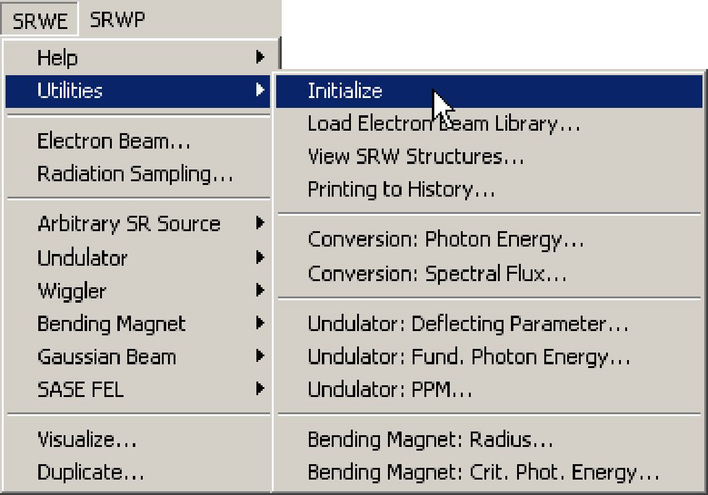

# **Wavefront Propagation**

## **Introduction**
This mode of computation is essentially the Near Field computation described earlier, yet with
the observation plane positioned somewhere after a sequence of lenses, mirrors, drift spaces
and diffracting apertures... It is therefore more **powerful**, but also much more complicated. In
fact, we **strongly advise** anyone interested in such a computation to study, experience and fully
understand the Near Field computation before jumping into the additional complexity of
performing a propagation. Depending on the wavelength and characteristics of optical
components, the accurate propagation of a wavefront may require enormous amount of
memory to the point that it cannot be done on your platform unless you strongly reduce the
range of observation.

## **Getting Started**

We assume that you have successfully installed the SRW on your computer and that you are
familiar with the Near Field computation. The next step is to run one of the examples included in
the SRW using the following menu:

Beware that Igor must have at least 32M available to perform successfully each of the
examples. In particular, Macintosh users should properly set-up the memory partition for Igor
before starting to use the propagation in SRW.

During the execution of the example, a window giving some explanations on the content of the
computation being made should appear on your screen. Please read the explanations and
make sure that everything goes as prescribed (you can also find the text of the explanations in
the section Examples). If everything goes well, at the end of the computation you should obtain
a set of graphs displaying the results, which should fit the explanations.

If you have passed this step successfully, you are ready to perform your own computation. The
following section briefly describes the main steps one needs to make in order to perform the
Near Field computation and then propagation of the SR wavefront.

## **Wavefront Propagation Step by Step**
This mode of computation includes creation of the initial wavefront (e.g. using SRWE), and the
simulation of its further propagation through optical components.

1) **Initialize** SRW.

See SRWE section for the comments to all relevant menu items, dialogs and macros.

3) OPTIONAL: **Visualize** the radiation component of interest.

This is where one plots the data associated with a particular polarization. For details on options
of visualization of single-electron or multi-electron SR components see the Reference Manual
record for the dialog box "Visualize" and the macro command SrwWfr2Int.

4) Define **Optical Component**(s), for example:

This is where one sets up all optical components the wavefront should be propagated through.
For details on the optical component(s) definition, see the Reference Manual records for the
macro commands **SrwOptDrift**, **SrwOptApertRect**, **SrwOptApertCirc**, **SrwOptThinLens**,
**SrwOptMirSpher**, **SrwOptCont**, **SrwOptContAdd**.

5) OPTIONAL: **Resize** the Wavefront.

The Resize procedure is dedicated to: make a propagation of the wavefront in manual mode;
check the accuracy of propagation in automatic mode and (if necessary) prepare the wavefront
for visualization. For details on resizing of the wavefront, see the Reference Manual record on
the macro command **SrwWfrResize**.

6) **Propagate** Wavefront through the Optical Component(s).

Please, beware of the problems and limitations of the propagation method used (see the section
**Problems and Limitations** below). For details on the wavefront propagation, see the sections
"**Special Notes on Propagation**" and "**Theoretical Notes**" below, and the Reference Manual
record on the macro command **SrwWfrPropagate**.

7) Repeat the Step 3 to **visualize** the radiation component of interest after the propagation.

**IMPORTANT**: It is important to make several cycles of propagation with different
sampling/resolution of the initial wavefront. The independence, at a given precision level, of the
computation results on the sampling/resolution of the initial wavefront is the necessary condition
for the validity of the results (however, it is not at all a sufficient condition...).

As described in the section concerning Near Field Computation, you may avoid using the menu
calls by writing your own macros.

## **Assumptions**

The assumptions used in this computation are essentially the same as those used in the Near
Field computation. We however, emphasize that:
- The observation angles are much smaller than 1 radian.
- The distances at which the diffraction is treated, are much larger than the radiation wavelength.
- The conductivity of diffracting objects is zero.

## **Problems and Limitations**

*Memory and Wavefront dimensions.*

The main limitations of the wavefront propagation method used in the current version of the
code come from a very strong consumption of memory with the increase of the wavefront
dimensions. Let's assume that one needs to propagate a wavefront at a wavelength lambda,
computed on a square aperture with transverse dimensions a x a located at a distance R from
the source. Then, to resolve well the electric field of the wavefront, one needs roughly the
following amount of memory:
$$C[MB]\approx 3.10^{-5}a^4/(\lambda R)^2$$

This makes around $$30$$ MB for the wavefront of $$10$$ cm $$\times$$ $$10$$ cm transverse size at $$1$$ micron
wavelength and $$10$$ m distance from the source. In cases of a strong demagnification or a
propagation in space over a long distance, more memory is needed.

We are working on, and have partially implemented an improved version of the wavefront
propagation, which is much less memory demanding compared to what is indicated above. This
improved method is applied when the wavefront has more-or-less constant instant radius within
its transverse dimensions.

We have successfully tried various cases of the SR propagation on a PC with $$64$$ MB of RAM
under Windows NT Workstation 4.0, for example:

- Propagation of Infra-Red Edge Radiation from central part or edges of bending magnets,
computed at $$1$$ m from geometrical source point, through a $$2$$ cm $$\times$$ $$2$$ cm aperture and drift space
of $$10$$ m length.
- $$10$$ : $$1$$ imaging of visible range bending magnet SR with a $$5$$ cm diameter lens located at $$10$$ m
from the geometrical source point.
- $$10$$ : $$1$$ imaging of a central cone of undulator radiation at $$\sim10$$ keV with a focusing element
located at $$30$$ m from the center of undulator.

## **Special Notes on Propagation**
* **Use Automatic Radiation Sampling**

It is strongly recommended that the SR wavefront is computed with the option "Use Automatic
Radiation Sampling" (dialog box "Compute SR Electric Field" or macro **SrwWfrCreate**) set to
"Yes", before making any propagation. With this option, the horizontal and vertical point
numbers specified in the Radiation Sampling structure are ignored. Instead, the code uses such
point numbers that correspond to the minimum required for further propagation of the wavefront
with the given ranges of horizontal and vertical position. An Oversampling Factor, which can be
<1 or >1, allows to manually steer the point numbers with respect to the above criterion. In all
cases, only the numbers of points are changed, whereas the ranges of transverse positions
remain unchanged.

This version of the code provides two methods of propagation of the SR Wavefront: manual and
"automatic" (which is, unfortunately, still far from perfection...).

* **Manual Mode**

The propagation is performed in the manual mode if the option "Auto-Resize Wavefront?"
(macro **SrwWfrPropagate**, menu call SRWP "Propagate...") is set to "No". In this mode, the
user is fully responsible for the electric field sampling range and numbers of points.

Please take into account that at the propagation, the electric field should be properly sampled
both in the Coordinate and Angular transverse representation (the latter is used for propagation
through a drift space, see the section "Theoretical Notes"). The increase of the horizontal
(vertical) range in the Coordinate representation by padding zeros will increase the horizontal
(vertical) resolution (i.e., reduce the step size) in the Angular representation, and vice versa.

A too small number of points will result in a wavefront with a phase shift between two adjacent
points larger than Pi/2 resulting in a loss of information. This will, very likely, give erroneous
results at further propagation. A too large number of points for a small observation range in
Coordinate representation may also be inefficient: it may strongly increase the range of the
electric field in Angular representation without improving the resolution in that representation, so
the propagation of such wavefront may give erroneous results too. Besides, it may lead to a very Since the propagation through any Optical Component tends to modify the size and / or
oscillation rate of the electric field in the Coordinate and Angular representation, practically each
step of the propagation in the manual mode requires Resizing before and / or after it, with
proper horizontal and vertical Range and Resolution Resizing factors. For details on the
resizing, see the Reference Manual record on the macro command **SrwWfrResize** (menu call
SRWP "Resize...").

Try to visualize intermediary results as frequently as possible (macro **SrwWfr2Int**, menu call
SRWP "Visualize..." ) when making the propagation in the manual mode. One can watch the
real component of the electric field (choose "Re(E)" in pop-up menu "Extract..." in the dialog box
"Visualize") to figure out whether the wavefront is well sampled or not.

Thus, the propagation in the manual mode is not at all a straightforward procedure. Therefore
we recommend it only to the users experienced in the methods of Fourier optics, if they are not
satisfied with, or want to check the results obtained in the "automatic" mode.

* **"Automatic" Mode**

The propagation is performed in the "automatic" mode if the option "Auto-Resize Wavefront?"
(macro **SrwWfrPropagate**, menu call SRWP "Propagate...") is set to "Yes". In this mode, before
and / or after propagation of the electric field through each optical component, the wavefront is
automatically resized based on the results of preliminary propagation of the first- and secondorder
statistical moments of radiation, and test pre-propagations in 1D.

The "automatic" mode can work properly only if the initial wavefront is sampled well enough to
resolve the smallest fringes of the electric field. To ensure this, at the creation of the wavefront,
one should set the option "Use Automatic Radiation Sampling" in the dialog box of the macro
**SrwWfrCreate** to "Yes", and specify the Oversampling Factor in that dialog box on the order of
one.

*How to check or improve the precision of the results obtained by the propagation in the
"automatic" mode?*

One can do this by applying the Resolution resizing to the wavefront before the propagation,
and repeating the propagation after that. In most cases, there is no need to check the effect of
resizing the Range before the propagation, because the automatic method is capable of
steering it in the process of propagation. Generally, if the propagation results are stabilized at
increasing the Resolution resizing before the propagation, this is a good sign about the
precision.

It is important to keep in mind that the Resolution resizing is done using an interpolation method,
and therefore it can not increase the precision infinitely, especially if the initial wavefront is not
well sampled. Re-computation of the SR wavefront with larger Oversampling Factor is always
advantageous in terms of precision with respect to the corresponding Resolution resizing. Yet as
a rule, it is much slower...

We note that the resizing for the purposes of checking and / or improving the precision of
propagation is better done using the "Normal" resizing method (see the dialog box of the macro
**SrwWfrResize**, menu call SRWP "Resize...).

Please take into account that the sampling of the wavefront which is sufficient for the
propagation, may appear insufficient for watching all the details of the intensity distribution
obtained after the propagation. Such a situation may occur when propagating the wavefront
after a focusing lens to the waist (image plane). One can reasonably improve the resolution in
this situation by applying the resizing of the wavefront **after** the propagation, with the Resolution
resizing factors larger than 1. In the cases of the resolution resizing of the wavefront in the waist,
the "Special" resizing method normally gives better results (for details, see the Reference
Manual record on the macro **SrwWfrResize**). A negative consequence of the manual resolution resizing of the propagated wavefront is that this wavefront may then appear not good for further
propagation (if any). One can solve this problem by duplicating the propagated wavefront before
making any manual manipulations with it (macro **SrwWfrDupl**, menu call SRWP "Duplicate...").

The next message is that at the propagation in the "automatic" mode, very large amounts of
memory can be demanded from the operating system for the allocation. On Mac OS, if the
memory partitioning for the Igor Pro appears insufficient, the SRW can crash the Igor Pro. The
Windows NT version of the SRW is safer in this respect. We estimate the minimal memory
partition for the Igor Pro on Mac OS, required for the SR propagation, to be 32 MB (note that the
SR computation which does not involve the propagation, can be performed on a considerably
smaller amount of memory).

The following case of propagation may require the most valuable amount of memory:
- propagation through a large drift space with no focusing.

We hope that with time, we'll be able to improve the "automatic" method of the SR propagation,
if this type of computation appears to be of users' interest.

* **An Example of Propagation with Comments**

This section illustrates a typical case of propagation using the "automatic" mode. Assume that
Electron Beam "Beam_ebm", Magnetic Field "Field_mag", Radiation Sampling "Smp_obs" and
a container of Optical Components "Optics_bli" are defined as described in the section
"Wavefront Propagation Step by Step". Also assume that the container of optical components
"Optics_bli" includes at least one drift space. The following are the actions one should make in
order to create the SR wavefront and propagate it through the optical components.
...

  1. This computes the SR wavefront with the option "Use Automatic Radiation Sampling", so the
wavefront is suitable for further propagation:
SrwWfrCreate("W","Beam_ebm","Field_mag","Smp_obs",2,1)
(menu call SRWP "SR Source->Create...")

  2. This visualizes the intensity of the initially computed radiation (OPTIONAL):
  
  SrwWfr2Int("W_rad","I",1,1,8,1,5,0,0,2)
(menu call SRWP "Visualize...")

  3. This propagates the wavefront through the optical component in the "automatic" mode. The
initial wavefront is chosen to be duplicated before the propagation:

SrwWfrPropagate("W_rad","Optics_bli",1,2,"Wd")
(menu call SRWP "Propagate...")

  4. This visualizes a characteristic intensity component of the propagated SR:
  
SrwWfr2Int("Wd_rad","J",2,1,3,1,5,0,0,2)
(menu call SRWP "Visualize...")

  5. This resizes the propagated wavefront in order to increase the resolution, if necessary. Note
that this trick works only in the cases of focusing. Also note that in such cases, the "Special"
resizing method typically gives better results (OPTIONAL):

SrwWfrResize("Wd_rad",2,1,4,1,4,1,"Wd")
(menu call SRWP "Resize...")

  6. Do this step only if you have done the step #5:
  
Repeat #4 in order to see the propagated intensity distribution with better resolution. If you notice
any qualitative differences (other than the increase of resolution may result in) between the
intensities obtained at this step and earlier at the step #4, this means that the increase of
resolution by post-resizing does not work properly in this case. A possible reason is insufficient
sampling of the initial wavefront.

*Do the following steps if you want to check or improve the accuracy of the propagation*.

  7.  This resizes the initial wavefront in order to check the accuracy of propagation by repeating it
with a more dense sampling. Note that for this purpose, the resizing is better done using the
"Normal" method. The initial Wavefront is chosen to be duplicated before the resizing (as an
alternative, one could re-compute the initial wavefront with larger Oversampling Factor; this
would be more precise, yet in most cases slower):

SrwWfrResize("W_rad",1,1.,1.3,1.,1.3,2,"Wd")
(menu call SRWP "Resize...")

  8. Repeat the steps #3, #4, #5, #6. If, by comparing the final intensities of the propagated SR
before the resizing at the step #7 and after it, you are not satisfied with the stability of the
propagation results, repeat the step #7 with larger values of the Resolution Resizing factors, and
steps #3 - #6, until the propagation results are stabilized.

Sooner or later, this loop may be stopped by the memory limitation (see the section "Problems
and Limitations"). Windows users will feel this when the code will start to swap at the basic
operations (resizing and propagation), and a warning message will appear in the History
window. For Mac users this limitation may appear even more evident: the SRW may crash the
Igor Pro in the case of insufficient memory (minimum 32 MB should be set for the Igor Pro when
using the propagation-related computation).

We hope that before this will happen, you'll be able to get some useful results... If this is not the
case, you can try to repeat the same computation with a smaller horizontal and / or vertical
radiation sampling ranges of the initial wavefront.

* **Radiation Sampling Range as a Default Aperture**

There is a default optical component, which is present in any case of propagation, for any
definition of a "beamline". This optical component is a rectangular aperture (i.e. diaphragm) with
dimensions and location defined by the Radiation Sampling parameters (longitudinal position,
horizontal and vertical center and ranges, menu call SRWP "Radiation Sampling..."), for which
the initial SR was computed.

For example, if one has computed the SR for the horizontal and vertical sampling ranges ax
and az at the longitudinal position y, and makes a propagation of the SR through a drift space
of the length L, this means that one actually computes the SR diffraction on a rectangular
aperture ax x az located at the longitudinal position y, as observed at the position y + L.

* **The Simpler the Better**

We do not advise you to start the propagation-related computation with a complicated set-up of
a "beamline" (i.e., container of optical components). Very probably, the current version of the
code will not be able to properly drive the propagation through a large collection of optical
components at once. It is much safer to start from a simple case, such as:

- (Aperture +) **Drift Space** (to simulate the SR diffraction on a slit/aperture);
- (Aperture +) **Thin Lens + Drift Space** (to simulate the SR focusing).

Only if you are satisfied with the consistency of the results for these simple cases, you can try to
continue developing your "beamline" (add more optical components, optimize parameters, etc.).

## **Theoretical Notes**

* **Propagation of the SR Wavefront**

Assume that we have computed, in frequency domain, the near-field SR electric field in a
transverse plane located at some distance from the "source" (for example, using the method
described in the chapter "Near Field Computation"). Now we need "to propagate" this electric
field through a number of optical components, to another transverse plane.

The SR Wavefront propagation is implemented in the frame of the Scalar Diffraction Theory
using CPU-efficient methods of Fourier Optics. In assumption of small angles and distances
considerably larger than wavelength, the transverse components of electric field of the diffracted
Synchrotron Radiation can be computed from the electric field at an aperture causing the
diffraction by the well-known Huygens-Fresnel principle:

$$\vec E_{\bot2} = -ik(2\pi)^{-1}\iint\limits_{\Sigma}\vec E_{\bot1}S^{-1}e^{ikS}d\Sigma$$

where $$\Sigma$$ is a surface within the diffracting aperture, $$S$$ is a distance from a point on this surface
to the observation point. This can be shown by applying the integral theorem of Helmholtz and
Kirchhoff (see M.Born, E.Wolf, Principles of Optics, 4th ed., Pergamon Press (1970), p. 377) to
the Synchrotron Radiation represented, for example, as described in the chapter "Near Field
Computation".

If $$\Sigma$$ is a plane normal to optical axis (assume $$Y$$ axis of a Cartesian frame), then

$$d\Sigma = dx_1dz_1$$
$$S=[(x_2-x_1)^2+(y_2-y_1)^2+(z_2-z_1)^2]^{1/2}$$

where $$(x_1,y_1,z_1)$$ and $$(x_2,y_2,z_2)$$ are coordinates of a point on the $$\Sigma$$ plane and on the
observation plane respectively, and the above Fresnel formula is a convolution type integral,
which can be quickly computed by applying the convolution theorem and the $$2D$$ Fast Fourier
Transforms. This gives a CPU-efficient method of propagation of all the wavefront at once (to be
more precise, the transverse components of the electric field) through a drift space of any
length.

The propagation of the transverse electric field through an optical element from a transverse
plane before the element to a plane immediately after it, in many cases can be well described
by multiplication of the electric field by a function of transverse coordinates. In the simplest case
of a thin lens this function is well-known. In more complicated cases, one can apply physical
considerations or analytical methods (for example, the stationary phase method) to derive the
proper transformation of the electric field.

The main advantage of this method of the wavefront propagation is speed. A $$2D$$ wavefront can
be propagated for the time from several seconds to one minute, which is normally much faster
than the time needed for its initial creation (i.e., the Near-Field SR computation). This allows to
perform computations with several optical components at once, make various optimizations of a
beamline, etc. Practically, however, the applicability of this method is limited by a very strong
consumption of memory with the increase of the wavefront size (see the section "Problems and
Limitations"). We are working on improving the propagation method of SRW in this respect.

We would like to appreciate the ideas and way of thinking suggested in the paper by K.-J. Kim
(Nucl. Instr. and Meth., A246 (1986), pp. 71-76), which we have extensively used at realization of
the Propagation related part of SRW.

* **Thick Electron Beam**

The method of computation of the intensity profile generated by a thick beam is very similar to
that of the Near Field Computation.The Matrix T now transfers the second-order moments from
one optical component to another. The single-electron intensity profile after propagation is
convoluted by a Gaussian with the RMS equal to the propagated second-order moment $$\langle(x-\langle x\rangle)^1\rangle_p$$
(see the "Theortical Notes" for the "Near Field Computation" above).

This method is typically valid for intensity distributions of the focused SR (provided that the size
of the focusing element aperture is much larger than the transverse size of the electron beam
and magnetic field is transversely uniform in the region of the SR emission). However, it can be
totally wrong if the optical component over which some propagation has been performed is
strongly diffracting the radiation. One should therefore be very cautious when performing the
multi-electron convolution.

## **Examples**

* **Focusing the Bending Magnet Radiation**

  - In this example a 6 GeV electron is propagated through a bending magnet with the vertical field
of 0.85 T. The trajectory of the electron is displayed in a graph.
  - The wavefront of the radiation at the energy of 3 eV is sampled over a rectangular aperture of
10 x 30 mm at a distance of 20 m from the bending magnet. The intensity with horizontal
polarization is displayed as an image. It shows the usual pattern of bending magnet radiation,
almost independent of the horizontal position. The vertical angle is significantly larger than
1/gamma since the photon energy is much smaller than the critical energy.
  - The wavefront is then propagated through a simple beamline made of a focusing lens (1.81 m
focal length) followed by a 2 m drift space in order to make a 10:1 imaging between the
bending magnet and the image plane. The linear horizontally and vertically polarized intensities
observed after the lens and the drift space are displayed as images. The images show a single
and double spot (for horizontal and vertical polarization components respectively). The axis of
the lens has been intentionally displaced by 0.05 mm from the plane of the electron beam. As
expected, the image is vertically displaced by 1.1 x 0.05 mm.
  - The filament electron beam intensity is convoluted with Gaussian particle distribution of a
"thick" electron beam. A graph shows together vertical polarization components corresponding
to the filament and thick electron beam. This illustrates the possibility of using the vertical
polarization component of the focused bending magnet SR for more precise estimation of the
vertical electron beam size (Å.Andersson, "Electron beam profile measurements and emittance
manipulation at the MAX-laboratory", Ph.D. thesis work).
  - A number of parameters have been intentionally selected to limit the CPU time and memory
requirements in this example. If you want to execute the same computation with different
parameters, read the following topics.

**If you want to make further computation**...
You may want to vary some parameters of this example and watch the resulting images. Such
an exercise is a good and recommended way to develop your own skills and understanding on
the way the computation is done in SRW. Some knowledge in macro programming within Igor
Pro is nevertheless needed. If you fill ready for the adventure, select the menu "Windows", Sub-
Menu "OtherWindows", topics "SRW Example BM SR Focusing.ipf". A window appears showing
the content of a macro which is the full and complete description of all computations made in
this example. All lines starting with // are comments, the first important instruction is
"SrwElecFilament("E",6,0.2,0,0,0,0,0)" which creates a filament electron beam of 6GeV, 200
mA etc... "SrwMagFieldCreate("BM",0,3,1000)" creates a set of field waves to describe the magnetic field of the bending magnet, and so on.

We suggest that you save this procedure file under a different name. In the newly saved macro
file, rename the "proc SrwExamImagBm()" into something like "macro MyMacro()". Select the
Command Window, a brief compilation takes place, and "MyMacro" can now be called directly
from the "Macros" menu of Igor. You can now make any modification inside MyMacro and be
sure that it will not interfere with other functions and procedures of SRW. If you are an
experienced user of Igor Pro, you will easily find a large number of different ways to copy the
content of the "proc SrwExamImagBm()" into some of your own procedure files.

To start with physics, we would suggest that you make the following simple modifications:
- Change the aperture of collection of the radiation and watch the size of the spot. Beware that
the larger the collection range the larger memory is needed.
- Change the energy of the radiation. The larger the energy the more points will be needed to
correctly sample the initial Wavefront resulting in the need of more memory and CPU time.
- Look at the image away from the image plane and watch the variation of the sizes in front or
behind of the image plane
- Change the focal length and the magnification ratio.

After each modification, re-execute the whole macro and compare the results. Save your work
frequently to an experiment file on your disk. To save memory and space on your screen, it is
recommended to kill the windows between successive executions since new windows are
systematically re-generated.

The Wavefront propagation may consume a lot of memory, but it is not greedy in CPU time. The
CPU time is only important at the first wavefront computation which needs to be done with a
correct spatial sampling. It is therefore advisable, if you only want to change some propagation
parameters. to re-use the same initial wavefront. It may dramatically shorten the response time.
Use "Duplicate Wavefront" option at propagation and resizing (see the Reference Manual
records for the macro **SrwWfrPropagate**, **SrwWfrResize**, **SrwWfrDupl**).

Please have a look at the sections "Wavefront Propagation Step by Step" and "Special Notes on
Propagation", where more details and recommendations for the propagation are given.

* **Focusing the central cone of Undulator Radiation**
  - In this example, a 6 GeV electron is propagated through a 46 x 35 mm conventional undulator
with K=2.2. The spectrum is first computed on axis of the undulator to identify the energy of
various harmonics.
  - The wavefront of the central cone of the third harmonic of the spectrum at 8.1 keV is computed
at a distance of 10 m from the source and its intensity is displayed as an image.
  - This wavefront is then focused by a 5 m focal length lens and further propagated to 8, 10 and
12 m from the lens. The 10 m point gives the minimum spot size and corresponds to a 1:1
imaging from the source. At 8 and 12 m from the lens, the radiation is out of focus and a larger
spot size is observed. To help comparing the cases of propagation, a vertical cut of the intensity
is made in each of the three cases and the corresponding profiles are placed in a single plot.
  - The filament electron beam intensity is convoluted with Gaussian particle density distribution of
the "thick" electron beam.
  - If you want to make further computations with different parameters, read the chapter
"Wavefront Propagation" of the SRW documentation and see the advises given in the example
"Focusing the Bending Magnet Radiation".
  - By varying the photon energy within a small range around the on-axis harmonic peak (8.0 -
8.15 keV), one may see a number of interesting features of the UR focusing. For example, one
may see that the exact central cone of the undulator radiation can be not at all an optimum for the focusing: a small "undulator ring" can give considerably larger peak intensity in the image
plane...

* **Propagating Undulator Radiation through a Two-Slit Interferometer**
  - In this example, a 7 GeV electron beam passes through a planar undulator (70 periods of 33
mm) with K=2.16. The single-electron spectrum is first computed on the undulator axis to verify
energy of the fundamental harmonic.
  - Monochromatic wavefront of undulator radiation central cone (fundamental harmonic) is
computed at 30 m distance from the undulator and its intensity is displayed as an image.
  - This wavefront is then propagated through an ideal lens (with focal distance equal to half
distance from the undulator), followed by two vertically-separated centered slits, and by drift
space - to the plane of 1 : 1 imaging.
  - Single-electron and multi-electron intensity distributions are considered in the image plane.
Interference fringes are clearly seen in vertical cut of the single-electron intensity distribution.
The multi-electron intensity distribution is estimated by convolution of the single-electron intensity
distribution with a 2D Gaussian.

* **Diffraction of Infra-Red Edge Radiation**
  - This example computes the diffraction of the IR Edge Radiation on a rectangular aperture at
124 μm wavelength for the parameters of the SOLEIL ring.
  - The IR ER is first computed on a 20 mm x 10 mm rectangular aperture at 0.7 m longitudinal
offset from downstream bending magnet edge. The intensity distribution vs transverse
coordinates, and the horizontal (median plane) intensity profile are shown.
  - The radiation is propagated through a 5 m length drift space. The final intensity distribution vs
transverse coordinates, and the horizontal (median plane) intensity profile of the diffracted ER
are displayed in graphs.
* **Focusing X-rays by a Refractive Lens**
  - In this example, 25 keV synchrotron radiation from a bending magnet (magnetic field 1.6 T,
electron energy 6 GeV and zero transverse emittance) is focused in vertical plane by a refractive
lens with circular holes. There is no focusing in horizontal plane.
  - The following are the main parameters of the lens.
Material: Be, hole diameter: 0.8 mm, number of holes: 113. This makes the focal distance of
~3.25 m. Wall thickness between the holes is 0.1 mm.
The lens is located at 4.5 m longitudinal position from the geometrical source point.
  - The radiation is first computed on a rectangular aperture of 0.05 mm x 0.4 mm at the
longitudinal position of the lens. Then a propagation through the lens and a drift space of 11.4
m, to the vertical waist, is performed. Intensity profiles of the radiation in transverse plane at the
waist are shown in graphs.
  - In vertical plane, the intensity profile of the focused radiation is dominated by a spherical
aberration (long "tails"). This aberration can be dramatically reduced by placing a slit limiting the
vertical aperture in front of the lens. As an alternative, one can use a lens with parabolic holes.
  - Since there is no focusing in horizontal direction, the horizontal intensity profile in the
observation plane is generally a result of diffraction on the input aperture. It's possible to place
another identical lens, yet focusing in horizontal plane, immediately after the one used. This
would result in a 2D focal spot with comparable dimensions.