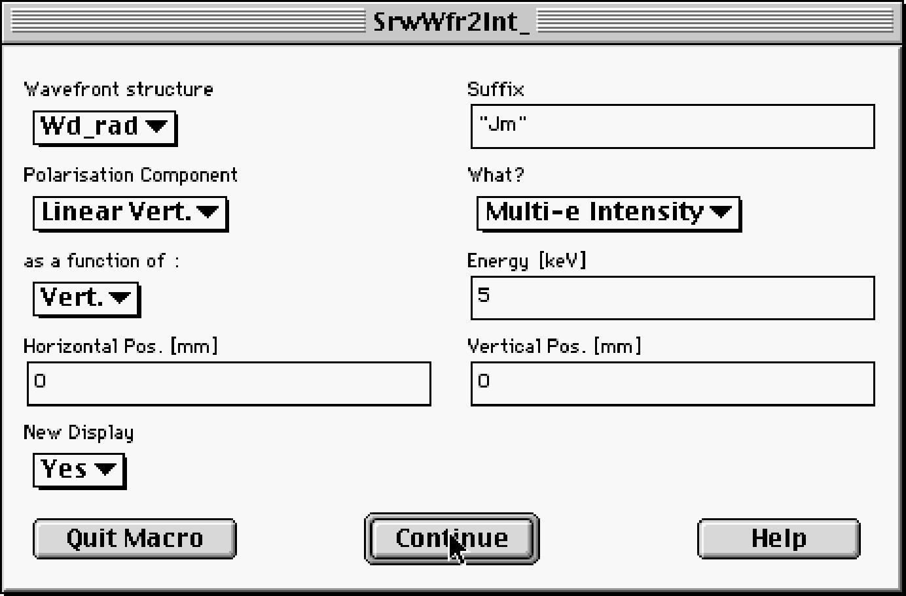
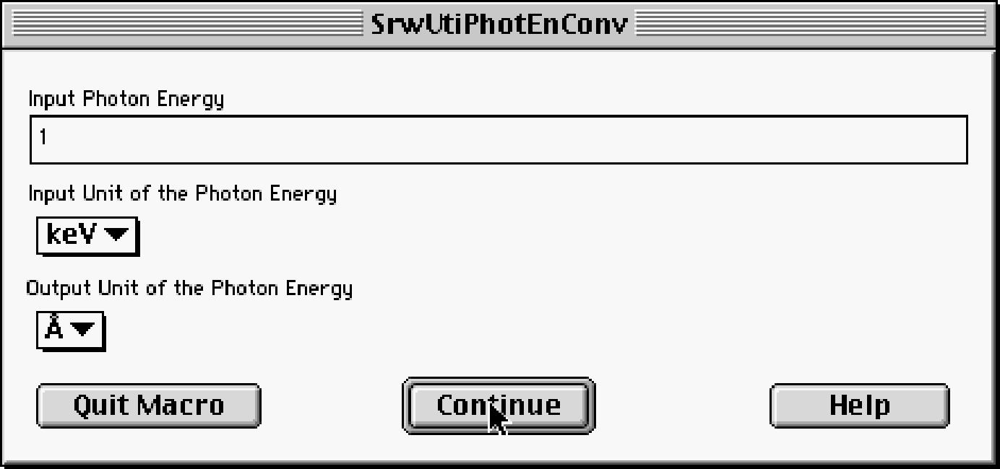

# Reference Manual

## Initialization

Before any computation with SRW, it should be initialized by a special macro.

**SrwInit**

***Definition:***

Proc SrwInit()

***Action:***

Creates a set of global variables in Igor which are necessary for proper functioning of the SRW.

***Details:***

1. The SRW initialization is essential when you start a new experiment in Igor. However, there is
no need to initialize SRW (moreover, it is not at all recommended to do this) when you open and
continue to work with an old experiment, where you have already performed the SRW
initialization.

## Electron Beam Definition

The electron beam definition means definition of "Filament" (single-electron) and "Thick"
(emittance-related) parameters of the electron beam.

**SrwElecDialog**

***Dialog Box:***

***Definition:***

Proc SrwElecDialog(mode)

Variable mode

***Action:***

Displays a dialog box and invokes proper SRW macros for setting up an Electron Beam
structure, which is a set of "Filament" electron beam parameters including: average energy,
current, initial horizontal and vertical coordinates and angles at some longitudinal position; and a
set of "Thick" beam characteristics which can be defined via emittances and Twiss parameters
of the magnet lattice, or via second-order statistical moments of particle distribution in the
electron beam.

***Details:***

1. We do not advise to use this macro at programming in Igor macro language. It is dedicated
only to facilitate the dialog-driven style of computation in SRW.
2. The layout of the dialog box depends on the input parameter mode: mode=0 shows all the
parameters that may be necessary for further computation of Synchrotron Radiation; mode=1
and 2 show only the parameters which can be used at wavefront computation from Gaussian
Beam and Isotropic Source respectively.
3. In most SR computation methods, the first and second-order moments of particle distribution
in the electron beam are used. The dialog box allows to define the second-order moments both
explicitly and through the emittance and Twiss parameters. The values of the first and secondorder
moments (Twiss parameters) should refer to the same longitudinal position.
4. The full name of the Electron Beam structure (numeric wave) is generated according to the following rule:
<Full Name> = <Name Specified by User> + "_ebm",
where "_ebm" is the type identifier of an Electon Beam structure.
5. Depending on the settings chosen in the dialog box, this macro invokes one or several lowlevel
macros of SRW that can be used at programming in Igor macro language:
**SrwElecFilament**, **SrwElecThick**, **SrwElecThickMom**. The invoked macros are printed in the
Igor History window with the input parameters values used. For more details please refer to the
Reference Manual records for these macros.

**SrwElecFilament**

***Dialog Box:***

***Definition:***

Proc SrwElecFilament(name,en,cur,s0,x,xp,z,zp)

String name

Variable en,cur,s0,x,xp,z,zp

***Action:***

Creates an Electron Beam structure with the name "name" and sets up the "Filament" beam
parameters: Energy in GeV (en), Current in A (cur), transverse coordinates and angles of the
beam at the Longitudinal Position s0: Horizontal Position in mm (x), Horizontal Angle in mr (xp),
Vertical Position in mm (z) and Vertical Angle in mr (zp).

***Details:***
1. The Electron Beam structure created is actually a numeric wave that holds all the electron
beam parameters.
2. The full name of the Electron Beam structure (numeric wave) was generated according to the
following rule:
<Full Name> = <Name Specified by User> + "_ebm",
where "_ebm" is the type identifier of an Electon Beam structure.

**SrwElecThick**

***Dialog Box:***

***Definition:***

Proc SrwElecThick(name,sige,emx,emz,betax,betaz,alphax,alphaz,etax,etaxp)

String name

Variable sige,emx,emz,betax,betaz,alphax,alphaz,etax,etaxp

***Action:***

Sets up emittance-related parameters for the existing Electron Beam structure with the name
"name": Relative RMS Energy Spread (sige), Horizontal Emittance in nm (emx), Vertical
Emittance in nm (emz), the values of the magnet lattice functions: Horizontal Beta in m (betax),
Vertical Beta in m (betaz), Horizontal Alpha (alphax), Vertical Alpha (alphaz), Horizontal
Dispersion function in m (etax) and its Derivative (etaxp).

***Details:***
1. The values of the lattice functions should correspond to the Longitudinal Position (s0)
specified in the Filament beam parameters dialog box (macro SrwElecFilament).
2. The lattice functions are needed to derive from the transverse emittances and energy spread
the second-order moments of particle distribution in the beam, which are used at computation of
the Thick beam effect on the SR distributions.
Eventhough the lattice function values are not actually the electron beam parameters, for
simplicity, we decided to place them together with the beam emittances and energy spread.
3. The values of RMS sizes and divergences of the electron beam, computed from the lattice
parameters, emittances and energy spread, are printed in the Igor's History window.

**SrwElecThickMom**

***Definition:***

Proc SrwElecThickMom(name,sige,sigx,sigz,sigxp,sigzp,mxxp,mzzp)

String name

Variable sige,sigx,sigz,sigxp,sigzp,mxxp,mzzp

***Action:***

Sets up second-order moments of particle distribution in the electron beam for the existing
Electron Beam structure with the name "name": relative RMS energy spread (sige), horizontal
and vertical RMS size (sigx,sigz), horizontal and vertical RMS angular divergence (sigxp,sigzp),
and horizontal and vertical mixed moments "position-angle" (mxxp,mzzp).

***Details:***
1. The values of the second-order moments should refer to the the same longitudinal position as
the first-order moments ("filament" beam parameters) specified in the Electron Beam dialog box
or macro SrwElecFilament.

## Arbitrary Magnetic Field
The magnetic field definition means execution of several SRW macros which create the
Magnetic Field structure and set up Horizontal and Vertical Field components vs longitudinal
position. The Magnetic Field structure is used at the Synchrotron Radiation computation.

**SrwMagFieldCreate**

***Dialog Box:***

***Definition:***

Proc SrwMagFieldCreate(name,cen,len,npts)

String name

Variable cen,len,npts

***Action:***

Creates a Magnetic Field structure with the name "name" and sets up a longitudinal position of
Center of the Field in m (cen), Length of the Field (i.e., longitudinal range of the field definition)
in m (len), and a Number of Points over longitudinal position (npts) where the field is defined.

***Details:***
1. The magnetic field has only transverse components and it is uniform in transverse directions.
2. The Magnetic Field structure created is actually a text wave that keeps the names of two
numeric 1D waves describing Horizontal and Vertical components of the field.
This waves are automatically created and set to zero by this macro.
3. The full name of the Magnetic Field structure (text wave) was generated according to the
following rule:
<Full Name> = <Name Specified by User> + "_mag",
where "_mag" is the type identifier of a Magnetic Field structure.
The full names of the Horizontal and Vertical field components were generated according to the
following rule:
<Full Name> = <Name Specified by User> + ("BX" or "BZ") + "_fld", where "BX" ("BZ") corresponds to Horizontal (Vertical) field component, "_fld" is the type
identifier of a Magnetic Field Component wave.
4. Horizontal and Vertical components of the field can be set up independently, using dedicated
SRW macros or by importing the field data manually, however the Center of the Field, Length of
the Field and the Number of Points is the same for the Horizontal and Vertical components.

**SrwMagZero**

***Dialog Box:***

***Definition:***

Proc SrwMagZero(name)

String name

***Action:***

Sets to zero Horizontal or Vertical Component of the magnetic field with the name "name".

***Details:***
1. The Field Component to be modified is taken from the pop-up menu of the dialog box. The
pop-up menu suggests all the existing Field Components. The names of the suggested Field
Components were generated automatically at the creation of the corresponding Magnetic Field
structures by the macro **SrwMagFieldCreate**, according to the name decoration rules described
in the reference record for that macro.

**SrwMagConst**

***Dialog Box:***

***Definition:***

Proc SrwMagConst(name, bconst)

String name

Variable bconst

***Action:***

Sets Horizontal or Vertical Component of the magnetic field with the name "name" to a constant
value in T (bconst).

***Details:***
1. The Field Component to be modified is taken from the pop-up menu of the dialog box. The
pop-up menu suggests all the existing Field Components. The names of the suggested Field
Components were generated automatically at the creation of the corresponding Magnetic Field
structures by the macro **SrwMagFieldCreate**, according to the name decoration rules described
in the reference record for that macro.

**SrwMagSin**

***Dialog Box:***

***Definition:***

Proc SrwMagSin(name,zero,scen,per,taper,sag,nper,bpeak,bnoise,bnoisei)

String name

Variable zero,scen,per,taper,sag,nper,bpeak,bnoise,bnoisei

***Action:***

Adds a sine wave to the magnetic Field Component with the name "name" (selected from the
existing Field Component waves). The selected wave can be initially set to zero or not. The
following parameters should be specified: Center Point of the sine wave in m (scen), Period in
mm (per), Taper in mm, which is approximately the magnetic gap difference of an undulator
from Entry to Exit (taper), Sag in mm, which is the magnetic gap difference of an undulator from
Center to Extremity (sag), Nunber of Periods (nper), Peak Field in T (bpeak), RMS Gaussian
Noise in T (bnoise), RMS Integrated Noise in T (bnoisei).

***Details:***
1. The Sag parameter introduces a quadratic variation of the Peak Field value between Center
and Extremities, such as the one generated by a girder sustained from both extremities and bent
under the weight of the blocks or the magnetic force between magnet jaws.
2. The Field Component to be modified is taken from the pop-up menu of the dialog box. The
pop-up menu suggests all the existing Field Components. The names of the suggested Field
Components were generated automatically at the creation of the corresponding Magnetic Field
structures by the macro **SrwMagFieldCreate**, according to the name decoration rules described
in the reference record for that macro.

**SrwMagEdge**

***Dialog Box:***

***Definition:***

Proc SrwMagEdge(name,zero,scen,strsect,frsize,bconst)

String name

Variable zero,scen,strsect,frsize,bconst

***Action:***

Adds two smooth steps simulating the Edge Field of bending magnets bounding one straight
section, to the magnetic Field Component wave with the name "name" (selected from the
existing Field Component waves). The selected wave can be initially set to zero (zero=1) or not
(zero=2). The following parameters should be specified: Center Point of the Edge Field wave in
m (scen), Length of Straight Section between the two edges in m (strsect), Fringe Field Length
(i.e., a length at which the edge fringe field varies from 10 to 90%) in mm (frsize), and the
Uniform Field in the bending magnets in T (bconst).

***Details:***
1. The Field Component to be modified is taken from the pop-up menu of the dialog box. The
pop-up menu suggests all the existing Field Components. The names of the suggested Field
Components were generated automatically at the creation of the corresponding Magnetic Field
structures by the macro **SrwMagFieldCreate**, according to the name decoration rules described
in the reference record for that macro.

**SrwMagGsnAng**

***Dialog Box:***

***Definition:***

Proc SrwMagGsnAng(name,zero,scen,sigma,bint)

String name

Variable zero,scen,sigma,bint

***Action:***

Adds Gaussian shape magnetic field wave simulating the field of a single steering magnet, to
the magnetic Field Component wave with the name "name" (selected from the existing Field
Component waves). The selected wave can be initially set to zero (zero=1) or not (zero=2). The
following parameters should be specified: Center Point in m (scen), RMS Length (i.e., RMS size
of the Gaussian) in mm (sigma), Field Integral (over the longitudinal coordinate from minus to
plus infinity) in T*mm (bint).

***Details:***
1. The Field Component to be modified is taken from the pop-up menu of the dialog box. The
pop-up menu suggests all the existing Field Components. The names of the suggested Field
Components were generated automatically at the creation of the corresponding Magnetic Field
structures by the macro **SrwMagFieldCreate**, according to the name decoration rules described
in the reference record for that macro.

**SrwMagGsnDipole**

***Definition:***

Proc SrwMagDipole(FldName,Zero,Scent,Len,FringeSize,Bconst)

String FldName

Variable FldName,Zero,Scent,Len,FringeSize,Bconst

***Action:***

Adds a Dipole Magnet field to the magnetic field component wave with the name "FldName"
(selected from the existing field component waves). The selected wave can be initially set to
zero (Zero=1) or not (Zero=2). The following parameters should be specified: Center Point in m
(Scent), Iron Length in m (Len), Fringe Field length (i.e., a length at which the edge fringe field
varies from 10 to 90%) in mm (FringeSize), and the Uniform Field in the bending magnets in T
(Bconst).

***Details:***
1. The field component to be modified is taken from the pop-up menu of the dialog box. The popup
menu suggests all the existing field components. The names of the suggested field components were generated automatically at the creation of the corresponding magnetic field
structures by the macro **SrwMagFieldCreate**, according to the name decoration rules described
in the reference record for that macro.

**SrwMagImportCmpn**

***Dialog Box:***

***Definition:***

Proc SrwMagImportCmpn(wname,units,fname)

String wname

Variable units

String fname

***Action:***

Imports Magnetic Field data from an external text file into Horizontal or Vertical Field
Component wave with the name "name" (selected from the existing Field Component waves).
The units of the data to import can be Tesla or Gauss. This should be specified by the
parameter units ("Tesla": units=1; "Gauss": units=2). A user can specify a Full Name with Path
of the text file with data to be imported, if this name is known exactly (for example,
fname="MyDisk::MyFolder:MyFile"). If it is not the case, the fname string should be left empty
(fname="").

***Details:***
1. Before executing this macro, a user has to create a Magnetic Field structure by the macro
**SrwMagFieldCreate**, where he needs to specify a longitudinal position of Center of the Field,
Length of the Field (i.e., longitudinal range of the field definition), and Number of Points for the
data to be imported. The specified **Number of Points should be exactly the same** as in the
data file.
2. Format of the external data file.
The external data file should be a **text (ASCII)** file containing **one column** of decimal floating
point numbers (i.e. each number from a new line) representing the values of one component
(horizontal or vertical) of the magnetic field. These field values are assumed to correspond to
**equidistant points** over the longitudinal coordinate. The sampling parameters, i.e., Center,
Length of the Field and the Number of Points over the longitudinal coordinate were defined by
the macro **SrwMagFieldCreate** that created the Magnetic Field structure one component of
which is filled by the data from the file. At the top or at the bottom of the data file, there can be a
number of strings of characters starting from non-number character (text comments). These
strings are ignored at the data import. The following is a fragment of a valid data file.
...
Vertical field (Tesla). Measured 15 Jan 1998...
0.0144
0.3401
0.6396
0.8629
0.9833
0.9865
0.8722
...
3. The Field Component to be filled by the imported data is taken from the pop-up menu "Name
of the Field Component" of the dialog box. The pop-up menu suggests all the existing Horizontal
and Vertical Field Components. The names of the suggested Field Components were
generated automatically at the creation of the corresponding Magnetic Field structures by the
macro **SrwMagFieldCreate**, according to the name decoration rules described in the reference
record for that macro.
4. If the need is to import only one component of magnetic field <say, vertical>, this can be done
in two steps:
- Create a Magnetic Field structure using the macro **SrwMagFieldCreate** by specifying the
name for the structure and proper sampling parameters. At the creation, the horizontal and
vertical Field Component waves are set to zero.
<Assume that the user has created the Magnetic Field structure with the name "MyField".>
- Import the data from an external file to the vertical Magnetic Field Component wave which
belongs to the Magnetic Field structure created. For this, the macro **SrwMagImportCmpn**
should be used.
<The user has to select the Field Component with the name "MyFieldBZ_fld" from the list of the
Field Component waves that are suggested by the pop-up menu of the **SrwMagImportCmpn**
dialog box.>
If the other <horizontal in our example> Field Component is not zero and should be imported as
well, one needs to repeat the last step for that component.
<The user has to select the Field Component with the name "MyFieldBX_fld" from the list of the
Field Component waves that are suggested by the pop-up menu of the **SrwMagImportCmpn**
dialog box.>
Please note that the data for the other Field Component should correspond to exactly the
same sampling parameters (Center, Length of the Field and the Number of Points) as the
previous Component. These parameters were specified by the macro **SrwMagFieldCreate**.
5. After the Import of a Field Component is done, it is recommended to display it in a Graph by
using the macro **SrwMagDisplayField**.
6. If you have failed to Import your Magnetic Field data by means of this macro, please refer to
the section **How to Import Magnetic Field Data into SRW** in the chapter Frequently Asked
Questions, where other possible methods of importing the data into SRW are discussed.

**SrwMagConstCreate**

***Dialog Box:***

***Definition:***

Proc SrwMagConstCreate(name, bv, bh)

String name

Variable bv, bh

***Action:***

Creates a constant magnetic field structure with the name "name" possessing vertical and
horizontal field components (bv, bh).

***Details:***

1. One of the two field components can be zero.

**SrwMagPrec**

***Dialog Box:***

***Definition:***

Proc SrwMagPrec(name,meth,step,prec,ptsave,lim,sdep,sfin)

String name

Variable meth,step,prec,ptsave,lim,sdep,sfin

***Action:***

Sets Longitudinal Integration Method and precision parameters to be used at computation of
Synchrotron Radiation generated in the Magnetic Field described by the structure with the name "name". The Longitudinal Integration Method can be "Manual" (meth=1), "Auto Undulator"
(meth=2) or "Auto Wiggler" (meth=3). The following precision parameters should be specified:
Step of Longitudinal Integration in m (used only for the "Manual" method, step), Relative
Precision (used only for "Auto Undulator" or "Auto Wiggler" methods, prec), Number of points to
keep in Memory at the integration (ptsave). One should also specify whether any special
Integration Limits that differ from the Magnetic Field definition limits (set up by the macro
**SrwMagFieldCreate**) should be used at the Longitudinal Integration (lim=2) or not (lim=1). The
Initial and Final Longitudinal Coordinates (sdep and sfin) are taken into account only if one has
chosen to Use special Integration Limits (lim=2).

***Details:***
1. About the Methods of Longitudinal Integration.
There are three Methods of Longitudinal Integration for the Synchrotron Radiation computation.
   - "Manual" is a simplest one-pass longitudinal integration with fixed step size.
In this method, the computation is based on the Longitudinal Step value (variable step, input box
"Long. Step [m]"). This method is very sensitive to the Longitudinal Integration Limits (especially
in the cases when magnetic field is not zero at the edges of the integration interval).
   - "Auto Undulator" is a simple "automatic" integration, mostly suitable for Undulator-type cases
(when the required sampling density is more or less uniform along the electron trajectory).
In this method, the computation is based on Relative Precision value (variable prec, input box
"Rel. Prec."). This method is very sensitive to the Longitudinal Integration Limits (especially in the
cases when magnetic field is not zero at the edges of the integration interval).
   - "Auto Wiggler" is a more sophisticated method. In was developed to optimize the SR
computation in Wiggler-type cases (when the required density of sampling is strongly different
for different parts of the trajectory). It is efficient also for the Edge Radiation, for complicated
field configurations with drift spaces, etc. In this method, the computation is based on Relative
Precision value (variable prec, input box "Rel. Prec."). This method is not very sensitive to the
Longitudinal Integration Limits: it tries to find the proper integration limits automatically
(depending on the observation point and other parameters). A user should only care that the
field definition range (set by the macro **SrwMagFieldCreate**) is large enough for the given SR
observation range.
   -  "Auto Wiggler" is a more universal method and it normally requires less efforts from user than
the other methods, however in some cases, the user may "steer" the other methods (by tuning
step/precision/limits) to work faster than the "Auto Wiggler".
2. Number of points to keep in memory (ptsave) is not a crucial parameter. It does not affect the
precision; it may only affect the CPU time.

**SrwMagDisplayField**

***Dialog Box:***

***Definition:***

Proc SrwMagDisplayField(name)

String name

***Action:***

Displays the Magnetic Field Component with the name "name" in a Graph.

***Details:***
1. The Field Component to be displayed is taken from the pop-up menu of the dialog
box. The pop-up menu suggests all the existing Field Components.
The names of the suggested Field Components were generated automatically at the creation of
the corresponding Magnetic Field structures by the macro **SrwMagFieldCreate**. See the
reference record for this macro for the naming details.

**SrwMagElecTraj**

***Dialog Box:***

***Definition:***

Proc SrwMagElecTraj(elname,magname,disxan,disxcr,diszan,diszcr)

String elname,magname

Variable disxan,disxcr,diszan,diszcr

***Action:***

Displays the average trajectory of the Electron Beam defined by the structure "elname" in the
Magnetic Field defined by the structure "magname". A user should specify whether the following
components should be displayed in Graphs vs the Longitudinal coordinate: Horizontal Angle
("No": disxan=1; "Yes": disxan=2); Horizontal Coordinate ("No": disxcr=1; "Yes": disxcr=2);
Vertical Angle ("No": diszan=1; "Yes": diszan=2); Vertical Coordinate ("No": diszcr=1; "Yes":
diszcr=2).

***Details:***
1. This macro is used only to visualize the trajectory. There is no need (other than this) to
execute it before the SR computation.

**SrwTrjCreateTransvUnif**

***Dialog Box:***

***Definition:***

Proc SrwTrjCreateTransvUnif(trjname,elname,magname,disxan,disxcr,diszan,diszcr)

String trjname,elname,magname

Variable disxan,disxcr,diszan,diszcr

***Action:***

Creates a Trajectory structure and computes a trajectory of a filament electron beam described
by the structure "elname" in transversely uniform magnetic field described by the structure
"magname". The computed trajectory vs longitudinal position can be displayed in graphs or not:
Horizontal Angle ("No": disxan=1; "Yes": disxan=2); Horizontal Coordinate ("No": disxcr=1;
"Yes": disxcr=2); Vertical Angle ("No": diszan=1; "Yes": diszan=2); Vertical Coordinate ("No":
diszcr=1; "Yes": diszcr=2).

***Details:***

**SrwMagDupl**

***Dialog Box:***

***Definition:***

Proc SrwMagDupl(name,named)

String name,named

***Action:***

Duplicates the Magnetic Field structure with the name "name" by creating a structure with the
name "named".

***Details:***
1. The Magnetic Field structure (text wave) is duplicated together with the 1D numeric waves defining Horizontal and Vertical field components. The full names of the duplicated text- and
numeric waves are generated according to the rules described in the reference record for the
macro **SrwMagFieldCreate**.

## Periodic Magnetic Field

**SrwMagPerCreateDialog**

***Dialog Box:***

***Action:***

Creates or modifies a Periodic Magnetic Field structure, i.e. sets up undulator parameters,
including period, length, plane of the field (vertical, horizontal or both), deflection parameter(s),
phase shift between vertical and horizontal field (if necessary), type of undulator (conventional,
tapered, optical klystron, infinite) and extra relevant parameters.

***Details:***
1. We do not advise to use this macro at programming in Igor macro language. *It is dedicated
only to facilitate the dialog-driven style of computation in SRW.*
2. The Periodic Magnetic Field structure created is actually a text wave that keeps main
parameters of an undulator and the name(s) of one or more other text waves describing
harmonics of the periodic magnetic field.
3. This macro creates the main harmonic of the periodic magnetic field, which may have both
vertical and horizontal components. All the rest harmonics of vertical and/or horizontal magnetic
field (if any) can be set up and added to the Periodic Magnetic Field structure using the macro
**SrwMagPerAddHarm**.
4. If the type of undulator was chosen to be "Tapered Undulator", it is essential to specify a
proper taper parameter which is defined as a relative change of instant resonant photon energy from the entrance of undulator to its exit multiplied by number of periods.
5. If the type of undulator was chosen to be "Optical Klystron", it is essential to specify a proper
optical klystron parameter, which is defined as Nd/N = dF/Pi/N, where dF is the phase shift in
dispersion section of the optical klystron for the photon energy equal to the on-axis resonant
value of the first harmonic, N is total number of periods (twice the number of periods in each of
two sections of the optical klystron).
6. The full name of the Periodic Magnetic Field structure (text wave) was generated according to
the following rule:
<Full Name> = <Name Specified by User> + "_map",
where "_map" is the type identifier of a Periodic Magnetic Field structure.
The full names of the Periodic Magnetic Field Harmonic structure was generated according to
the following rule:
<Full Name> = <Name Specified by User> + "_fha",
where "_fha" is the type identifier of a Periodic Magnetic Field Harmonic structure.
7. This macro invokes another macro of SRW that can be used at programming in Igor macro
language: **SrwMagPerCreate2D**. The invoked macro is printed in the Igor History window with
the input parameters values used.

**SrwMagPerCreate2D**

***Definition:***

Proc SrwMagPerCreate2D(name,per,kz,kx,len,phx,undtyp,tappar,okpar)

String name

Variable per,kz,kx,len,phx,undtyp,tappar,okpar

***Action:***

Creates a Periodic Magnetic Field structure with the name "name" and sets up the main
harmonic of the periodic magnetic field. The following parameters should be specified: period in
mm (per), vertical and horizontal deflection parameters (kz, kx), total length in m (len), phase
shift of horizontal magnetic field with respect to vertical (phx), type of the undulator (undtyp=1 for
conventional, 2 for tapered, 3 for optical klystron, 4 for infinite), extra parameters for the cases of
tapered undulator (tappar) and optical klystron (okpar).

***Details:***
1. The Periodic Magnetic Field structure created is actually a text wave that keeps main
parameters of an undulator and the name(s) of one or more other text waves describing
harmonics of the periodic magnetic field.
2. This macro creates the main harmonic of the periodic magnetic field, which may have both
vertical and horizontal components. All the rest harmonics of vertical and/or horizontal magnetic
field (if any) can be set up and added to the Periodic Magnetic Field structure using the macro
**SrwMagPerAddHarm**.
3. If the type of undulator was chosen to be "Tapered Undulator", it is essential to specify a
proper taper parameter which is defined as a relative change of instant resonant photon energy
from the entrance of undulator to its exit multiplied by number of periods.
4. If the type of undulator was chosen to be "Optical Klystron", it is essential to specify a proper
optical klystron parameter, which is defined as Nd/N = dF/Pi/N, where dF is the phase shift in
dispersion section of the optical klystron for the photon energy equal to the on-axis resonant
value of the first harmonic, N is total number of periods (twice the number of periods in each of
two sections of the optical klystron).
5. The full name of the Periodic Magnetic Field structure (text wave) was generated according to
the following rule:
<Full Name> = <Name Specified by User> + "_map", where "_map" is the type identifier of a Periodic Magnetic Field structure.
The full names of the Periodic Magnetic Field Harmonic structure was generated according to
the following rule:
<Full Name> = <Name Specified by User> + "_fha",
where "_fha" is the type identifier of a Periodic Magnetic Field Harmonic structure.

**SrwMagPerCreate2D_**

***Definition:***

Proc SrwMagPerCreate2D_(name,per,kz,kx,len,phx)

String name

Variable per,kz,kx,len,phx

***Action:***

Creates a Periodic Magnetic Field structure with the name "name" and sets up the main
harmonic of the periodic magnetic field. The following parameters should be specified: period in
mm (per), vertical and horizontal deflection parameters (kz, kx), total length in m (len), phase
shift of horizontal magnetic field with respect to vertical (phx).

***Details:***
1. The Periodic Magnetic Field structure created is actually a text wave that keeps main
parameters of an undulator and the name(s) of one or more other text waves describing
harmonics of the periodic magnetic field.
2. This macro creates the main harmonic of the periodic magnetic field, which may have both
vertical and horizontal components. All the rest harmonics of vertical and/or horizontal magnetic
field (if any) can be set up and added to the Periodic Magnetic Field structure using the macro
**SrwMagPerAddHarm**.
3. The full name of the Periodic Magnetic Field structure (text wave) was generated according to
the following rule:
<Full Name> = <Name Specified by User> + "_map",
where "_map" is the type identifier of a Periodic Magnetic Field structure.
The full names of the Periodic Magnetic Field Harmonic structure was generated according to
the following rule:
<Full Name> = <Name Specified by User> + "_fha",
where "_fha" is the type identifier of a Periodic Magnetic Field Harmonic structure.

**SrwMagDupl**

***Dialog Box:***

***Definition:***

Proc SrwMagPerCreate(name,per,plane,k,len,undtyp,tappar,okpar)

String name

Variable per,plane,k,len,undtyp,tappar,okpar

***Action:***

Creates a Periodic Magnetic Field structure with the name "name" and sets up the main
harmonic of the periodic magnetic field. The following parameters should be specified: period in
mm (per), plane of the field (plane=1 for vertical, 2 for horizontal), deflection parameter (k), total
length in m (len), type of the undulator (undtyp=1 for conventional, 2 for tapered, 3 for optical
klystron, 4 for infinite), extra parameters for the cases of tapered undulator (tappar) and optical
klystron (okpar).

***Details:***
1. The Periodic Magnetic Field structure created is actually a text wave that keeps main
parameters of an undulator and the name(s) of one or more other text waves describing
harmonics of the periodic magnetic field.
2. This macro creates one (main) harmonic of the periodic magnetic field. All the rest harmonics
of vertical and/or horizontal magnetic field (if any) can be set up and added to the Periodic
Magnetic Field structure using the macro **SrwMagPerAddHarm**.
3. If the type of undulator was chosen to be "Tapered Undulator", it is essential to specify a
proper taper parameter which is defined as a relative change of instant resonant photon energy
from the entrance of undulator to its exit multiplied by number of periods.
4. If the type of undulator was chosen to be "Optical Klystron", it is essential to specify a proper
optical klystron parameter, which is defined as Nd/N = dF/Pi/N, where dF is the phase shift in
dispersion section of the optical klystron for the photon energy equal to the on-axis resonant
value of the first harmonic, N is total number of periods (twice the number of periods in each of
two sections of the optical klystron).
5. The full name of the Periodic Magnetic Field structure (text wave) was generated according to
the following rule:
<Full Name> = <Name Specified by User> + "_map",
where "_map" is the type identifier of a Periodic Magnetic Field structure.
The full names of the Periodic Magnetic Field Harmonic structure was generated according to
the following rule:
<Full Name> = <Name Specified by User> + "_fha",
where "_fha" is the type identifier of a Periodic Magnetic Field Harmonic structure.

**SrwMagPerAddHarm**

***Dialog Box:***

***Definition:***

Proc SrwMagPerAddHarm(name,harm,plane,k,phase)

String name

Variable harm,plane,k,phase

***Action:***

Creates a periodic magnetic field harmonic and adds it to the Periodic Magnetic Field structure
with the name "name". The following parameters should be specified: harmonic number (harm),
plane of the field (plane=1 for vertical, 2 for horizontal), deflection parameter (k), and initial
phase of the harmonic in radian (phase).

***Details:***
1. Note that after creation by the macro **SrwMagPerCreate**, the undulator has already the
harmonic 1 (main), which is assumed to have zero phase. Any harmonic created and added to
the Periodic Magnetic Field structure by the macro **SrwMagPerAddHarm** has to have the phase
specified with respect to the main harmonic. The harmonic number can be 1,2,... .
2. The full name of the Periodic Magnetic Field Harmonic structure was generated according to
the following rule:
<Full Name> = <Name Specified by User> + "_fha",
where "_fha" is the type identifier of a Periodic Magnetic Field Harmonic structure.

**SrwMagPerPPM**

***Dialog Box:***

***Definition:***

Proc SrwMagPerPPM(per,gap,height,air,mpper,br)

Variable per,gap,height,air,mpper,br

***Action:***

Computes and prints to Igor History window the values of peak field and deflection parameter of
a pure permanent magnet undulator. The following input parameters of should be specified:
period in mm (per), magnetic gap in mm (gap), height of magnet blocks in mm (height), air
space between blocks in mm (air), number of magnet blocks per period (mpper), magnetization
of the blocks in Tesla (br).

***Details:***
1. To compute magnetic field from a pure permanent magnet undulator, the Halbach formula is
used (see the paper: K. Halbach, Nucl. Instr. and Meth., 187 (1981), pp. 109-117).

**SrwMagPerDupl**

***Dialog Box:***

***Definition:***

Proc SrwMagPerDupl(name,named)

String name,named

***Action:***

Duplicates the Periodic Magnetic Field structure with the name "name" by creating a structure
with the name "named".

***Details:***
1. The Magnetic Field structure (text wave) is duplicated together with all the harmonic
structures constituting in it.

**SrwSASEUndCreate**

***Dialog Box:***

***Definition:***

Proc SrwSASEUndCreate(mname,typ,k,per,seclen,nsec,intsec,nfocx,nfocy)

String mname

Variable typ,k,per,seclen,nsec,intsec,nfocx,nfocy

***Action:***

Creates Magnetic Field structure (for SASE computation) with the name "mname" and sets up
periodic magnetic field of an undulator. The following parameters should be specified: type of
the undulator (planar or helical, typ=1 or 2 respectively), deflection parameter (k), period in mm
(per), length of one section in m (seclen), number of sections (nsec), interval between sections
in m (intsec), horizontal and vertical natural focusing of the undulator (nfocx,nfocy).

***Details:***
1. This macro sets up ideal sinusoidal magnetic field of an undulator. After calling this macro,
one can call the macros **SrwSASEUndTaperAdd**, **SrwSASEUndErrAdd** and
**SrwSASEFODOAdd** to add/setup taper, undulator field errors and FODO lattice parameters, if
necessary.

**SrwSASEUndTaperAdd**

***Dialog Box:***

***Definition:***

Proc SrwSASEUndTaperAdd(mname,typ,start,par)

String mname

Variable typ,start,par

***Action:***

Sets up taper parameters for SASE undulator Magnetic Field structure with the name "mname":
taper type (linear or quadratic, typ=1 or 2 respectively), taper start position in m with respect to
the beginning of the undulator (start), and relative magnetic field change due to the taper (par).

***Details:***
1. This macro is called after the macro **SrwSASEUndCreate**, which creates the Magnetic Field
structure for SASE computation.

**SrwSASEUndErrAdd**

***Dialog Box:***

***Definition:***

Proc SrwSASEUndErrAdd(mname,typ,par)

String mname

Variable typ,par

***Action:***

Sets up magnetic field error parameters for SASE undulator Magnetic Field structure with the
name "mname": type of the error (uniform uncorrelated, uniform correlated, Gaussian
uncorrelated, Gaussian correlated: typ=1,2,3,4 respectively), and RMS error value in Tesla (par).

***Details:***
1. This macro is called after the macro **SrwSASEUndCreate,** which creates the Magnetic Field
structure for SASE computation.

**SrwSASEFODOAdd**

***Dialog Box:***

***Definition:***

Proc SrwSASEFODOAdd(mname,drift,qf,qd,lf,ld,dx,dz)

String mname

Variable drift,qf,qd,lf,ld,dx,dz

***Action:***

Sets up FODO lattice parameters for Magnetic Field structure (for SASE computation) with the
name "mname": interval between focusing and defocusing quadrupoles in m (drift), focusing
and defocusing quadrupole strengths in T/m (qf,qd), effective lengthes of the focusing and
defocusing quadrupoles in m (lf,ld), maximum errors in horizontal and vertical positions of the
quadrupoles in mm (dx,dz).

***Details:***
1. This macro should be called after the macro SrwSASEUndCreate, which creates the
Magnetic Field structure for SASE computation.

## Radiation Sampling

**SrwRadSamplDialog**

***Dialog Box:***

***Definition:***

Proc SrwRadSamplDialog(name,named)

String name,named

***Action:***

Displays a dialog box and invokes proper SRW macros for setting up a Radiation Sampling
structure, which is a set of sampling parameters over Transverse Coordinates and Photon
Energy and a single value of the Longitudinal Position for the radiation electric field or spectral
flux per unit surface. This structure should be used at Synchrotron Radiation computation.

***Details:***
1. We do not advise to use this macro at programming in Igor macro language. It is dedicated
only to facilitate the dialog-driven style of computation in SRW.
2. This macro invokes two low-level macros of SRW that can be used at programming in Igor
macro language: SrwSmpCreate and SrwSmpScanXZE. The invoked macros are printed in
the Igor History window with the input parameters values used. For more details please refer to
the Reference Manual records for these macros.
3. The sampling is equidistant with respect to Horizontal and Vertical Position and Photon
Energy. In general case, the Radiation Sampling defines a cube of data that corresponds to a
single value of Longitudinal Position.
This means that in most cases a computation is performed on a rectangular grid consisting of
nx x nz x ne points (nx different values of Horizontal Position, nz values of Vertical Position and
ne values of Photon Energy, where nx, nz and ne are the Numbers of Points entered in the
dialog box). These points are equidistantly placed within the Horizontal and Vertical Ranges xr,
zr around the Center positions xc, zc, within the Initial and Final photon energy values ei, ef:
xc - xr/2 <= x <= xc + xr/2, zc - zr/2 <= z <= zc + zr/2, ei <= e <= ef.
If nx = 1 and/or nz = 1 and/or ne = 1, the computation is performed for one value of horizontal
position x = xc and/or vertical position z = zc and/or photon energy e = ei; the corresponding
Range and/or Final photon energy parameters are not taken into account in these cases.
Thus, one can define a scan over only one or two (of three) coordinates by specifying "Number
of Pts.: 1" for the coordinate(s) over which the scan is not done.
The values of nx <= 0, nz <= 0, ne <= 0 are forbidden.
4. We note that the above default meaning of the Radiation Sampling parameters may slightly
differ for some modes of computation. In such cases the differences are pointed out in the
Reference Manual records for the macros doing particular computations.
5. The "Existing structures" pop-up menu suggests all the existing (if any) Radiation Sampling
structures for modification. When an existing structure is selected, its parameters are shown in
the corresponding edit boxes. A user can change any of the parameters and press "Continue". If
a new name was specified (edit box "Name"), this will create a new structure, if not, this will
modify the old one.
6. Please note that in the pop-up menu, the full names of the existing structures are shown.
Each of these names was automatically generated from the name specified by user at creation
of the structure, according to the following rule:
<Full Name> = <Name Specified by User> + "_obs",
where "_obs" is the type identifier of a Radiation Sampling structure.
7. The Radiation Sampling dialog box accepts Photon Energy only in keV. The macro
**SrwUtiPhotEnConv** (menu call "Utilities->Photon Energy Conversion...") helps to convert other
photon energy / wavelength units to keV.

**SrwSmpCreate**

***Definition:***

Proc SrwSmpCreate(name,dist)

String name

Variable dist

***Action:***

Creates a Radiation Sampling structure with the name "name" and sets up a Longitudinal
Position in m (dist).

***Details:***
1. The Radiation Sampling structure created is actually a numeric wave that holds the values of
all the sampling parameters.
2. The full name of the Radiation Sampling structure was generated according to the following
rule:
<Full Name> = <Name Specified by User> + "_obs",
where "_obs" is the type identifier of a Radiation Sampling structure.

**SrwSmpScanXZE**

***Definition:***

Proc SrwSmpScanXZE(name,xc,xr,nx,zc,zr,nz,ei,ef,ne)

String name

Variable xc,xr,nx,zc,zr,nz,ei,ef,ne

***Action:***

Sets up parameters of a Radiation Sampling structure with the name "name": Center, Range (in
mm) and Number of Points for Horizontal coordinate (xc,xr,nx), Center, Range (in mm) and
Number of Points for Vertical coordinate (zc,zr,nz), Initial and Final value (in keV) and Number of Points for Photon Energy (ei,ef,ne).

***Details:***
1. The sampling defined by the macro SrwSmpScanXZE is assumed to be equidistant with
respect to Horizontal and Vertical Position and Photon Energy. In general case, the Radiation
Sampling defines a cube of data that corresponds to a single value of Longitudinal Position.
This means that in most cases a computation is performed on a rectangular grid consisting of
nx x nz x ne points (nx different values of Horizontal Position, nz values of Vertical Position and
ne values of Photon Energy, where nx, nz and ne are the Numbers of Points entered in the
dialog box). These points are equidistantly placed within the Horizontal and Vertical Ranges xr,
zr around the Center positions xc, zc, within the Initial and Final photon energy values ei, ef:
xc - xr/2 <= x <= xc + xr/2, zc - zr/2 <= z <= zc + zr/2, ei <= e <= ef.
If nx = 1 and/or nz = 1 and/or ne = 1, the computation is performed for one value of horizontal
position x = xc and/or vertical position z = zc and/or photon energy e = ei; the corresponding
Range and/or Final photon energy parameters are not taken into account in these cases.
Thus, one can define a scan over only one or two (of three) coordinates by specifying "Number
of Pts.: 1" for the coordinate(s) over which the scan is not done.
The numbers of points nx <= 0, nz <= 0, ne <= 0 are forbidden.

## SR Computation
This section describes the macro commands dedicated for SR computation.

**SrwWfrCreateDialog**

***Dialog Box:***

***Definition:***

Proc SrwWfrCreateDialog(mode)

Variable mode

***Action:***

Displays a dialog box and invokes proper SRW macros for the computation of the near-field
electric field of synchrotron radiation in frequency domain. The following parameters should be
entered/chosen in the dialog box:
- Name of the electric field Wavefront structure to contain the computation results;
- Basic input structures:
  - a switch specifying whether the computation is done from magnetic field or from electron
trajectory;
  - names of Electron Beam and Magnetic Field structures in the case of computation from
magnetic field, or name of Trajectory structure in the case of computation from electron
trajectory;
  - name of Radiation Sampling structure;
- Precision parameters:
  - method for longitudinal integration (Manual / Auto Undulator / Auto Wiggler);
  - step of integration (in the case of manual integration method) or relative precision (in case
of automatic integration method);
  - a switch specifying whether integration limits that differ from the limits of definition of the
magnetic field or electron trajectory should be used at the integration or not ("Use Special
Limits for Longitudinal Integration");
  - initial and final position of the longitudinal integration (if different integration limits were
chosen to be used);
- Extra parameters for propagation (available only if parameter mode is not zero):
  - switch specifying whether the numbers of points in horizontal and vertical directions, where
the electric field is computed, should be automatically deduced to enable further propagation of the wavefront ("Use Automatic Radiation Sampling"), or the numbers of
points in horizontal and vertical directions are exactly those specified in the Radiation
Sampling structure;
  - an oversampling factor with respect to the minimal sampling allowing the wavefront
propagation (if automatic radiation sampling was chosen to be used).

***Details:***
1. We do not advise to use this macro at programming in Igor macro-language. This macro is
dedicated only to facilitate the dialog-driven style of computation in SRW.
2. There are three Methods of Longitudinal Integration available for Synchrotron Radiation
computation:
   - "Manual" is a simplest one-pass longitudinal integration with fixed step size. In this method, the
computation is based on the Longitudinal Step value (variable step, input box "Long. Step [m]").
This method is very sensitive to the Longitudinal Integration Limits (especially in the cases when
magnetic field is not zero at the edges of the integration interval).
   - "Auto Undulator" is a simple "automatic" integration, mostly suitable for Undulator-type cases
(when the required sampling density is more or less uniform along the electron trajectory).
In this method, the computation is based on Relative Precision value (variable prec, input box
"Rel. Prec."). This method is very sensitive to the Longitudinal Integration Limits (especially in the
cases when magnetic field is not zero at the edges of the integration interval).
   - "Auto Wiggler" is a more sophisticated method. In was developed to optimize the SR
computation in Wiggler-type cases (when the required density of sampling is strongly different
for different parts of the trajectory). It is efficient also for the Edge Radiation, for complicated
field configurations with drift spaces, etc. In this method, the computation is based on Relative
Precision value (variable prec, input box "Rel. Prec."). This method is not very sensitive to the
Longitudinal Integration Limits: it tries to find the proper integration limits automatically
(depending on the observation point and other parameters). A user should ideally care only that
the magnetic field (or trajectory) definition range is large enough to cover all the region(s) where
the SR can be generated. "Auto Wiggler" is a more universal method and it normally requires
less efforts from user than the other methods, however in some cases, the user may "steer" the
other methods (by tuning step/precision/limits) to work faster than the "Auto Wiggler".
3. It is important to make several cycles of the SR computation with different values of the
precision parameters. After each cycle of computation, the results can be visualized (menu
"Visualize..."). Independence of the computation results on the precision parameters (at a given
accuracy level) is the necessary condition for the validity of the results. More deep information
about the Near-Field SR computation method used can be found in the section "Theoretical
Notes" of the chapter "Near Field Computation".
4. The electric field of synchrotron radiation can be computed from the input Magnetic Field and
Electron Beam structures or from a Trajectory structure. For an electron travelling in a
transversely-uniform magnetic field (which is an appropriate approximation for many SR
sources), the SR computation from the trajectory gives the same results as the computation
from the magnetic field. However, if the transverse magnetic field is not uniform along the
electron trajectory (that may happen, for example, in a very long insertion device or in a
quadrupole lenses), the computation from the trajectory is a more correct and only
recommended method.
5. In the case of transversely-uniform magnetic field, a Trajectory structure can be created from
Magnetic Field and Electron Beam structures by the macro SrwTrjCreateTransvUnif (menu call
"...Arbitrary Magnetic Field -> Create Trajectory..."). In a more general case, the Trajectory
structure describing properly computed electron trajectory should be supplied by user.

    *Format of the Trajectory structure.*
    
    The Trajectory structure is a TEXT wave with the following records in its fields:
    - name of a scaled 1D numerical wave defining the Horizontal Position [m] vs Longitudinal
Position [m];
    - name of a scaled 1D numerical wave defining the Vertical Position [m] vs Longitudinal
Position [m];
    - ascii string representing a decimal number of the Electron Energy;
    - ascii string representing a decimal number of the Electron Current.
6. This macro performs computation of the SR electric field, but it does not visualize the
computation results. To visualize the results, i.e., to extract and plot the SR component of
desired polarization, one needs to invoke the Visualize dialog box (menu "Visualize...") and
specify proper settings there.
7. The SR electric field is computed for the filament electron beam, i.e. only filament electron
beam parameters specified in the Electron Beam dialog box (or by the macro
**SrwElecFilament**) are taken into account at this stage. These parameters are: energy, current
and initial transverse coordinates and angles of the electron trajectory together with the
longitudinal position to which they relate.
8. Please make sure that the **initial transverse coordinates and angles of the electron
trajectory together with the longitudinal position to which they relate agree with the
magnetic field definition and the radiation sampling range.**

    *For example, in order to get the maximum of the central cone of Undulator Radiation at zero
transverse position, one needs to set to zero the initial transverse coordinates and angles of the
electron trajectory at the longitudinal position before the undulator, where the magnetic field is
zero or almost zero (but not out of the magnetic field definition range !).*
9. The SR Intensity distributions that correspond to a "thick" (finite-emittance) electron beam can
be obtained at the stage of visualization of the SR computation results using the Visualize dialog
box (menu "Visualize..."). A convolution method is applied for this. See the reference record for
the Visualize dialog box and the chapter "Near Field Computation" for more details.
10. If the user has chosen to "Use Automatic Radiation Sampling" (see the dialog box), then the
Horizontal and Vertical Point Numbers specified in the Radiation Sampling structure are
ignored. Instead, the code uses such Horizontal and Vertical Point Numbers that correspond
approximately to the minimum required for further propagation of the Wavefront with the Range
of horizontal and vertical position defined by the Radiation Sampling structure. The
Oversampling Factor, which can be <1 or >1, allows to manually steer the numbers of points
with respect to the above criterion.
11. In order to program more types of computation or manipulations with the SR Wavefront
which are not implemented in SRW, one may find it necessary to use directly the SRW
Wavefront structure (for example, to access the SR electric field data, etc.). For such a case we
note, that the Wavefront structure is a 1D TEXT wave that keeps in its first two fields the names
of two complex 3D waves describing the horizontal and vertical components of the SR electric
field in frequency domain. Each of these complex 3D waves contains a cube of the complex
electric field data in which:
    - ROWS correspond to the scan vs Photon Energy;
    - COLUMNS correspond to the scan vs Horizontal Position;
    - LAYERS correspond to the scan vs Vertical Position.
The units of the computed electric field are (Photons/s/0.1%bw/mm$$^2$$)$$^{1/2}$$ (to facilitate
extraction of the spectral flux per unit surface in Photons/s/0.1%bw/mm$$^2$$).
12. Other fields of the Wavefront structure (1D TEXT wave) contain more information necessary
for manipulations with the wavefront, among which there are names of two numeric waves of
Statistical Moments of the computed horizontal and vertical polarization components of the
radiation. By viewing the Statistical Moments of the computed SR (menu "Utilities->View SRW
Structures...", structures ending by "_mom"), one can get a lot of useful information about the
SR Wavefront: integrated spectral flux (in Photons/s/0.1%bw), RMS sizes and divergences
(don't mix this with the RMS sizes and divergences of the electron beam!), etc.
13. The full name of the Wavefront structure was generated according to the following rule:

    \<Full Name> = \<Name Specified by User> + "_rad",
    where "_rad" is the type identifier of a Wavefront structure.
    
    The full names of the Horizontal and Vertical electric field component waves were generated
according to the following rule:

    \<Full Name> = \<Name Specified by User> + ("X" or "Z") + "_rae",
    
    where "X" ("Z") corresponds to Horizontal (Vertical) electric field component, "_rae" is the type
identifier of an Electric Field Component wave.

    The full names of the waves of Statistical Moments of Horizontal and Vertical electric field were
generated according to the following rule:

    \<Full Name> = \<Name Specified by User> + ("X" or "Z") + "_mom",
    
    where "X" ("Z") corresponds to Horizontal (Vertical) electric field component, "_mom" is the
type identifier of a wave of Statistical Moments of the electric field.
14. Depending on the settings chosen in the dialog box, this macro invokes one or several lowlevel
macros of SRW that can be used at programming in Igor macro language: **SrwMagPrec**,
**SrwWfrCreate_**, **SrwWfrCreate**, **SrwWfrCreateFromTrj_**, **SrwWfrCreateFromTrj**. The
invoked macros are printed in the Igor History window with the input parameter values used.

**SrwWfrCreate_**

***Dialog Box:***

***Definition:***

Proc SrwWfrCreate(wfname,elname,magname,smpname)

String wfname,elname,magname,smpname

***Action:***

Creates a SR Wavefront structure with name "wfname", i.e. computes the horizontal and vertical
components of the near-field electric field of Synchrotron Radiation in frequency domain,
produced by a filament electron beam defined by the structure "elname" in magnetic field
defined by the structure "magname", according to the radiation sampling parameters defined by
the structure "smpname".

***Details:***
1. The Mode of Integration for the SR computation is specified by the macro SrwMagPrec
(menu call "(Arbitrary) Magnetic Field->Mode of Integration..."). It is important to make several
cycles of the SR computation with different values of the integration parameters specified by that
macro (see the Reference Manual record on that macro for details about different Modes of
Integration). After each cycle of computation, the results can be visualized (menu call
"Visualize..."). Independence of the computation results on the integration parameters (at a
given precision level) is the necessary condition for the validity of the results.
More deep information about the Near-Field SR computation method used can be found in the
section "Theoretical Notes" of the chapter "Near Field Computation".
2. This macro performs computation of the SR electric field, but it does not visualize the
computation results. To visualize the results, i.e., to extract and plot the SR component of
desired polarization, one needs to invoke the Visualize dialog box (menu call "Visualize...") and
specify proper settings there.
3. The SR electric field is computed for the filament electron beam, i.e. only filament electron
beam parameters specified in the Electron Beam dialog box (or by the macro
**SrwElecFilament**) are taken into account at this stage. These parameters are: energy, current
and initial transverse coordinates and angles of the electron trajectory together with the
longitudinal position to which they relate.
4. Please make sure that the initial transverse coordinates and angles of the electron
trajectory together with the longitudinal position to which they relate agree with the
magnetic field definition and the radiation sampling range.

    *For example, in order to get the maximum of the central cone of Undulator Radiation at zero
transverse position, one needs to set to zero the initial transverse coordinates and angles of the
electron trajectory at the longitudinal position before the undulator, where the magnetic field is
zero or almost zero (but not out of the magnetic field definition range !).*
5. The SR Intensity distributions that correspond to a "thick" (finite-emittance) electron beam can
be obtained at the stage of visualization of the SR computation results using the Visualize dialog
box (menu "Visualize..."). A convolution method is applied for this. See the reference record for
the Visualize dialog box and the chapter "Near Field Computation" for more details.
6. The Wavefront structure created is actually a text wave that keeps the names of two complex
3D waves describing horizontal and vertical components of the electric field, two numeric waves
with the values of the first- and second-order statistical moments of the computed radiation and
some other information necessary for manipulations (propagation, resizing) with the wavefront.
The manipulations modify the wavefront structure (electric field, moments and other relevant
parameters).
7. The full name of the Wavefront structure was generated according to the following rule:

    \<Full Name> = \<Name Specified by User> + "_rad",
    
    where "_rad" is the type identifier of a Wavefront structure.

    The full names of the Horizontal and Vertical Electric Field component waves were generated
according to the following rule:

    \<Full Name> = \<Name Specified by User> + ("X" or "Z") + "_rae",
    
    where "X" ("Z") corresponds to Horizontal (Vertical) Electric Field component, "_rae" is the type
identifier of an Electric Field Component wave.
The full names of the waves of Statistical Moments of Horizontal and Vertical Electric Field were
generated according to the following rule:

    \<Full Name> = \<Name Specified by User> + ("X" or "Z") + "_mom",
    
    where "X" ("Z") corresponds to Horizontal (Vertical) Electric Field component, "_mom" is the
type identifier of a wave of Statistical Moments of Electric Field.
8. By viewing the Statistical Moments of the computed SR (menu "Utilities->View SRW
Structures...", structures ending by "_mom"), one can get a lot of useful information about the
SR Wavefront: integrated flux (number of photons), RMS sizes and divergences (don't mix this
with the RMS sizes and divergences of the electron beam!), etc.

**SrwWfrCreate**

***Dialog Box:***

***Definition:***

Proc SrwWfrCreate(wfname,elname,magname,smpname,autosmp,smpfact)

String wfname,elname,magname,smpname

Variable autosmp,smpfact

***Action:***

Creates a SR Wavefront structure with name "wfname", i.e. computes the horizontal and vertical
components of the near-field electric field of Synchrotron Radiation in frequency domain,
produced by a filament electron beam defined by the structure "elname" in magnetic field
defined by the structure "magname", according to the radiation sampling parameters defined by
the structure "smpname". The user can choose to "Use Automatic Radiation Sampling" for
further Wavefront propagation or not (autosmp=2 or 1 respectively) and specify an
Oversampling Factor with respect to the minimal sampling required for the Wavefront
propagation (smpfact).

***Details:***
1. The Mode of Integration for the SR computation is specified by the macro **SrwMagPrec**
(menu call "Magnetic Field->Mode of Integration..."). It is important to make several cycles of the
SR computation with different values of the integration parameters specified by that macro (see
the Reference Manual record on that macro for details about different Modes of Integration).
After each cycle of computation, the results can be visualized by the macro **SrwWfr2Int** (menu
call "Visualize..."). Independence of the computation results on the integration parameters (at a
given precision level) is the necessary condition for the validity of the results (however, it is not at
all a sufficient condition...).
More deep information about the Near-Field SR computation method used can be found in the
section "Theoretical Notes" of the chapter "Near Field Computation".
2. This macro performs computation of the SR electric field, but it does not visualize the
computation results. To visualize the results, i.e., to extract and plot the SR component of
desired polarization, one needs to invoke the Visualize dialog box (menu call "Visualize...") and
specify proper settings there.
3. The SR electric field is computed for the filament electron beam, i.e. only filament electron
beam parameters specified in the Electron Beam dialog box (or by the macro
SrwElecFilament) are taken into account at this stage. These parameters are: energy, current
and initial transverse coordinates and angles of the electron trajectory together with the
longitudinal position to which they relate.
4. Please make sure that the **initial transverse coordinates and angles of the electron
trajectory together with the longitudinal position to which they relate agree with the
magnetic field definition and the radiation sampling range.**

    *For example, in order to get the maximum of the central cone of Undulator Radiation at zero
transverse position, one needs to set to zero the initial transverse coordinates and angles of the
electron trajectory at the longitudinal position before the undulator, where the magnetic field is zero or almost zero (but not out of the magnetic field definition range !).*
5. The SR Intensity distributions that correspond to a "thick" (finite-emittance) electron beam can
be obtained at the stage of visualization of the SR computation results using the Visualize dialog
box (menu "Visualize..."). A convolution method is applied for this. See the reference record for
the Visualize dialog box and the chapter "Near Field Computation" for more details.
6. If the user has chosen to "Use Automatic Radiation Sampling" (see the dialog box), then the
Horizontal and Vertical Point Numbers specified in the Radiation Sampling structure are
ignored. Instead, the code uses such Horizontal and Vertical Point Numbers that correspond
approximately to the minimum required for further propagation of the Wavefront with the Range
of horizontal and vertical position defined by the Radiation Sampling structure. The
Oversampling Factor, which can be <1 or >1, allows to manually "steer" the numbers of points
with respect to the above criterion.
7. Please note that the computation of the SR wavefront which is suitable for further Propagation
may take a lot of CPU time (up to several 10s of minutes at 200 MHz) and memory (0 - 10 MB).
The larger is the Sampling Range of the wavefront to be propagated, the larger is the Number
of Points where the SR should be computed (much stronger than linearly).
8. The Wavefront structure created is actually a text wave that keeps the names of two complex
3D waves describing Horizontal and Vertical components of the electric field, two numeric
waves with the values of the first- and second-order Statistical Moments of the computed
radiation and some other information which is necessary for manipulations (propagation,
resizing) with the wavefront. The manipulations modify the Wavefront structure (Electric Field,
Moments and other relevant parameters).
9. The full name of the Wavefront structure was generated according to the following rule:

    \<Full Name> = \<Name Specified by User> + "_rad",
    
    where "_rad" is the type identifier of a Wavefront structure.
    
    The full names of the Horizontal and Vertical electric field component waves were generated
according to the following rule:

    \<Full Name> = \<Name Specified by User> + ("X" or "Z") + "_rae",
    
    where "X" ("Z") corresponds to Horizontal (Vertical) electric field component, "_rae" is the type
identifier of an Electric Field Component wave.

    The full names of the waves of Statistical Moments of Horizontal and Vertical electric field were
generated according to the following rule:

    \<Full Name> = \<Name Specified by User> + ("X" or "Z") + "_mom",
    
    where "X" ("Z") corresponds to Horizontal (Vertical) electric field component, "_mom" is the
type identifier of a wave of Statistical Moments of electric field.
10. By viewing the Statistical Moments of the computed SR (menu "Utilities->View SRW
Structures..."), one can get a lot of useful information about the SR Wavefront: integrated flux
(number of photons), RMS sizes and divergences (don't mix these with the RMS sizes and
divergences of the electron beam!), etc.

**SrwWfrCreateFromTrj_**

***Definition:***

Proc SrwWfrCreateFromTrj_(wfname,trjname,smpname,mode,prec,diflim,sdep,sfin)

String wfname,trjname,smpname

Variable mode,prec,diflim,sdep,sfin

***Action:***

Creates a SR Wavefront structure with name "wfname", i.e. computes the horizontal and vertical
components of the near-field electric field of Synchrotron Radiation in frequency domain emitted
from a filament electron beam trajectory described by the structure "trjname", according to the
radiation sampling parameters defined by the structure "smpname". The user needs to specify
mode of longitudinal integration (mode=1/2/3: "Manual"/"Auto Undulator"/"Auto Wiggler"), step for manual integration or relative precision for automatic integration (prec), whether any special
integration limits that differ from the trajectory definition limits should be used at the longitudinal
integration (lim=2) or not (lim=1). The initial and final longitudinal positions (sdep and sfin) are
taken into account only if one has chosen to use special integration limits (lim=2).

***Details:***
1. This macro performs computation of the SR Electric Field, but it does not visualize the
computation results. To visualize the results, i.e., to extract and plot the SR Intensity Distribution
of desired polarization, or other SR characteristics, one needs to execute the macro **SrwWfr2Int**
(menu call "Visualize...") with proper settings.
2. The SR Electric Field is computed for the Filament Electron Beam, i.e. only Filament Electron
Beam parameters specified by the macro **SrwElecFilament** are taken into account at this stage.
These parameters are: energy, current and initial transverse coordinates and angles of the
electron trajectory together with the longitudinal position to which they relate.
3. For details on the methods for longitudinal integration see the Reference Manual record on
the macro **SrwMagPrec**.
4. The Wavefront structure created is actually a text wave that keeps the names of two complex
3D waves describing Horizontal and Vertical components of the Electric Field, two numeric
waves with the values of the first- and second-order Statistical Moments of the computed
radiation and some other information which is necessary for manipulations (propagation,
resizing) with the wavefront. The manipulations modify the Wavefront structure (Electric Field,
Moments and other relevant parameters).
5. The full name of the Wavefront structure was generated according to the following rule:

    \<Full Name> = \<Name Specified by User> + "_rad",
    
    where "_rad" is the type identifier of a Wavefront structure.
    
    The full names of the Horizontal and Vertical Electric Field component waves were generated
according to the following rule:

    \<Full Name> = \<Name Specified by User> + ("X" or "Z") + "_rae",
    
    where "X" ("Z") corresponds to Horizontal (Vertical) Electric Field component, "_rae" is the type
identifier of an Electric Field Component wave.

    The full names of the waves of Statistical Moments of Horizontal and Vertical Electric Field were
generated according to the following rule:

    \<Full Name> = \<Name Specified by User> + ("X" or "Z") + "_mom",
    
    where "X" ("Z") corresponds to Horizontal (Vertical) Electric Field component, "_mom" is the
type identifier of a wave of Statistical Moments of Electric Field.
6. By viewing the Statistical Moments of the computed SR (menu "Utilities->View SRW
Structures..."), one can get a lot of useful information about the SR wavefront: integrated flux
(number of photons), RMS sizes and divergences (don't mix these with the RMS sizes and
divergences of the electron beam!), etc.

**SrwWfrCreateDialoSrwWfrCreateFromTrjg**

***Definition:***

Proc

SrwWfrCreateFromTrj(wfname,trjname,smpname,mode,prec,diflim,sdep,sfin,autosmp,smpfact)

String wfname,trjname,smpname

Variable mode,prec,diflim,sdep,sfin,autosmp,smpfact

***Action:***

Creates a SR Wavefront structure with name "wfname", i.e. computes the horizontal and vertical
components of the near-field electric field of Synchrotron Radiation in frequency domain emitted
from a filament electron beam trajectory described by the structure "trjname", according to the
radiation sampling parameters defined by the structure "smpname". The user needs to specify
mode of longitudinal integration (mode=1/2/3: "Manual"/"Auto Undulator"/"Auto Wiggler"), step for manual integration or relative precision for automatic integration (prec), whether any special
integration limits that differ from the trajectory definition limits should be used at the longitudinal
integration (lim=2) or not (lim=1). The initial and final longitudinal positions (sdep and sfin) are
taken into account only if one has chosen to use special integration limits (lim=2). The user can
choose to "Use Automatic Radiation Sampling" for further wavefront propagation or not
(autosmp=2 or 1 respectively) and specify an Oversampling Factor with respect to the minimal
sampling required for the wavefront propagation (smpfact).

***Details:***
1. This macro performs computation of the SR Electric Field, but it does not visualize the
computation results. To visualize the results, i.e., to extract and plot the SR Intensity Distribution
of desired polarization, or other SR characteristics, one needs to execute the macro **SrwWfr2Int**
(menu call "Visualize...") with proper settings.
2. The SR Electric Field is computed for the Filament Electron Beam, i.e. only Filament Electron
Beam parameters specified by the macro **SrwElecFilament** are taken into account at this stage.
These parameters are: energy, current and initial transverse coordinates and angles of the
electron trajectory together with the longitudinal position to which they relate.
3. For details on the methods for longitudinal integration see the Reference Manual record on
the macro **SrwMagPrec**.
4. The Wavefront structure created is actually a text wave that keeps the names of two complex
3D waves describing Horizontal and Vertical components of the Electric Field, two numeric
waves with the values of the first- and second-order Statistical Moments of the computed
radiation and some other information which is necessary for manipulations (propagation,
resizing) with the wavefront. The manipulations modify the Wavefront structure (Electric Field,
Moments and other relevant parameters).
5. If the user has chosen to "Use Automatic Radiation Sampling" (see the dialog box), then the
Horizontal and Vertical Point Numbers specified in the Radiation Sampling structure are
ignored. Instead, the code uses such Horizontal and Vertical Point Numbers that correspond
approximately to the minimum required for further propagation of the wavefront with the Range
of horizontal and vertical position defined by the Radiation Sampling structure. The
Oversampling Factor, which can be <1 or >1, allows to manually "steer" the numbers of points
with respect to the above criterion.
6. The full name of the Wavefront structure was generated according to the following rule:

    \<Full Name> = \<Name Specified by User> + "_rad",
    
    where "_rad" is the type identifier of a Wavefront structure.
    
    The full names of the Horizontal and Vertical Electric Field component waves were generated
according to the following rule:

    \<Full Name> = \<Name Specified by User> + ("X" or "Z") + "_rae",
    
    where "X" ("Z") corresponds to Horizontal (Vertical) Electric Field component, "_rae" is the type
identifier of an Electric Field Component wave.

    The full names of the waves of Statistical Moments of Horizontal and Vertical Electric Field were
generated according to the following rule:

    \<Full Name> = \<Name Specified by User> + ("X" or "Z") + "_mom",
    
    where "X" ("Z") corresponds to Horizontal (Vertical) Electric Field component, "_mom" is the
type identifier of a wave of Statistical Moments of Electric Field.
7. By viewing the Statistical Moments of the computed SR (menu "Utilities->View SRW
Structures..."), one can get a lot of useful information about the SR wavefront: integrated flux
(number of photons), RMS sizes and divergences (don't mix these with the RMS sizes and
divergences of the electron beam!), etc.

**SrwWfrGsnBeamCreate**

***Dialog Box:***

***Definition:***

Proc SrwWfrGsnBeamCreate(wfname,gbname,smpname,autosmp,smpfact)

String wfname,gbname,smpname

Variable autosmp,smpfact

***Action:***

Creates a Wavefront structure with name "wfname" and fills it by the electric field data (in
frequency domain) simulating a Gaussian beam defined by the structure "gbname", according
to the radiation sampling parameters defined by the structure "smpname". The user can choose
to "Use Automatic Radiation Sampling" for further wavefront propagation or not (autosmp=2 or 1
respectively) and specify an Oversampling Factor with respect to the minimal sampling required
for the wavefront propagation (smpfact).

***Details:***
1. Before calling this macro, one needs to set up a Gaussian Beam structure by executing the
macro **SrwGsnBeam** (menu call "...TEM Mode...").
2. This macro performs computation of electric field of a Gaussian beam, but it does not
visualize the computation results. To visualize the results, i.e., to extract and plot the Singleelectron
or Multi-electron intensity distribution of desired polarization, or other wavefront
characteristics, one needs to execute the macro **SrwWfr2Int** (menu call "Visualize...") with
proper settings.
3. If the user has chosen to "Use Automatic Radiation Sampling" (see the dialog box), then the
Horizontal and Vertical Point Numbers specified in the Radiation Sampling structure are
ignored. Instead, the code uses such horizontal and vertical point numbers that correspond
approximately to the minimum required for further propagation of the Wavefront with the Ranges
of horizontal and vertical position defined by the Radiation Sampling structure. The
Oversampling Factor, which can be <1 or >1, allows to manually steer the numbers of points
with respect to the above criterion.
4. The Wavefront structure created is actually a text wave that keeps the names of two complex
3D waves describing Horizontal and Vertical components of the Electric Field, two numeric
waves with the values of the first- and second-order Statistical Moments of the computed
radiation and some other information which is necessary for manipulations (propagation,
resizing) with the Wavefront. The manipulations will further modify the Wavefront structure
(Electric Field, Moments and other relevant parameters).
5. The full name of the Wavefront structure was generated according to the following rule: <Full Name> = <Name Specified by User> + "_rad",
where "_rad" is the type identifier of a Wavefront structure.
The full names of the Horizontal and Vertical Electric Field component waves were generated
according to the following rule:
<Full Name> = <Name Specified by User> + ("X" or "Z") + "_rae",
where "X" ("Z") corresponds to Horizontal (Vertical) Electric Field component, "_rae" is the type
identifier of an Electric Field Component wave.
The full names of the waves of Statistical Moments of Horizontal and Vertical Electric Field were
generated according to the following rule:
<Full Name> = <Name Specified by User> + ("X" or "Z") + "_mom",
where "X" ("Z") corresponds to Horizontal (Vertical) Electric Field component, "_mom" is the
type identifier of a wave of Statistical Moments of Electric Field.
6. By viewing the Statistical Moments of the computed radiation (menu "Utilities->View SRW
Structures..."), one can get a lot of useful information about the Wavefront: integrated spectral
flux (number of photons), RMS sizes and divergences (don't mix with the RMS sizes and
divergences of the electron beam!), etc.

**SrwGsnBeam**

***Dialog Box:***

***Definition:***

Proc SrwGsnBeam(gbname,elname,wx,wz,mx,mz,phot,polar)

String gbname,elname

Variable wx,wz,mx,mz,phot,polar

***Action:***
Creates a Gaussian Beam structure with name "gbname" and fills it with the following
parameters: name of the Electron Beam structure defining the location and orientation of the
Gaussian beam ("elname"), horizontal and vertical RMS waist sizes of the Gaussian beam at
the "source point" (wx,wz), horizontal and vertical orders of the Gaussian beam modes (mx,mz),
number of photons per 0.1% bandwidth emitted by one electron (phot), and the electric field
polarization (polar).

***Details:***
1. The Electron Beam structure defines position and orientation of the gaussian beam source in
space.
2. The spectral power of the source if deduced from the number of photons per 0.1% bandwidth
emitted by one electron and the current value specified in the Electron Beam structure. Different electrons are assumed to emit incoherently.
3. Possible choices of the polarization are: Linear Horizontal, Linear Vertical, Linear 45 deg.,
Linear 135 deg., Circular Right and Circular Left.

**SrwGsnBeamCreate**

***Dialog Box:***

***Definition:***

Proc SrwGsnBeamCreate(gbname,flux,wx,wz,mx,mz,polar)

String gbname

Variable flux,wx,wz,mx,mz,polar

***Action:***

Initiates a Gaussian Beam structure with name "gbname" and fills it with the following
parameters: total spectral flux of the Gaussian beam, i.e. total number of photons per second
per 0.1% relative spectral bandwidth (flux), horizontal and vertical RMS waist sizes of the
Gaussian beam at the "source point" (wx,wz), horizontal and vertical orders of the Gaussian
beam modes (mx,mz) and the electric field polarization (polar).

***Details:***

1. If the initial average transverse positions and angles of the Gaussian beam are not zero, one
can setup these values by calling the macro **SrwGsnBeamMom1**.
2. The Gaussian beam time structure can be specified by the macro **SrwGsnBeamTime**.
3. Possible choices of the polarization are: Linear Horizontal, Linear Vertical, Linear 45 deg.,
Linear 135 deg., Circular Right and Circular Left.
4. To calculate the Wavefront corresponding to this Gaussian beam structure, at a given
longitudinal position with a given sampling, one should call the macro **SrwWfrGsnBeamCreate**.

**SrwGsnBeamMom1**

***Dialog Box:***

***Definition:***

Proc SrwGsnBeamMom1(gbname,s0,x0,z0,xp0,zp0)

String gbname

Variable s0,x0,z0,xp0,zp0

***Action:***
Specifies, for a Gaussian beam named "gbname", initial average transverse coordinates (x0, z0,
in mm) and angles (xp0, zp0, in mrad), at longitudinal position s0 (in m).

**SrwWfrIsotrSrcCreate**

***Dialog Box:***

***Definition:***

Proc SrwWfrIsotrSrcCreate(wfname,elname,phot,polar,smpname,autosmp,smpfact)

String wfname,elname

Variable phot,polar

String smpname

Variable autosmp,smpfact

***Action:***
Creates a Wavefront structure with name "wfname" and fills it by the electric field data (in
frequency domain) simulating an isotropic source. The location of the source is specified by the
Electron Beam structure with name "elname". The user needs to specify number of photons per 0.1% bandwidth emitted by one electron (phot), electric field polarization (polar), the name of
the Radiation Sampling structure for the wavefront ("smpname"). One can choose to "Use
Automatic Radiation Sampling" for further wavefront propagation or not (autosmp=2 or 1
respectively) and specify an Oversampling Factor with respect to the minimal sampling required
for the wavefront propagation (smpfact).

***Details:***

1. The Electron Beam structure defines position and orientation of the source in space.
2. The spectral power of the source if deduced from the number of photons per 0.1% bandwidth
emitted by one electron and the current value specified in the Electron Beam structure. Different
electrons are assumed to emit incoherently.
3. Possible choices of the polarization are: Linear Horizontal, Linear Vertical, Linear 45 deg.,
Linear 135 deg., Circular Right and Circular Left.
4. This macro performs computation of electric field of a Gaussian beam, but it does not
visualize the computation results. To visualize the results, i.e., to extract and plot the Singleelectron
or Multi-electron intensity distribution of desired polarization, or other wavefront
characteristics, one needs to execute the macro **SrwWfr2Int** (menu call "Visualize...") with
proper settings.
5. If the user has chosen to "Use Automatic Radiation Sampling" (see the dialog box), then the
Horizontal and Vertical Point Numbers specified in the Radiation Sampling structure are
ignored. Instead, the code uses such horizontal and vertical point numbers that correspond
approximately to the minimum required for further propagation of the wavefront with the Ranges
of horizontal and vertical position defined by the Radiation Sampling structure. The
Oversampling Factor, which can be <1 or >1, allows to manually steer the numbers of points
with respect to the above criterion.
6. The Wavefront structure created is actually a text wave that keeps the names of two complex
3D waves describing Horizontal and Vertical components of the Electric Field, two numeric
waves with the values of the first- and second-order Statistical Moments of the computed
radiation and some other information which is necessary for manipulations (propagation,
resizing) with the Wavefront. The manipulations will further modify the Wavefront structure
(Electric Field, Moments and other relevant parameters).
7. The full name of the Wavefront structure was generated according to the following rule:

    \<Full Name> = \<Name Specified by User> + "_rad",
    
    where "_rad" is the type identifier of a Wavefront structure.
    
    The full names of the Horizontal and Vertical Electric Field component waves were generated
according to the following rule:

    \<Full Name> = \<Name Specified by User> + ("X" or "Z") + "_rae",
    
    where "X" ("Z") corresponds to Horizontal (Vertical) Electric Field component, "_rae" is the type
identifier of an Electric Field Component wave.

    The full names of the waves of Statistical Moments of Horizontal and Vertical Electric Field were
generated according to the following rule:

    \<Full Name> = \<Name Specified by User> + ("X" or "Z") + "_mom",
    
    where "X" ("Z") corresponds to Horizontal (Vertical) Electric Field component, "_mom" is the
type identifier of a wave of Statistical Moments of Electric Field.

**SrwSASEInRadGsn**

***Dialog Box:***

***Definition:***

Proc SrwSASEInRadGsn(inrname,w,wpos,pow)

String inrname

Variable w,wpos,pow

***Action:***

Creates a Gaussian beam Input Radiation structure for SASE computation with name "inrname"
and fills it with the following parameters: RMS waist of the radiation field (w), longitudinal position
of the waist in m (wpos), radiation power in W (pow).

***Details:***

1. This macro defines the Input Radiation as a Gaussian beam (TEM00 mode).
2. Zero longitudinal position corresponds to the end of the SASE undulator.

**SrwSASEPrecMain**

***Dialog Box:***

***Definition:***

Proc SrwSASEPrecMain(pname,delz,npart,rmax0,ncar,nptr,nscr,nscz,iorb)

String pname

Variable delz,npart,rmax0,ncar,nptr,nscr,nscz,iorb

***Action:***

Creates a Precision structure for SASE computation with name "pname" and fills it with the
following parameters: longitudinal step in units of undulator period (delz), number of macroparticles
(npart), transverse mesh extent factor (rmax0), number of transverse mesh points in
horizontal and vertical directions (ncar), number of radial grid points where the space charge
field is evaluated (nptr), number of azimuthal modes for space charge computation (nscr),
number of longitudinal modes for space charge computation (nscz). One can choose to use or
not to use orbit correction at the computation (iorb=2 or 1 respectively).

***Details:***

1. The precision parameters specified by this macro are mainly inherited from the GENESIS 1.3
SASE code developed at DESY by S.Reiche et. al. For more information, one can refer to the
GENESIS 1.3 documentation available from the DESY web site (see section "Mesh Parameters"
in this documentation).

**SrwSASECntrl**

***Dialog Box:***

***Definition:***

Proc SrwSASECntrl(cname,ipow,iphase,irsize,iehsize,ievsize,ibunch,idisp)

String cname

Variable ipow,iphase,irsize,iehsize,ievsize,ibunch,idisp

***Action:***

Creates a SASE computation Control structure with name "cname" and fills it with the values of
"switch" variables, indicating whether particular SASE characteristics should be displayed in
graphs vs longitudinal position as the computation progresses or not. The following
characteristics can be displayed: radiation power (ipow=2), on-axis radiation phase (iphase=2),
RMS size of the power density distribution (irsize=2), horizontal RMS size of the electron beam
(iehsize=2), vertical RMS size of the electron beam (ievsize=2), bunching factor (ibunch=2). One
can specify whether the control characteristics should be displayed in new windows (idisp=2), or
in already existing windows (if any).

***Details:***

1. The structure created by this macro should be passed as argument to the macro
SrwWfrSASECreate, which performs the SASE computation.

**SrwWfrSASECreate**

***Dialog Box:***

***Definition:***

Proc

SrwWfrSASECreate(wfname,elname,mname,inrname,smpname,pname,cname,asmp,fsmp)

String wfname,elname,mname,inrname,smpname,pname,cname

Variable asmp,fsmp

***Action:***

Performs steady state SASE computation and produces, as a result of this computation, the
Radiation Wavefront (i.e. complex electric field) structure with name "wfname". The SASE
computation is performed for the electron beam defined by the structure "elname", in magnetic
field of an undulator defined by the structure "mname", with the initial wavefront defined by the
structure "inrname". The final wavefront is computed at a grid and at a longitudinal position
defined by the radiation sampling structure "smpname". The SASE Precision and Control
structures (with names "pname" and "cname" respectively) must be supplied. The user can
choose to "Use Automatic Radiation Sampling" for further Wavefront propagation or not
(asmp=2 or 1 respectively) and specify an Oversampling Factor with respect to the minimal
sampling required for the Wavefront propagation (fsmp).

***Details:***

1. The implementation the SASE computation is based on the GENESIS 3D code developed at
DESY by S.Reiche et. al. For better inter-operation with other parts of SRW, this FORTRAN
code was converted (with minor modifications) to C and re-compiled as a shared library.
2. The SASE computation in SRW is currently limited by numerical solution of the steady state
paraxial FEL equations at the approximation of slowly varying amplitude of the radiation field. If
electron beam and FEL undulator parameters, together with the wavelength of observed
radiation, are tuned properly, one can simulate the radiation wavefront amplification in the
undulator due to interaction with the electron beam. The wavefront (i.e. complex electric field of
the radiation) obtained after this simulation, can be used for further manipulations / propagation
through optical elements using the methods of Fourier optics implemented in the SRWP.
3. This computation does not take into account a number of important factors and processes
(e.g. time dependence, stochastic "origin" of the SASE, "competition" of modes, possible
degradation of transverse coherence, etc.), and therefore can be used for qualitative estimations

**SrwPerStoCreate**

***Dialog Box:***

***Definition:***

Proc SrwPerStoCreate(stoname,elname,magname,smpname,hst,hfin,ps,pphi,flxun)

String stoname,elname,magname,smpname

Variable hst,hfin,ps,pphi,flxun

***Action:***

Creates a SR Stokes Components structure with name "stoname", i.e. computes Stokes
components of radiation produced by electron beam described by the structure "elname" in
periodic magnetic field described by the structure "magname", according to the radiation
sampling parameters defined by the structure "smpname". The following additional parameters
should be specified: first and last harmonic numbers of the UR spectrum to be taken into
account at the computation (hst and hfin respectively), precision parameters for longitudinal and
azimuthal integration (ps and pphi respectively), and physical units for the Stokes parameters to
be computed (flxun=1 for Photons/s/.1%bw per pixel, 2 for Photons/s/.1%bw/mm$$^2$$).

***Details:***

1. This macro computes photon flux collected within a rectangular slit. The slit parameters are
specified by the Radiation Sampling structure (see macros **SrwSmpCreate** and
**SrwSmpScanXZE**).
If numbers of points in horizontal and vertical directions of the Radiation Sampling structure are
equal to 1, then the slit sizes are assumed to be equal to the corresponding (horizontal and
vertical) ranges specified in the Radiation Sampling structure.
If numbers of points in horizontal and vertical directions are nx > 1 and nz > 1, then the photon
flux is collected separately in nx x nz pixels of equal size. In horizontal direction, the pixels size is
dx = xr/(nx - 1), and pixel center coordinates are xi = i*dx + xc - xr/2, i = 1,2,...,nx, where xr and xc
are, respectively, the horizontal range and center specified in the Radiation Sampling structure.
The relations for the vertical direction are identical.
Thus, at sufficiently small pixel sizes, the computed entity tends to the intensity distribution (i.e.,
flux per unit surface). The computation results may be expressed in units of Photons/s/.1%bw
per pixel or Photons/s/.1%bw/mm$$^2$$.
2. The computation precision can be tuned by two parameters (ps and pphi), one of them responsible for longitudinal, the other one for azimuthal integration. By changing the
parameters, one proportionally changes the numbers of points at the corresponding integration.
The values of the precision parameters are set by default to 1. This corresponds to a reasonable
precision for many cases of computation with different e-beam emittances, slit sizes and
observation directions. However, there is no guaranty that the precision parameters equal to 1
are optimal for each particular case of computation. Therefore, we strongly advise for any new
case to repeat the computation several times with different values of the precision parameters
(for example, to try 0.5 and 2 for each of the parameters) in order to make sure that the final
results do not depend on them on an appropriate precision level. If you see that the results
change when increasing the precision parameters, you need to proceed the increasing until the
results are stabilized. On the other hand, you may find that for your case of computation the
precision parameters' values smaller than 1 are appropriate. Then use these smaller values in
order to reduce the computation time.

**SrwStoWigCreate**

***Dialog Box:***

***Definition:***

Proc SrwStoWigCreate(stoname,elname,magname,smpname,prec)

String stoname,elname,magname,smpname

Variable prec

***Action:***

Creates a SR Stokes Components structure with name "stoname", i.e. computes Stokes
components of radiation produced by a thick electron beam described by the structure "elname"
in magnetic field described by the structure "magname", according to the radiation sampling
parameters defined by the structure "smpname". In addition, one should specify a precision
parameter for the computation (prec).

***Details:***

1. For this computation method to give correct results, the emission conditions should
correspond to a wiggler case, i.e. the radiation is generally emitted from distinct separate parts
of electron trajectory, and phase shift of the radiation between these trajectory parts is much
larger than Pi.
2. The accuracy of computation can be tuned by the precision parameter prec. The value of the
precision parameter is set by default to 1. This corresponds to a reasonable precision for many cases of computation with different magnetic fields. However, there is no guaranty that the
precision parameter equal to 1 is optimal for each particular case of computation. Therefore, we
strongly advise for any new case to repeat the computation several times with different values of
the precision parameter (for example, to try 0.5 and 2) in order to make sure that the final results
do not depend on it.
3. This macro accepts both periodic and arbitrary magnetic field. In the case of periodic
magnetic field, the computation is performed using a far-field method, in the case of arbitrary
field by a near-field method.
4. In this computation method, thick electron beam parameters are taken into account.

**SrwStoConstCreate**

***Dialog Box:***

***Definition:***

Proc SrwStoConstCreate(stoname,elname,magname,smpname)

String stoname,elname,magname,smpname

***Action:***

Creates a SR Stokes Components structure with name "stoname", i.e. computes Stokes
components of radiation emitted by a thick electron beam described by the structure "elname" in
constant magnetic field described by the structure "magname", according to the radiation
sampling parameters defined by the structure "smpname".

***Details:***

1. The computation is based on analytical formulas describing the spectral-angular distribution
of bending magnet radiation in far field.

**SrwPowCreate**

***Dialog Box:***

***Definition:***

Proc SrwPowCreate(powname,elname,magname,smpname,prec,meth,disp)

String powname,elname,magname,smpname

Variable prec,meth,disp

***Action:***

Computes power density of synchrotron radiation produced by electron beam described by the
structure "elname" in magnetic field described by the structure "magname", according to the
radiation sampling parameters defined by the structure "smpname". The following additional
parameters should be specified: precision parameter (prec), computation method (meth=1
<"Near Field">, meth=2 <"Far Field">). The computation results can be immediately displayed
in a graph (disp = 2) or not (disp = 1). The computed power density distribution is saved in a
Power Density structure with the name "powname".

***Details:***

1. This macro computes the **Power Density** integrated over all photon energies (the photon
energy parameters specified in the Radiation Sampling structure are ignored at this
computation). The main use of this macro is to estimate heat load on optical components in a
beamline.
2. The units of the computed **Power Density** are **W/mm$$^2$$**.
3. The computation precision can be tuned the precision parameter (prec). The value of the
precision parameter is set by default to 1. This corresponds to a reasonable precision for many
cases of computation with different magnetic field configurations. However, there is no guaranty
that the precision parameter equal to 1 is optimal for each particular case of computation.
Therefore, we strongly advise for any new case to repeat the computation several times with
different values of the precision parameter (for example, to try values 0.5 and 2) in order to
make sure that the final results do not depend on it on an appropriate precision level. If you see
that the results change when increasing the value of the precision parameter, you need to
proceed increasing it until the results are stabilized. On the other hand, you may find that for
your case of computation the precision parameter value smaller than 1 is appropriate. Then use
this smaller value in order to reduce the computation time.

**SrwBrilUnd**

***Dialog Box:***

***Definition:***

Proc SrwBrilUnd(brilname,elname,magname,kmin,hmin,hmax,ne,typ,disp)

String brilname,elname,magname

Variable kmin,hmin,hmax,ne,typ,disp

***Action:***

Computes approximate brilliance curve vs photon energy for the UR produced by non-zero
emittance electron beam described by the structure "elname" in periodic magnetic field
described by the structure "magname". The following additional parameters should be specified:
minimal value of deflection parameter defining the maximum photon energy value for the UR
brilliance curve (kmin), minimal and maximal UR harmonic numbers to compute the brilliance
for (hmin, hmax), number of photon energy point in the brilliance curve (ne), type of physical
value to compute: brilliance (typ=3), spectral flux per unit solid angle (typ=2) or angular
integrated spectral flux (typ=1). The results can be immediately displayed in a graph (disp=2) or
not (disp=1). The computed brilliance curve is saved in a numerical wave with the name
"brilname" (plus some extension).

***Details:***

1. The computation of brilliance is only done (for the time being) for planar, helical and
ellipsoidal undulators. For the planar undulator, the formulae used are those of K.-J.Kim
presented in the X-ray Data Booklet Chapter 4 (PUB-400 from Lawrence Berkeley Lab). The
formula has been straightforwardly generalized for the case of the ellipsoidal undulator. The
computation does not make any distinction between the polarization components and only deals
with the number of photons integrated over all states of polarization.
2. The Spectral flux per unit solid angle and the brilliance are computed in the direction of the
electron beam. The computation is only done on the odd harmonics of the spectrum. The range
of energies covered by each harmonics is limited on the low energy side by the deflection
parameter values of the undulator selected and on the high energy side by the minimum
deflection parameter value specified by the user. Contrary to the wiggler and bending magnet
cases, the brilliance at any photon energy is recomputed for the particular K value which makes
the energy of the selected harmonics to coincide with the photon energy of interest. This
requires a continuous gap change (current change) for a permanent magnet (electro-magnet)
undulator.
3. The reduction of brilliance due to the electron energy spread is not taken into account. In this
respect, one must mention the absence of worldwide agreement on the method of computation
of the undulator brilliance including electron energy spread. Nevertheless, the brilliance as
defined here gives a fair indication on how a monochromatic beam is collimated and is therefore appropriate for a quick comparison of sources.

**SrwBrilUndEnDet**

***Dialog Box:***

***Definition:***

Proc SrwBrilUndEnDet(brilname,elname,magname,kmin,hmin,hmax,endet,ne,typ,disp)

String brilname,elname,magname

Variable kmin,hmin,hmax,endet,ne,typ,disp

***Action:***

Computes approximate brilliance curve vs photon energy for the UR produced by non-zero
emittance electron beam described by the structure "elname" in periodic magnetic field
described by the structure "magname". Takes into account electron beam energy spread and
eventual "detuning" of the photon energy with respect to the on-axis resonant values of UR
harmonics. The following additional parameters should be specified: minimal value of deflection
parameter defining the maximum photon energy value for the UR brilliance curve (kmin),
minimal and maximal UR harmonic numbers to compute the brilliance for (hmin, hmax), photon
energy "detuning" parameter, defined as relative deviation of the photon energy from the
resonant value of the fundamental harmonic (endet), number of photon energy point in the
brilliance curve (ne), type of physical value to compute: brilliance (typ=3), spectral flux per unit
solid angle (typ=2) or angular integrated spectral flux (typ=1). The results can be immediately
displayed in a graph (disp=2) or not (disp=1). The computed brilliance curve is saved in a
numerical wave with the name "brilname" (plus some extension).

***Details:***

1. The computation of brilliance can only be done for planar, helical and ellipsoidal undulators
with sinusoidal magnetic fields. As different from the method presented in the "Synchrotron
Radiation" article by K.-J. Kim in the "X-ray Data Booklet", this method takes into account
electron beam energy spread, deviation of UR distributions (in the far field and "at the source")
from Gaussian shape, as well as eventual "detuning" of the photon energy with respect to the onaxis
resonant values of UR harmonics. The "detuning" parameter was introduced to take into
account the fact that the peak UR flux is usually attained at some "red-shifted" photon energy
with respect to the on-axis resonant value of a harmonic. The "detuning" parameter is defined
for the fundamental harmonic as relative deviation of the photon energy from the on-axis
resonant value (and it scales with a harmonic number for higher harmonics); a characteristic
measure of this deviation is the relative bandwidth of the fundamental harmonic (i.e. inverse of the number of undulator periods); negative detuning parameter corresponds to a "red-shifted"
photon energy with respect to the on-axis resonant value.
2. The Spectral flux per unit solid angle and the brilliance are computed in the direction of the
electron beam. The computation is only done on the odd harmonics of the spectrum. The range
of energies covered by each harmonics is limited on the low energy side by the deflection
parameter values of the undulator selected and on the high energy side by the minimum
deflection parameter value specified by the user. Contrary to the wiggler and bending magnet
cases, the brilliance at any photon energy is recomputed for the particular K value which makes
the energy of the selected harmonics to coincide with the photon energy of interest. This
requires a continuous gap change (current change) for a permanent magnet (electro-magnet)
undulator.

**SrwBrilWig**

***Dialog Box:***

***Definition:***

Proc SrwBrilWig(brilname,elname,magname,enpts,edep,efin,typ,disp)

String brilname,elname,magname

Variable enpts,edep,efin,typ,disp

***Action:***

Computes approximate brilliance curve vs photon energy for the wiggler radiation produced by
non-zero emittance electron beam described by the structure "elname" in vertical sinusoidal
magnetic field described by the structure "magname". The following additional parameters
should be specified: number of photon energy points in the brilliance curve (ne), minimal and
maximal photon energy values (edep,efin), type of physical value to compute: brilliance (typ=3),
spectral flux per unit solid angle (typ=2) or angularly integrated spectral flux (typ=1). The results
can be immediately displayed in a graph (disp=2) or not (disp=1). The computed brilliance curve
is saved in a numerical wave with the name "brilname" (plus some extension).

***Details:***

1. One assumes a vertical sinusoidal field wiggler, excluding (for the time being) the asymmetric
and ellipsoidal wigglers. Three computations can be made: the spectral flux per unit horizontal
angle, spectral flux per unit solid angle and surface (brilliance). They are all made on axis of the
electron beam. The computations do not make any distinction between the polarization
components and only deals with the numbers of photons integrated over all states of
polarization.

**SrwBrilBM**

***Dialog Box:***

***Definition:***

Proc SrwBrilBM(brilname,elname,bz,enpts,edep,efin,typ,disp)

String brilname,elname

Variable bz,enpts,edep,efin,typ,disp

***Action:***

Computes approximate brilliance curve vs photon energy for bending magnet radiation
produced by non-zero emittance electron beam described by the structure "elname" in constant
vertical magnetic field (bz). The following additional parameters should be specified: number of
photon energy points (ne), minimal and maximal photon energy values (edep,efin), type of
physical value to compute: brilliance (typ=3), spectral flux per unit solid angle (typ=2) or spectral
flux per unit horizontal angle (typ=1). The results can be immediately displayed in a graph
(disp=2) or not (disp=1). The computed brilliance curve is saved in a numerical wave with the
name "brilname" (plus some extension).

***Details:***

1. One assumes a constant vertical magnetic field. Three computations can be made: the
spectral flux per unit horizontal angle, spectral flux per unit solid angle and the spectral flux per
unit solid angle and surface (brilliance). They are all made on axis of the electron beam. The
computations do not make any distinction between the polarization components and only deal
with the number of photons integrated over all states of polarization.

## Manipulations with the SR Wave Front
This section describes the macro commands dedicated for simulation of the Wavefront
propagation through simple optical components, and other relevant manipulations with the
wavefront. The propagation is performed in the frame of the Scalar Diffraction Theory, using
CPU-efficient methods of Fourier Optics.

**SrwWfrPropagate**

***Dialog Box:***

***Definition:***

Proc SrwWfrPropagate(wfname,blname,meth,dpl,named)

String wfname,blname

Variable meth,dpl

String named

***Action:***

Propagates a Wavefront structure "wfname" through an Optical Component "blname". The
wavefront can be automatically resized at the propagation or not (meth=1 or 2). It can also be
duplicated before the propagation or not (dpl=2 or 1). If the wavefront was chosen to be
duplicated, the Name of Duplicated Wavefront structure should be specified (named).

***Details:***

1. **Before making any serious computation involving the Wavefront propagation, please
have a look at the chapter "Wavefront Propagation", where the theory of the Propagation
method used, its advantages, problems and limitations are described. This will help you
to avoid serious mistakes due to improper use of this code.**
2. The Optical Component can be a Container or any single component (ThinLens, Aperture,
etc.). If a Container is chosen, this means that the propagation is performed one by one through
each Optical Component in the Container, preserving the order according to which the
components were placed to the Container.
3. If the user has chosen "Auto-Resize Wavefront", this means that the propagation will be
performed in automatic mode, with a special correction of the wavefront sampling at each step
of the propagation. For this mode to work properly, it is essential that the wavefront is sufficiently
well sampled at its creation. To ensure this, one should set to "Use Automatic Radiation
Sampling" with the "Oversampling Factor" not much smaller than 1 (see dialog box "Compute
SR Electric Field", menu call SRWP "SR Source -> Create Wavefront...").
4. One should have not less than 64 MB of RAM installed on one's system, to be able to get
useful and consistent physical results with the propagation method used.
Please note that at the propagation with the option "Auto-Resize Wavefront", very large amounts
of memory can be demanded from the operating system for allocation.
**Mac users: make sure that the memory partitioning for Igor Pro is set to at least 32 MB,
before starting to use the propagation**, otherwise this macro may "crash" the Igor Pro. No
special processing the memory allocation problems on Mac OS is done in the code. Windows
NT users may feel safer in this respect.
5. If the Wavefront structure was chosen to be duplicated before Propagation, the Propagation
will be performed on the duplicated structure, otherwise it will be performed on the initial
structure, so the initial wavefront data will be overwritten.
6. The wavefront creation (initial computation) is typically a slower process than its propagation /
resizing. And it is easy to "destroy" the wavefront data by an incorrect manipulation. Therefore, if
memory conditions allow, we recommend to keep one copy of the initial wavefront.

**SrwWfrPropag**

***Dialog Box:***

***Definition:***

Proc SrwWfrPropag(wfname,blname,resbefore,resafter,prec,dpl,named)

String wfname,blname

Variable resbefore,resafter,prec,dpl

String named

***Action:***

Propagates a Wavefront named "wfname" through an Optical Component named "blname".
The wavefront can be automatically resized before and after the propagation or not
(resbefore=1 or 2, resafter=1 or 2). It can also be duplicated before the propagation or not
(dpl=2 or 1). If the wavefront was chosen to be duplicated, the name of Duplicated Wavefront
structure should be specified (named), otherwise the last variable is not taken into account.

***Details:***

1. If the switch "Auto-Resize Before Propagation" (variable "resbefore") is equal to 1 ("Yes"), the
wavefront is automatically resized before propagation through each optical element, trying to
obtain the same sampling rate in the propagated electric field as it was in the electric field before
the propagation. The resizing before the propagation may result in increase of the limits
(transverse ranges) of the propagated wavefront. If the switch "Auto-Resize After Propagation"
(variable "resafter") is equal to 1 ("Yes"), the wavefront limits will be automatically reduced after
the propagation, by cutting the parts of the wavefront where intensity is less than given threshold.
The default threshold value is on the order of $$1e^{-03}$$ with respect to the peak intensity in the
wavefront; this value can be further reduced by choosing the "Precision Parameter" (variable
"prec") larger than 1.

**SrwWfrProp**

***Definition:***

Proc SrwWfrProp(wfname,blname,resbefore,resafter,prec,undersamp,dpl,named)

String wfname,blname

Variable resbefore,resafter,prec,undersamp,dpl

String named

***Action:***

Propagates a Wavefront named "wfname" through an Optical Component named "blname".
The wavefront can be automatically resized before and after the propagation or not
(resbefore=1 or 2, resafter=1 or 2); it can be allowed to be propagated in "under-sampling"
mode (with semi-analytical treatment) or not (undersamp=1 or 2). It can also be duplicated
before the propagation or not (dpl=2 or 1). If the wavefront was chosen to be duplicated, the
name of Duplicated Wavefront structure should be specified (named), otherwise the last
variable is not taken into account.

***Details:***

1. If the switch "Auto-Resize Before Propagation" (variable "resbefore") is equal to 1 ("Yes"), the
wavefront is automatically resized before propagation through each optical element, trying to
obtain the same sampling rate in the propagated electric field as it was in the electric field before
the propagation. The resizing before the propagation may result in increase of the limits
(transverse ranges) of the propagated wavefront. If the switch "Auto-Resize After Propagation"
(variable "resafter") is equal to 1 ("Yes"), the wavefront limits will be automatically reduced after
the propagation, by cutting the parts of the wavefront where intensity is less than given threshold.
The default threshold value is on the order of 1e-03 with respect to the peak intensity in the
wavefront; this value can be further reduced by choosing the "Precision Parameter" (variable
"prec") larger than 1.

**SrwBrilBM**

***Dialog Box:***

***Definition:***

Proc SrwWfrResize(wfname,meth,kxran,kxres,kzran,kzres,dpl,named)

String wfname

Variable meth,kxran,kxres,kzran,kzres,dpl

String named

***Action:***

Resizes a Wavefront structure with the name "wfname". The resizing can be performed by two methods: "Normal" or "Special" (meth=1 or 2). The resizing can change horizontal and vertical
Range and Resolution (i.e., sampling density) of the wavefront (variables
kxran,kxres,kzran,kzres). The Wavefront structure can be duplicated before the resizing or not
(dpl=2 or 1). If the wavefront was chosen to be duplicated, the Name of Duplicated Wavefront
structure should be specified (named).

***Details:***

1. The resizing of the wavefront should be used when making the wavefront propagation in
manual mode, checking the quality of the propagation in automatic mode or preparing the
wavefront for computation of the multi-electron (Thick electron beam) intensity.
2. The resizing modifies the horizontal (vertical) Range of the wavefront proportionally to the
entered Range Resizing factors. It modifies the horizontal (vertical) Resolution (i.e., sampling
density) proportionally to the entered Resolution Resizing factors. Both Range Resizing and
Resolution Resizing modify the horizontal and vertical point numbers of the wavefront.
3. There are two methods of the Resizing: "Normal" and "Special".
The action of the "Normal" method is the following (depending on the values of the entered
Range and Resolution Resizing factors).
If "Range Resizing" > 1, zeros are padded to the newly created outer parts of the wavefront.
If "Range Resizing" < 1, the outer parts of the wavefront are truncated.
If "Resolution Resizing" != 1, a smooth 2D interpolation is performed on the wavefront data.
The "Special" method performs the corresponding operations on the "Fourier side". I.e., it
makes direct FFT of the wavefront data before the Resizing operations, and inverse FFT after
them.
4. The "Special" method is recommended only in cases when the Electric Field is very small or
zero on the outer parts of the wavefront, and the central part of the wavefront (with non-zero
Electric Field) is sampled poorly (so that the "Normal" method, which is simply using an
interpolation, can not give good results). Such situations may appear at computation of the
focused SR, when the SR wavefront is propagated to its waist.
5. Please take into account that in any case, the resizing does not make a new computation of
the SR wavefront, it only manipulates with the one already computed. The Resolution Resizing
of the initial wavefront is always inferior, in terms of precision, to the direct SR wavefront
computation.

**SrwBrilBM**

***Dialog Box:***

***Definition:***

Proc SrwWfrDupl(name,named)

String name,named

***Action:***

Duplicates a Wavefront structure with the name "name" by creating a structure of the same content with the name "named".

***Details:***

1. The Wavefront structure is duplicated together with all the constituting structures (waves): 3D
complex waves with Horizontal and Vertical components of the Electric Field, the waves with the
values of the first- and second-order Statistical Moments of the computed radiation, etc.

**SrwRadDupl**

***Dialog Box:***

***Definition:***

Proc SrwRadDupl(name,named)

String name,named

***Action:***

Duplicates a radiation structure with the name "name" by creating a structure of the same
content with the name "named".

***Details:***

1. The Wavefront structure is duplicated together with all the constituting structures (waves): 3D
complex waves with Horizontal and Vertical components of the Electric Field, the waves with the
values of the first- and second-order Statistical Moments of the computed radiation, etc.

**SrwWfrDelConfirm**

***Dialog Box:***

***Definition:***

Proc SrwWfrDelConfirm(name)

String name

***Action:***

Deletes the Wavefront structure named "name", together with all constituent sub-structures.

## Visualizing the Intensity

**SrwVisualizeDialog**

***Dialog Box:***

***Definition:***

Proc SrwVisualizeDialog()

***Action:***

Displays a dialog box and invokes proper SRW macros for visualizing the SR computation
results, i.e., extracting from a computed SR structure an Intensity Distribution of desired
polarization component.

The user needs to specify the polarization component of interest, whether the Single-electron or
Multi-electron intensity should be extracted, as a function of which coordinates: Horizontal and/or
Vertical and/or Photon Energy the extraction should be done. If the extraction should be done vs
only one or two coordinates of the possible three, one needs to specify the value(s) of the
coordinate(s) which are constant (en,x,z). The user can specify a suffix, i.e. a string of characters
that will be appended to the full name of the extracted data wave. Finally, the user has to specify
whether the extracted data wave should be immediately plotted in a graph or not.

***Details:***

1. We do not advise to use this macro at programming in Igor macro language. It is dedicated
only to facilitate the dialog-driven style of computation in SRW.
2. Possible options for the component to be extracted (visualized) depend on the type of
computed radiation (for example, power density does not allow to specify any particular
polarization, etc.).
3. Possible polarizations are: Linear Horizontal, Linear Vertical, Linear 45 degree, Linear 135
degree, Circular Right and Circular Left.
4. The units of the extracted Spectral Flux per Unit Surface are Photons/s/(0.1%bw)/mm$$^2$$.
5. Note on extraction of Single-electron and Multi-electron SR components.
Some of the SR computation methods implemented in SRW produce electric field or stokes
components of radiation emitted by single electron ("filament" electron beam), other methods
produce the stokes components calculated originally for finite-emittance ("thick") electron beam.

    In the former case (i.e., when the computed radiation structure contains the single-electron SR
data) the dialog box may suggest to extract both the single-electron ("filament" electron beam)
or multi-electron ("thick" electron beam) component of the radiation. If the multi-electron
component is chosen to be extracted, the code performs a convolution over horizontal and
vertical coordinates of the single-electron SR data with a 2D Gaussian. The widths of this
Gaussian are given by the electron beam sizes propagated, using the rules of the second-order
moments propagation, to the same observation plane as the single-electron SR. The
parameters of the "thick" electron beam are defined by the Electron Beam dialog box (menu
"...Electron Beam...") or by the macro **SrwElecThick**.

      This method of calculation of multi-electron intensity is valid only at a number of constraints,
including:
   - transversely uniform magnetic field;
   - linearity of the optical components the wavefront was propagated through;
   - small contribution of diffraction on apertures.
   
It works well for several important cases like:
   - intensity distributions of SR emitted in transversely-uniform magnetic field computed at some
longitudinal position with no propagation;
   - intensity distributions in the image plane of focused SR.
   
However, we would like to point out that **no special checking is done in the code to ensure
that this method of computation of multi-electron SR components is valid in each
particular case of SR emission or propagation.** Such a checking should be done by the user.
For this, one may perform a number of propagation tests with offsets of the filament electron
beam in transverse position/angle, or apply theoretical considerations.
6. Don't forget to choose "New Display" -> "Yes", otherwise the extracted SR component wave
will not be plotted.
7. The full name of the wave containing the extracted SR component is generated according to
the following rule:

    \<Full Name> = \<Name of the computed Radiation structure without type identifier> \+
\+ \<Suffix Specified by User> +
\+ ("_x" or "_z" or "_e" or "_xz" or "_ex" or "_ez" or "_exz").

    The "_x" or "_z", etc. is appended to the name depending on the type of the plot (vs which
coordinate(s) the data was extracted).
8. Depending on settings in the dialog box, this macro invokes one or several low-level macros
of SRW that can be used at programming in the Igor macro language:
**SrwWfr2Int**, **SrwSto2Int**, **SrwSto2PolRate**, **SrwPow2Int**. The invoked macros are printed in
Igor History window with the input parameters values used.

**SrwWfr2Int_**

***Dialog Box:***

***Definition:***

Proc SrwWfr2Int_(name,suf,polcmp,inttype,plottype,en,x,z,disp)

String name,suf

Variable polcmp,inttype,plottype,en,x,z,disp

***Action:***

Visualizes the SR computation results, i.e., extracts from the computed SR Wavefront structure
with the name "name" to a separate wave the Intensity Distribution of desired SR polarization
component. The user can specify a suffix, i.e. a string of characters that will be appended to the
full name of the extracted data wave (suf). He needs to specify the polarization component of
interest (polcmp), whether the Single-electron or Multi-electron intensity or Electric Field or
phase should be extracted (inttype), as a function of which coordinates: Horizontal and/or
Vertical and/or Photon Energy (variable plottype) the extraction should be done. If the extraction
should be done vs only one or two coordinates of the possible three, one needs to specify the
value(s) of the coordinate(s) which are constant (en,x,z). Finally, the user has to specify whether
the extracted data wave should be immediately plotted in a graph or not (disp).

***Details:***

1. Possible Polarizations are: Linear Horizontal, Linear Vertical, Linear 45 degree, Linear 135
degree, Circular Right and Circular Left.
2. The units of the extracted **Intensity** are **Photons/s/mm$$^2$$/(0.1%bw)**.
3. The user can choose to extract **Single-electron** (Filament Electron Beam) or **Multi-electron**
("thick" electron beam) Intensity. If the Multi-electron Intensity is chosen, the code performs a
convolution over Horizontal and Vertical coordinates of the Single-electron Intensity with a 2D
Gaussian. The widths of this Gaussian are given by the electron beam sizes propagated, using
the rules of the second-order moments propagation, to the same observation plane as the
Single-electron SR. The initial parameters of the "thick" electron beam are defined by the macro
**SrwElecThick**.
4. The implemented computation method of Multi-electron Intensity is valid only in the cases
when the magnetic field is transversely uniform in the regions where the SR is emitted.
5. Don't forget to choose "New Display" = "Yes", otherwise the extracted wave will not be plotted.
6. The full name of the extracted Intensity wave was generated according to the following rule:

    \<Full Name> = \<Name of the Wavefront structure without "_rad"> \+
\+ \<Suffix Specified by User> \+\+ ("_x" or "_z" or "_e" or "_xz" or "_ex" or "_ez" or "_exz").

    The "_x" or "_z", etc. is appended to the name depending on the type of the plot (vs which
coordinate(s) the data was extracted).

**SrwWfr2Int**

***Dialog Box:***

***Definition:***

Proc SrwWfr2Int(name,suf,polcmp,inttype,plottype,repr,en,x,z,dist)

String name,suf

Variable polcmp,inttype,plottype,repr,en,x,z,dist

***Action:***

Visualizes the SR computation results, i.e., extracts from the computed SR Wavefront structure
with the name "name" to a separate wave the Intensity Distribution of desired SR polarization
component. The user can specify a suffix, i.e. a string of characters which will be appended to
the full name of the extracted data wave (suf). He needs to specify the polarization component
of interest (polcmp), whether the Single-electron or Multi-electron intensity or Electric Field or
phase should be extracted (inttype), in which Transverse Representation: Position or Angle
(variable repr), as a function of which coordinates: Horizontal and/or Vertical and/or Photon
Energy (variable plottype) the extraction should be done. If the extraction should be done vs only
one or two coordinates of the possible three, one needs to specify the value(s) of the
coordinate(s) which are constant (en,x,z). Finally, the user has to specify whether the extracted
data wave should be immediately plotted in a Graph or not (dist).

***Details:***

1. Possible Polarizations are: Linear Horizontal, Linear Vertical, Linear 45 degree, Linear 135
degree, Circular Right and Circular Left.
2. The units of the extracted Intensity are Photons/s/mm$$^2$$/(0.1%bw).
3. The user can choose to extract Single-electron (Filament Electron Beam) or Multi-electron
("thick" electron beam) Intensity. If the Multi-electron Intensity is chosen, the code performs a
convolution over Horizontal and Vertical coordinates of the Single-electron Intensity with a 2D
Gaussian. The widths of this Gaussian are given by the electron beam sizes propagated, using
the rules of the second-order moments propagation, to the same observation plane as the
Single-electron SR. The initial parameters of the "thick" electron beam are defined by the macro **SrwElecThick**.
4. The implemented computation method of Multi-electron Intensity is valid only at a number of
constraints, including:
   - transversely uniform magnetic field;
   - linearity of the optical components the wavefront was propagated through;
   - small contribution of the diffraction on apertures.

   It works for several important cases like:
   - SR intensity distributions computed directly, with no propagation;
   - intensity distributions in image planes of the focused SR.

   However, we would like to point out that **no special checking is done in the code to ensure
that this method of computation of multi-electron SR components is valid in each
particular case of SR emission or propagation**. Such a checking should be done by the user.
For this, one may perform a number of propagation tests with offsets of the filament electron
beam in transverse position/angle, or apply theoretical considerations.
5. The Angular Transverse Representation is not fully supported in this version of the code.
6. Don't forget to choose "New Display" = "Yes", otherwise the extracted wave will not be plotted.
7. The full name of the extracted Intensity wave is generated according to the following rule:

    \<Full Name> = \<Name of the Wavefront structure without "_rad"> \+
\+ <Suffix Specified by User> \+
\+ ("_x" or "_z" or "_e" or "_xz" or "_ex" or "_ez" or "_exz").

    The "_x" or "_z", etc. is appended to the name depending on the type of the plot (vs which
coordinate(s) the data was extracted).

**SrwSto2Int**

***Dialog Box:***

***Definition:***

Proc SrwSto2Int(name,suf,polcmp,plottype,en,x,z,disp)

String name,suf

Variable polcmp,plottype,en,x,z,disp

***Action:***

Visualizes the SR computation results, i.e., extracts from the computed SR Stokes Components
structure with the name "name" to a separate wave, the Intensity Distribution of desired SR
polarization component. The user can specify a suffix, i.e. a string of characters that will be
appended to the full name of the extracted data wave (suf). He needs to specify the polarization component of interest (polcmp), as a function of which coordinates: horizontal and/or vertical
and/or photon energy (variable plottype) the extraction should be done. If the extraction should
be done only vs one or two coordinates of the three possible, one needs to specify the value(s)
of the coordinate(s) which are constant (en,x,z). Finally, the user has to specify whether the
extracted data wave should be immediately plotted in a graph or not (disp).

***Details:***

1. Possible Polarizations are: Linear Horizontal, Linear Vertical, Linear 45 degree, Linear 135
degree, Circular Right and Circular Left.
2. The units of the extracted Spectral Flux per Unit Surface are Photons/s/mm$$^2$$/(0.1%bw).
3. If "New Display" is chosen to be "Yes", the extracted intensity wave will be plotted in a graph,
otherwise it will be only created, without plotting.
4. The full name of the extracted Intensity wave is generated according to the following rule:

    \<Full Name> = \<Name of the Stokes Components structure without "_ras"> \+
\+ \<Suffix Specified by User> \+
\+ ("_x" or "_z" or "_e" or "_xz" or "_ex" or "_ez" or "_exz").

    The "_x" or "_z", etc. is appended to the name depending on the type of the plot (vs which
coordinate(s) the data were extracted).

**SrwSto2PolRate**

***Definition:***

Proc SrwSto2PolRate(name,suf,polcmp,plottype,en,x,z,disp)

String name,suf

Variable polcmp,plottype,en,x,z,disp

***Action:***

Visualizes the SR computation results, i.e., extracts from the computed SR Stokes Components
structure with the name "name" to a separate wave, the Polarization Rate of desired SR
polarization component. The user can specify a suffix, i.e. a string of characters that will be
appended to the full name of the extracted data wave (suf). He needs to specify the polarization
component of interest (polcmp), as a function of which coordinates: horizontal and/or vertical
and/or photon energy (variable plottype) the extraction should be done. If the extraction should
be done only vs one or two coordinates of the three possible, one needs to specify the value(s)
of the coordinate(s) which are constant (en,x,z). Finally, the user has to specify whether the
extracted data wave should be immediately plotted in a graph or not (disp).

***Details:***

1. Possible Polarizations are: Linear Horizontal, Linear Vertical, Linear 45 degree, Linear 135
degree, Circular Right and Circular Left.
2. The values the extracted Polarization Rate should be between 0 and 1.
3. If "New Display" is chosen to be "Yes", the extracted polarization rate wave will be plotted in a
graph, otherwise it will be only created, without plotting.
4. The full name of the extracted Intensity wave is generated according to the following rule:

    \<Full Name> = \<Name of the Stokes Components structure without "_ras"> \+
\+ \<Suffix Specified by User> \+
\+ ("_x" or "_z" or "_e" or "_xz" or "_ex" or "_ez" or "_exz").

    The "_x" or "_z", etc. is appended to the name depending on the type of the plot (vs which
coordinate(s) the data were extracted).

**SrwPow2Int**

***Dialog Box:***

***Definition:***

Proc SrwPow2Int(name,suf,plottype,x,z,disp)

String name,suf

Variable plottype,x,z,disp

***Action:***

Visualizes the SR power density computation results, i.e., extracts from the computed SR Power
Density structure with the name "name" to a separate wave, a profile of the Power Density
distribution vs desired coordinates. A user can specify a suffix, i.e. a string of characters that will
be appended to the full name of the extracted data wave (suf). He needs to specify as a function
of which coordinates: horizontal and/or vertical the extraction should be done. If the extraction
should be done only vs one of two possible coordinates, one needs to specify the value of the
coordinate which is constant (x or z). Finally, the user has to specify whether the extracted data
wave should be immediately plotted in a graph or not (disp).

***Details:***

1. The units of the extracted **Power Density are W/mm$$^2$$**.
2. If "New Display" is chosen to be "Yes", the extracted intensity wave will be plotted in a graph,
otherwise it will be only created, without plotting.
3. The full name of the extracted Intensity wave is generated according to the following rule:

    \<Full Name> = \<Name of the Power Density structure without "_pow"> \+
\+ \<Suffix Specified by User> \+
\+ ("_x" or "_z" or "_xz").

    The "_x" or "_z", etc. is appended to the name depending on the type of the plot (vs which
coordinate(s) the data were extracted).

**SrwRadIntensInteg**

***Dialog Box:***

\<UNDER DEVELOPMENT>

***Definition:***

Proc SrwRadIntensInteg(name, rname, inttype, disp, emin, emax, xmin, xmax, zmin, zmax)

String name, rname

Variable inttype, disp, emin, emax, xmin, xmax, zmin, zmax

***Action:***

Integrates radiation intensity (spectral flux per unit surface or power densit distribution) over
photon energy or horizontal or vertical position.

## Optical Elements
This section describes macro commands defining Optical Components which can be used to
simulate propagation of Synchrotron Radiation over a Beamline. We support only a few Optical
Components for the moment, however, we hope that this collection will grow with time.

**SrwOptDrift**

***Dialog Box:***

***Definition:***

Proc SrwOptDrift(name,len)

String name

Variable len

***Action:***

Creates a Drift Space structure with the name "name" and sets up a longitudinal Length for it in
m (len).

***Details:***

1. Drift Space is a linear optical media with refraction n=1. The Length of the Drift Space means
its duration along optical axis.
2. The full name of the Optical Component structure was generated according to the following
rule:

    \<Full Name> = \<Name Specified by User> \+ "_bli",
    
    where "_bli" is the type identifier of an Optical Component structure.

**SrwOptApertRect**

***Dialog Box:***

***Definition:***

Proc SrwOptApertRect(name,dx,dz,x,z)

String name

Variable dx,dz,x,z

***Action:***

Creates a Rectangular Aperture (or a diaphragm) structure with the name "name" and sets up
Horizontal and Vertical Sizes and Position of its center in mm (dx,dz,x,z).

***Details:***

1. Rectangular Aperture has no longitudinal size. It is perpendicular to optical axis.
2. The full name of the Optical Component structure was generated according to the following
rule:

    \<Full Name> = \<Name Specified by User> + "_bli",
    
    where "_bli" is the type identifier of an Optical Component structure.

**SrwOptApertCirc**

***Dialog Box:***

***Definition:***

Proc SrwOptApertCirc(name,d,x,z)

String name

Variable d,x,z

***Action:***

Creates a Circular Aperture (or a diaphragm) structure with the name "name" and sets up
Diameter and Horizontal and Vertical Position of its center in mm (d,x,z).

***Details:***

1. Circular Aperture has no longitudinal size. It is perpendicular to optical axis.
2. The full name of the Optical Component structure was generated according to the following
rule:

    \<Full Name> = \<Name Specified by User> + "_bli",
    
    where "_bli" is the type identifier of an Optical Component structure.
**SrwOptThinLens**

***Dialog Box:***

***Definition:***

Proc SrwOptThinLens(name,fx,fz,x,z)

String name

Variable fx,fz,x,z

***Action:***

Creates a Thin Lens structure with the name "name" and sets up Horizontal and Vertical Focal
Length and Position of its center in mm (fx,fz,x,z).

***Details:***

1. Thin Lens allows horizontal-vertical astigmatism. Horizontal and Vertical Focal Lengths can
be essentially different.
2. By default, transverse dimensions of the Thin Lens are assumed to be the same as the
ranges of the computed SR (defined by the Radiation Sampling structure for the Near Field
computation). Rectangular or Circular Apertures can be used to simulate different transverse
size/shape of the lens (macro SrwOptApertRect and **SrwOptApertCirc**). For this, the apertures should be placed into the same Container just before or immediately after the Thin
Lens (macro **SrwOptCont** and **SrwOptContAdd**).
3. Thin Lens has no longitudinal size. It is perpendicular to optical axis.
4. The full name of the Optical Component structure was generated according to the following
rule:

    \<Full Name> = \<Name Specified by User> + "_bli",
    
    where "_bli" is the type identifier of an Optical Component structure.

**SrwOptThinTempl**

***Dialog Box:***

***Definition:***

Proc SrwOptThinTempl(name,out,xc,zc,xr,zr,nx,nz)

String name

Variable out,xc,zc,xr,zr,nx,nz

***Action:***

Creates a Thin Generic optical component structure with the name "name" and an empty
complex transmission wave for this component. The user needs to specify whether the
transmission in the external part of transverse plane (outside the optical component) should be
assumed zero or the same as at the border of the component (out = 1 or 2), horizontal and
vertical center positions in mm (xc,zc), ranges in mm (xr,zr) and point numbers of the 2D
complex transmission wave in horizontal and vertical directions (nx,nz).

***Details:***

1. This macro creates a structure (text wave) and a 2D complex wave for further set up of Thin
optical component, i.e. component which can be characterized by two functions of transverse
coordinates describing the Amplitude Transmission and Phase Shift in each point of the
transverse plane.
2. The full name of the optical component structure (text wave) was generated according to the
following rule:

    \<Full Name> = \<Name Specified by User> \+ "_bli",
    
    where "_bli" is the type identifier of an Optical Component structure.
    
    The full name of the 2D complex wave was generated according to the following rule:
    
    \<Full Name> = \<Name Specified by User> \+ "_bgt",
    
    where "_bgt" is the type identifier of an 2D complex wave characterizing a Thin optical
component.
3. After this macro, the Thin optical component still is not ready for the use in propagation. User
needs to finish the set up of the component by filling-in the 2D complex wave created by this
macro. The real part of this wave should be the Amplitude Transmission, and the imaginary part
of it the Optical Path Difference for each point of the grid defined by this macro. The final set up
of the Thin component can be done using the macro **SrwOptThinSetup** (where user needs to
submit the names of functions defining the amplitude transmission and the optical path
difference) or manually, using the Igor Pro macro language.

**SrwOptThinGenTempl** **- obsolete**

***Dialog Box:***

***Definition:***

Proc SrwOptThinGenTempl(name,en,xc,zc,xr,zr,nx,nz,out)

String name

Variable en,xc,zc,xr,zr,nx,nz,out

***Action:***

Creates a Thin Generic optical component structure with the name "name" and an empty
complex transmission wave for this component. The user needs to specify Photon Energy in keV
(en), horizontal and vertical center positions in mm (xc,zc), ranges in mm (xr,zr) and point
numbers of the 2D complex transmission wave in horizontal and vertical directions (nx,nz). The
transmission in the external part of transverse plane (out of the ranges xr,zr) can be treated as
zero or the same as at the border of the component (out = 1 or 2).

***Details:***

1. This macro creates a structure (text wave) and a 2D complex wave for further set up of a Thin
Generic optical component, i.e. component which can be characterized by two functions of
transverse coordinates describing the Amplitude Transmission and Phase Shift introduced by
the optical component in each point of the transverse plane.
2. The full name of the optical component structure (text wave) was generated according to the
following rule:

    \<Full Name> = \<Name Specified by User> \+ "_bli",
    
    where "_bli" is the type identifier of an Optical Component structure.
    
    The full name of the 2D complex wave was generated according to the following rule:
    
    \<Full Name> = \<Name Specified by User> \+ "_bgt",
    
    where "_bgt" is the type identifier of an 2D complex wave characterizing a Thin Generic optical component.
3. After this macro, the Thin Generic optical component still is not ready for the use in
Propagation. The user needs to finish the set up of the component by filling-in the 2D complex
wave created by this macro. The real part of this wave should be the Amplitude Transmission,
and the imaginary part of it the Phase Shift for each point of the grid defined by this macro. In
general case, the final set up of the Thin Generic component can be done using the macro
**SrwOptThinGenSetup** (where user needs to submit the names of the user-defined functions
for the amplitude transmission and phase shift) or manually, using the wave assignment
mechanisms of the Igor Pro macro language.
4. There is a number of special optical components built on the basis of the Thin Generic
component, for example Refractive Lenses for X-ray (see macros
**SrwOptThinGenSetupXrayLensCirc**, **SrwOptThinGenSetupXrayLensParab**). Each of these
components require creation of a template, i.e. execution of this macro, before the final set up.

**SrwOptThinSetup**

***Dialog Box:***

***Definition:***

Proc SrwOptThinSetup(wname,trfun,optpathfun)

String wname,trfun,optpathfun

***Action:***

Sets up a Thin Generic optical component by filling-in its 2D complex wave with the name
"wname" using the user-defined functions with names "trfun" (for Amplitude Transmission) and
"optpathfun" (for Optical Path Difference).

***Details:***

1. The user-defined function with the name "trfun" should be a real function of two real
arguments (x,z) returning the Amplitude Transmission for the point with transverse coordinates
(x,z). The user-defined function with the name "optpathfun" should be a real function of two real
arguments (x,z) returning the relative Optical Path Difference (Optical Path Difference = Phase
Shift / Wave Number) for the point with transverse coordinates (x,z). The functions should be
written in Igor Pro macro language in a procedure file of user's experiment and compiled before
calling this macro.
2. When writing the Amplitude Transmission and Optical Path Difference functions, a
mechanism of Igor global variables can be used to pass any extra parameters to these functions
in addition to their two arguments (x,z). For example, optical component material and/or
geometry parameters can be defined as global variables which can then be used by the
Amplitude Transmission and Optical Path Difference functions.
3. This macro should be called only after the macro **SrwOptThinTempl**, where the 2D complex
wave for the Amplitude Transmission and Optical Path Difference is created.

**SrwOptThinGenSetup - obsolete**

***Dialog Box:***

***Definition:***

Proc SrwOptThinGenSetup(wname,trfun,phfun)

String wname,trfun,phfun

***Action:***

Sets up a Thin Generic optical component by filling-in its 2D complex wave with the name
"wname" using the user-defined functions with names "trfun" (for Amplitude Transmission) and
"phfun" (for Phase Shift).

***Details:***

1. The user-defined function with the name "trfun" should be a real function of two real
arguments "trfun(x,z)" returning the Amplitude Transmission for the point with transverse
coordinates (x,z). The user-defined function with the name "phfun" should be a real function of
two real arguments "phfun(x,z)" returning the Phase Shift for the point with transverse
coordinates (x,z). The functions should be written in Igor Pro macro language in a procedure file
of user's experiment and compiled before calling this macro.
2. When writing the Amplitude Transmission and Phase Shift functions, a mechanism of Igor
global variables can be used to pass any extra parameters to these functions in addition to their
two arguments (x,z). For example, optical component material and/or geometry parameters can
be defined as global variables which are used by the Amplitude Transmission and Phase Shift
functions (see how this is done for refractive X-ray lenses in SRW: macro
**SrwOptThinGenSetupXrayLensCirc** and relevant functions).
3. This macro should be called only after the macro **SrwOptThinGenTempl**, where the 2D
complex wave for the Amplitude Transmission and Phase Shift is created.

**SrwOptThinXrayLensParab**

***Dialog Box:***

***Definition:***

Proc SrwOptThinXrayLensParab(name,focpl,delta,attlen,ap,rmin,nh,d,xc,zc)

String name

Variable focpl,delta,attlen,ap,rmin,nh,d,xc,zc

***Action:***

Sets up an X-ray Refractive Lens with Parabolic holes, as a special case of a Thin optical
component. User needs to specify: name of the component to be created ("name"), plane of the
focusing (focpl), refractive index decrement (delta) and attenuation length in mm (attlen) of the
lens material, geometrical aperture in mm (ap), radius at the tip of parabola in mm (rmin),
number of holes (nh), the wall thickness between holes in mm (d), horizontal and vertical
position of the lens center in mm (xc,zc).

***Details:***

1. The theory of refractve lenses for X-rays is described in the papers:
   - A.Snigirev, V.Kohn, I.Snigireva, B.Lengeler, "A compound refractive lens for focusing highenergy
X-rays", Nature, 1996, vol.384, p.49;
   - P.Elleaume, "Optimization of compound refractive lenses for X-rays", Nucl. Instr. and Meth.,
1998, vol.A412, p.483;
   - B.Lengeler et. al., "Imaging by parabolic refractive lenses in the hard X-ray range", J.
Synchrotron Rad., 1999, vol.6, p.1153.
2. This macro creates a template of a Thin optical component by calling the macro
**SrwOptThinTempl**, and then sets it up by calling **SrwOptThinSetup**. User may apply this
approach to simulate his own optical component.

**SrwOptThinXrayLensCirc**

***Dialog Box:***

***Definition:***

Proc SrwOptThinXrayLensCirc(name,focpl,delta,attlen,diam,nh,d,xc,zc)

String name

Variable focpl,delta,attlen,ap,rmin,nh,d,xc,zc

***Action:***

Sets up an X-ray Refractive Lens with Circular holes, as a special case of a Thin optical
component. User needs to specify: name of the component to be created ("name"), plane of the
focusing (focpl), refractive index decrement (delta) and attenuation length in mm (attlen) of the
lens material, diameter of holes in mm (diam), number of holes (nh), wall thickness between the
holes in mm (d), horizontal and vertical position of the lens center in mm (xc,zc).

***Details:***

1. The theory of refractve lenses for X-rays is described in the papers:
- A.Snigirev, V.Kohn, I.Snigireva, B.Lengeler, "A compound refractive lens for focusing highenergy
X-rays", Nature, 1996, vol.384, p.49;
- P.Elleaume, "Optimization of compound refractive lenses for X-rays", Nucl. Instr. and Meth.,
1998, vol.A412, p.483;
2. This macro creates a template of a Thin optical component by calling the macro
**SrwOptThinTempl**, and then sets it up by calling **SrwOptThinSetup**. User may apply this
approach to simulate his own optical component.

**SrwOptThinGenSetupXrayLensCirc - obsolete**

***Dialog Box:***

***Definition:***

Proc SrwOptThinGenSetupXrayLensCirc(wname,mat,z,attlen,dens,focpl,diam,nh,d)

String wname

Variable mat,z,attlen,dens,focpl,diam,nh,d

***Action:***

Sets up a Circular Holes Refractive Lens for X-rays as a special case of a Thin Generic optical
component. The user needs to specify the following parameters: name of 2D complex wave to
be filled ("wname"), material of the lens (choose from the supported materials (mat) or enter the
parameters of any other material: atomic number (z), attenuation length (attlen) and density
(dens)), in which (horizontal or vertical) plane the focusing takes place (focpl), diameter of the
holes (diam), number of holes (nh), and the thickness of the wall between successive holes (d).

***Details:***

1. This macro should be called only after the macro **SrwOptThinGenTempl**, where the 2D
complex wave for definition of Amplitude Transmission and Phase Shift is created.

**SrwOptThinGenSetupXrayLensParab - obsolete**

***Dialog Box:***

***Definition:***

Proc SrwOptThinGenSetupXrayLensParab(wname,mat,z,attlen,dens,focpl,ap,rmin,nh,d)

String wname

Variable mat,z,attlen,dens,focpl,ap,rmin,nh,d

***Action:***

Sets up a Parabolic Holes Refractive Lens for X-rays as a special case of a Thin Generic optical
component. The user needs to specify the following parameters: name of 2D complex wave to
be filled ("wname"), material of the lens (choose from the supported materials (mat) or enter the
parameters of any other material: atomic number (z), attenuation length (attlen) and density
(dens)), in which (horizontal or vertical) plane the focusing takes place (focpl), aperture (ap),
radius at the tip of parabola (rmin), number of holes (nh), and the thickness of the wall between
successive holes (d).

***Details:***

1. This macro should be called only after the macro **SrwOptThinGenTempl**, where the 2D
complex wave for definition of Amplitude Transmission and Phase Shift is created.

**SrwOptThinGenSetupZonePlateSmpl**

***Dialog Box:***

***Definition:***

Proc SrwOptThinGenSetupZonePlateSmpl(wname,foc,attl1,del1,attl2,del2,thicktr,thick,dph,n)

String wname

Variable foc,attl1,del1,attl2,del2,thicktr,thick,dph,n

***Action:***

Sets up a Circular Zone Plate as a special case of a Thin Generic optical component. The user
needs to specify the following parameters: name of 2D complex wave to be filled ("wname"),
focal distance (foc), attenuation lengths and refraction indexes for the two materials constituiting
in the zone plate (attl1,del1,attl2,del2), whether the thickness of the zone plate should be
chosen for best efficiency (taking into account phase shifts produced by all the zones) or defined
explicitly (thicktr = 1 or 2), the thickness value (thick, is used only if thicktr = 2), phase shift
between successive zones (dph) and total number of zones (n).

***Details:***

1. This macro should be called only after the macro **SrwOptThinGenTempl**, where the 2D
complex wave for definition of Amplitude Transmission and Phase Shift is created.

**SrwOptMirSpher**

***Dialog Box:***

***Definition:***

Proc SrwOptMirSpher(name,r,dx,dz,plane,theta,x,z)

String name

Variable r,dx,dz,plane,theta,x,z

***Action:***

Creates a Spherical Mirror structure with the name "name" and sets up Radius of Curvature of
the Mirror surface in m (r) and Horizontal and Vertical Size in mm (dx,dz). The Mirror can be
rotated in Horizontal (plane=1) or in Vertical Plane (plane=2), i.e. about Vertical or Horizontal
axis respectively. The rotation angle (in r) is specified by the variable theta. The Horizontal and
Vertical Position of the Mirror center (in mm) is specified by x and z.

***Details:***

1. By default, the central surface normal vector of the Spherical Mirror is parallel to optical axis
("normal incident"). Rotation only in one of the two planes (Horizontal or Vertical, not both) is
allowed. Please note that such rotation introduces an astigmatism by changing the horizontal
and vertical focal distances of the mirror separately.
2. The full name of the Optical Component structure was generated according to the following
rule:

    \<Full Name> = \<Name Specified by User> \+ "_bli",
    
    where "_bli" is the type identifier of an Optical Component structure.

**SrwOptCont**

***Dialog Box:***

***Definition:***

Proc SrwOptCont(name)

String name

***Action:***

Creates a Container structure with the name "name".

***Details:***

1. The Container is an individual Optical Component. Any Optical Component can be placed
into the Container, except for that Container itself. If a Wavefront propagation (macro
**SrwWfrPropagate**) is performed over a Container, this means that it is performed one by one
over each Optical Component placed to the Container.
2. The order according to which the Optical Component are placed to the Container should be
the same as for the real beamline being simulated.
3. The full name of the Optical Component structure was generated according to the following
rule:

    \<Full Name> = \<Name Specified by User> + "_bli",
    
    where "_bli" is the type identifier of an Optical Component structure.

**SrwOptContFull**

***Dialog Box:***

***Definition:***

Proc SrwOptContFull(name,name1,name2,name3,name4)
String name,name1,name2,name3,name4

***Action:***

Creates a Container structure with the name "name", and adds up to 4 different optical
components into the container, if their names ("name1","name2","name3","name4") are
specified.

***Details:***

1. The Container is an individual Optical Component. Any Optical Component can be placed
into the Container, except for that Container itself. If a Wavefront propagation (macro
**SrwWfrPropagate**) is performed over a Container, this means that it is performed one by one
over each Optical Component placed to the Container. The order according to which the
components are placed into the Container should be the same as in the real beamline.
2. If no optical components to add are specified, the container will be created empty.
3. The full name of the Optical Component structure was generated according to the following
rule:

    \<Full Name> = \<Name Specified by User> \+ "_bli",
    
    where "_bli" is the type identifier of an Optical Component structure.

**SrwOptContAdd**

***Dialog Box:***

***Definition:***

Proc SrwOptContAdd(name,contname,where)

String name,contname

Variable where

***Action:***

Adds an Optical Component with the name "name" to a Container with the name "contname".
The Optical Component can be placed at the front (where=1) or at the end (where=2) of the
container.

***Details:***

1. The order according to which the Optical Components are placed in a Container should be
the same as for the real beamline being simulated.

**SrwOptRefrDelta**

***Dialog Box:***

***Definition:***

Proc SrwOptRefrDelta(z,dens,en)

Variable z,dens,en

***Action:***

Estimates and prints in Igor history window the refraction index (delta = 1 - n) of a material with
atomic number z, density in g/cm^3 (dens), at the photon energy in keV en.

***Details:***

1. The estimation is valid only for hard X-rays.

**SrwOptThinTransmDisplay**

***Dialog Box:***

***Definition:***

Proc SrwOptThinTransmDisplay(wname,extname,cmpn,plottype,x,z,disp)

String wname,extname

Variable cmpn,plottype,x,z,disp

***Action:***

Extracts and displays characteristics of a Thin optical component, i.e. extracts from 2D complex
wave with the name "wname" and plots in a graph the transmission or optical path as a function
of transverse coordinates. The user needs to specify a name for the wave to be extracted
("extname"), characteristic of interest (cmpn), as a function of which coordinates: horizontal
and/or vertical the extraction should be done (plottype). If the extraction should be performed vs
only one of two coordinates, it is necessary to specify the value of the coordinate which remains
constant (x or z). Finally, the user has to specify whether the extracted data wave should be
immediately plotted in a graph or not (disp).

***Details:***

1. The following characteristics can be extracted: Amplitude Transmission, Intensity
Transmission, Optical Path Difference.

**SrwOptThinGenDisplay - obsolete**

***Dialog Box:***

***Definition:***

Proc SrwOptThinGenDisplay(wname,extname,cmpn,plottype,x,z,disp)

String wname,extname

Variable cmpn,plottype,x,z,disp

***Action:***

Displays characteristics of a Thin Generic optical component, i.e. extracts from 2D complex
wave with the name "wname" and plots in graphs transmission or phase shift as a function of
transverse coordinates. The user needs to specify a name for the wave to be extracted
("extname"), characteristic of interest (cmpn), as a function of which coordinates: horizontal
and/or vertical (variable plottype) the extraction should be done. If the extraction should be done
vs only one of two coordinates, one needs to specify the value of the coordinate which is
constant (x or z). Finally, the user has to specify whether the extracted data wave should be
immediately plotted in a graph or not (disp).

***Details:***

1. The following characteristics can be extracted: Amplitude Transmission, Intensity
Transmission, Phase Shift, real and imaginary parts of the complex transmission.

## Utilities
This section describes a few Utilities supplied with the current version of the SRW.

**SrwUtiPhotEnConv**

***Dialog Box:***

***Definition:***

Proc SrwUtiPhotEnConv(val,inun,outun)

Variable val,inun,outun

***Action:***

Converts different Photon Energy / Wavelength units one to another.

***Details:***

1. This macro helps to prepare input for the **Radiation Sampling** structure (menu call
"Radiation Sampling..."), which accepts the Photon Energy only in keV. The conversion results
are printed in the Igor History window.

**SrwUtiSpecFluxConv**

***Dialog Box:***

***Definition:***

Proc SrwUtiSpecFluxConv(val,inun,outun)

Variable val,inun,outun

***Action:***

Converts different Spectral Flux units one to another.

***Details:***

1. The conversion results are printed in the Igor History window.

**SrwUtiViewStructDialog**

***Dialog Box:***

***Definition:***

Proc SrwUtiViewStructDialog()

***Action:***

Displays a dialog box and invokes a macro for viewing the content of SRW structures.

***Details:***

1. We do not advise to use this macro at programming in Igor macro language. It is dedicated
only to facilitate the dialog-driven style of computation in SRW.
2. The "Type" pop-up menu shows the type identifiers of the SRW structures. Once a particular
type is chosen, the other pop-up menu shows all the Existing structures of that type. After a
necessary structure is chosen, one needs to press "Continue". This will open a table showing
the structure content. Please note that by default, any modification made in the structure during
the viewing will be ignored afterwards.
3. The following are the identifiers (name endings) of the general SRW structures:

   - "ebm" - Electron Beam;
   - "mag" - Magnetic Field (transversely-uniform, arbitrary vs longitudinal position);
   - 3"fld" - horizontal or vertical Magnetic Field Component (arbitrary vs longitudinal position);
   - "map" - Periodic Magnetic Field;
   - "fha" - Periodic Magnetic Field Harmonic;
   - "trj" - Trajectory of Electron Beam
   - "obs" - Radiation Sampling (Observation);
   - "gsn" - Gaussian Beam source;
   - "rad" - Wavefront;
   - "rae" - Electric Field Component of radiation;
   - "ras" - Stokes Components of radiation;
   - "mom" - Statistical Moments of radiation;
   - "bli" - Beamline / Optical Component.
4. This mechanism can be used for viewing Statistical Moments of the computed SR wavefront
(the Statistical Moments structure type identifier is "mom"). The transversely integrated Spectral
Flux (Number of Photons/s/0.1%bw) is shown in the Moments structure as well.
5. After "Continue" is pressed, this dialog box calls the macro **SrwUtiViewStruct**.

**SrwUtiViewStruct**

***Definition:***

Proc SrwUtiViewStruct(name,modif)

String name;

Variable modif;

***Action:***

Opens a table showing parameters of a structure with the name "name". The variable "modif" specifies whether the structure can be modified at the viewing or not (modif=2 or 1).

**SrwUtiTriggerPrint**

***Definition:***

Proc SrwUtiTriggerPrint(onoff)

Variable onoff;

***Action:***

Allows (onoff = 1) or suppresses (onoff = 2) printing by SRW macros extra auxiliary information
to the Igor History window.

**SrwUtiUndK**

***Dialog Box:***

***Definition:***

Proc SrwUtiUndK(b0,lambu)

Variable b0,lambu

***Action:***

Calculates Deflecting Parameter of an undulator and prints the result into History window. User
needs to specify on-axis peak magnetic field in T (b0) and the undulator period in mm (lambu).

**SrwUtiUndFundPhotEn**

***Dialog Box:***

***Definition:***

Proc SrwUtiUndFundPhotEn(b0,lambu,en,unit)

Variable b0,lambu,en,unit

***Action:***

Calculates Fundamental photon energy / wavelength of an undulator and prints the result into
History window. User needs to specify on-axis peak magnetic field in T (b0), undulator period in
mm (lambu), electron energy in GeV (en), units of the resulting photon energy / wavelength
(unit=1,2,3,4,5,6,7 for keV,eV,1/cm,Å,nm,μm,mm respectively).

**SrwUtiMagRad**

***Dialog Box:***

***Definition:***

Proc SrwUtiMagRad(b0,en,unit)

Variable b0,en,unit

***Action:***

Calculates magnetic radius of a bending magnet and prints the result into History window. User
needs to specify constant magnetic field in T (b0), electron energy in GeV (en), units of the
resulting radius value (unit=1,2,3 for mm,m,km respectively).

**SrwUtiMagCritPhotEn**

***Dialog Box:***

***Definition:***

Proc SrwUtiMagCritPhotEn(b0,en,unit)

Variable b0,en,unit

***Action:***

Calculates critical photon energy / wavelength of bending magnet SR and prints the result into
History window. User needs to specify constant magnetic field in T (b0), electron energy in GeV
(en), units of the resulting photon energy / wavelength (unit=1,2,3,4,5,6,7 for
keV,eV,1/cm,Å,nm,μm,mm respectively).