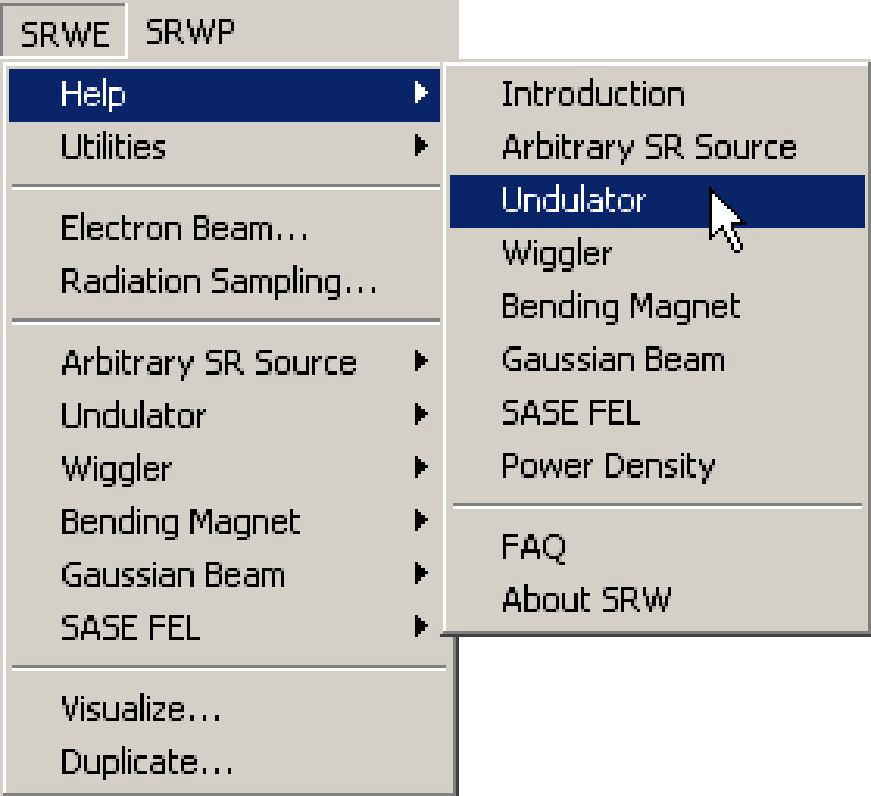
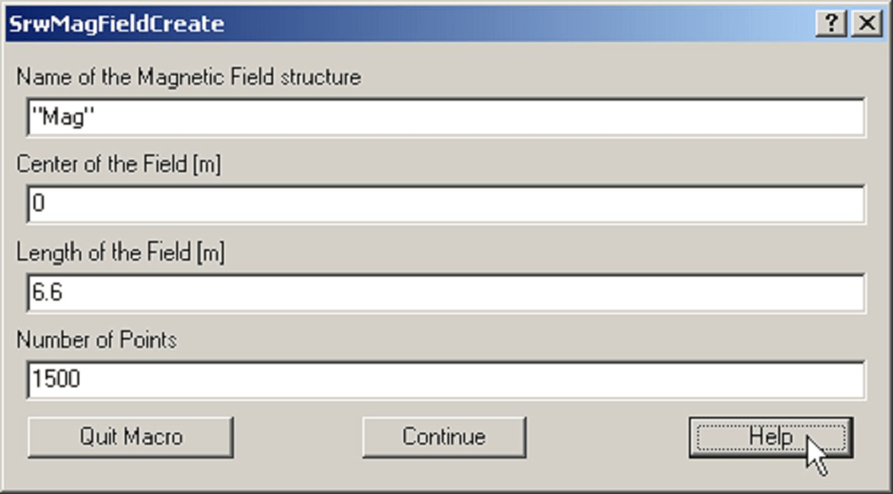

# **Introduction**
## **What SRW Can Do**
SRW is a set of tools dedicated to the computation of a number of features of Synchrotron
Radiation (SR). The present version of the SRW enables the following types of computation.

**Near Field computation of Synchrotron Radiation.** The radiation is generated by a filament
relativistic electron beam as it travels through an arbitrary magnetic field. It is observed in a
plane located at a fixed distance from the source as a function of the photon energy and
polarization. The broadening of the intensity profile induced by the non zero transverse
emittances is computed on request assuming that one can neglect the variations of the
magnetic field of the source as a function of the transverse coordinates.

**Propagation of the Near Field SR Wavefronts.** This is a more elaborated version of the near
field computation. It computes a whole wavefront of radiation and propagates it through any
combination of simple optical components such as thin lens, focusing mirrors, drift spaces,
diffracting apertures... It makes use of CPU efficient methods of Fourier optics. There is a
number of practical limitations to this approach. Therefore anyone interested in performing such
computations must read the section entitled "Wavefront Propagation" before starting.

**Fast computation of Undulator Radiation Spectra through a Slit for Finite-Emittance
Electron Beam.** Fast computation of Undulator Radiation Spectra through a Slit for Finite-Emittance
Electron Beam. The radiation is generated by an electron beam with non-zero transverse
emittance and energy spread travelling in a periodic magnetic field of an undulator. It is
collected at a long distance from the undulator within a rectangular slit (or a number of cells) of
arbitrary size. Spectra vs photon energy and transverse slit position can be computed. Ellipsoidal
undulators are supported.

**Computation of Spectral Angular Distributions of Wiggler Radiation.** Computation of Spectral Angular Distributions of Wiggler Radiation. The radiation is
generated by an electron beam with non-zero transverse emittance travelling in magnetic field
of arbitrary configuration, with the emission conditions corresponding to a wiggler case. Spectra
vs photon energy and flux per unit surface as a function of transverse position in an observation
plane can be computed.

**Computation of Power Density of Synchrotron Radiation.** Computation of Power Density of Synchrotron Radiation. The radiation is generated by an
electron beam with non-zero transverse emittance travelling in arbitrary magnetic field. Power
density distributions vs transverse coordinates integrated over all photon energies can be computed.

**Estimation of Brilliance** of undulator, wiggler and bending magnet sources.

**Simulation of Gaussion Beam Wavefronts.** One may use this type of calculation to simulate a
wavefront of a laser beam (at a desired polarization and mode order). After the wavefront is
created, it can be further propagated numerically using the methods of Fourier optics
implemented in the SRWP.

**CSR Computation** taking into account 6D phase space distribution of emitting relativistic
electrons.

**SASE Computation.** This type of computation allows to simulate Self-Amplified Spontaneous
Emission (SASE) in Free-Electron Lasers (FEL). In the current version, the implementation is
mainly based on the GENESIS 3D code developed at DESY by S.Reiche et. al. For better interoperation
with other parts of SRW, this FORTRAN code was converted (with minor
modifications) to C and re-compiled as a shared library.
The SASE computation in SRW is currently limited by numerical solution of the steady state
paraxial FEL equations at the approximation of slowly varying amplitude of the radiation field. If
electron beam and FEL undulator parameters, together with the wavelength of observed
radiation, are tuned properly, one can simulate the radiation wavefront amplification in the
undulator due to interaction with the electron beam. The wavefront (i.e. complex electric field)
obtained after this simulation, can be used for further manipulations / propagation through
optical elements using the methods of Fourier optics implemented in the SRWP.
## **System Requirements**
The current version of the SRW requires:
- PowerMac under MacOS 8.0 or later or a PC under Windows 95/NT 4.0 or later.
- At least 32 MB of RAM (propagation-related computation may require 64 MB or more).
- Igor Pro 3.1 or later from WaveMetrics ("http://www.wavemetrics.com").
- Patience.

The core part of the SRW is written in C++; the interface-related part is implemented in Igor Pro
macro language.
## **Organization**
SRW deals with a number of different structures which encapsulate the information related to a
particular object entering into the computation. For example, the electron beam characteristics
(energy, current, position, emittance...) are stored in an Electron Beam structure. All the
structures are numerical or text waves in the Igor language. The structures are created by some
macro commands that the user can invoke either by calling them from the menu "SRW..." or by
typing their text equivalents in the Command window. The following are few of the main SRW
structures:
- Electron Beam
- Magnetic Field
- Radiation Sampling
- Optical Component
- Wavefront

The SRW menu consists of two parts. In the part "SRWE" ("E" stands for "emission"),
spontaneous SR emission can be computed with no further propagation through any optical
components. In the part "SRWP" ("P" stands for "propagation") the SR can be computed in a
mode suitable for further propagation in terms of wave optics, and the SR propagation through various beamline components and drift spaces can be performed.

The SRW provides a set of examples illustrating any available mode of computation. Note that
even though one can run various examples from the "SRW" menu without any specific
knowledge of Igor, we strongly advise the user to get acquainted with the Igor before doing any
large-scale computation. Igor Pro comes with many tutorials which greatly help in this respect.
## **How to Get Help**
All the Help information for this version of SRW is concentrated in the "SRW Help.ifn" file. The
information is sorted by topics. Some topics can be accessed from the Help sub-menu of the
main SRW menu, for example:

Others are accessed by pressing the help button in any of the SRW dialog boxes, as in:
