# **Near Field Computation**

## **Introduction**
Most of currently available synchrotron radiation codes perform the computation in so-called Far
Field approximation. This approximation is suitable for the large majority of cases. However, it is
known that at long wavelengths, there can be important deviations between the Far Field
approximation and the more exact Near Field computation. The macro commands related to
this part of the SRW make the computation in the Near Field approximation (see the section
"Assumptions" below). We have applied some efforts to implement a CPU-efficient near-field
computation algorithm. As a result, there is no significant slow down in the near-field
computation as compared to the far-field. Note that the Far Field approximation of the radiation
can always be derived from the Near Field computation by moving the observation plane at a
very large distance from the source. One then needs to re-scale the range of observation to the
distance between the source and the observation plane.

The near-field computation of SRW essentially consists in computing the radiation produced by
an electron beam travelling through some magnetic field and observed in a plane located at
some distance from the source. The longitudinal axis is orthogonal to the observation plane and
passes through the origin of the source. The horizontal and vertical axes are orthogonal to the
longitudinal axis and to each other. The horizontal and vertical components of the magnetic field
are defined as arbitrary waveforms extending over some range of longitudinal coordinate. The
computation is made over a range of horizontal and vertical position (in the observation plane)
and a range of photon energy. The time needed to perform the computation is almost
proportional to the total number of points over the transverse positions and energy. For example,
if one wants to compute the radiation for 10 values of the horizontal coordinate, 10 values of the
vertical coordinate and 10 values of the photon energy, the CPU-time required will be 1000 that
of a single point computation. The result of the computation essentially contains the horizontal
and vertical components of the frequency-domain complex electric field for each point and
energy of observation, produced by a filament electron beam. It is kept in memory with a few
other pieces of information. A one- or two- or three-dimensional cut of the electric field data can
be made, converted into intensity of desired polarization and displayed in a window as a graph,
contour plot or graphical slicer. This can be done for the filament or "thick" (non-zero emittance)
electron beam.
## **Getting Started**
We assume that you have successfully installed the SRW on your computer, strictly following
the instructions in the "ReadMe.txt" file supplied with the distribution pack. Run Igor Pro. Menu
items "SRW..." should appear in the Igor Pro menu. Select the following sub-menu of SRW:

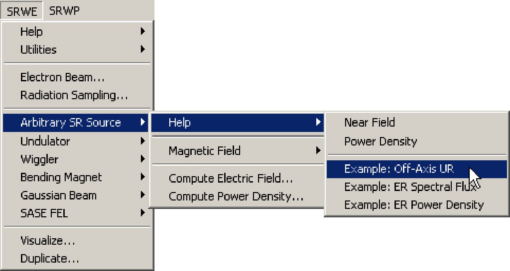

An example of computation will start. During the execution of the example, a window giving
some explanations on the content of the computation being made should appear on your
screen. Please read the explanations and make sure that everything goes as prescribed (you
can also find the text of the explanations in the section "Examples"). If everything goes well, at
the end of the computation you should obtain a set of graphs displaying the results, which
should fit the explanations.

If you have passed this step successfully, you are ready to perform your own computation.
## **Near Field Computation Step by Step**
The following are steps one typically needs to make in order to perform the Near Field SR
computation with SRW. Depending of particular goal, some of the steps may not be necessary,
others may require several iterations.

1) **Initialize** SRW.

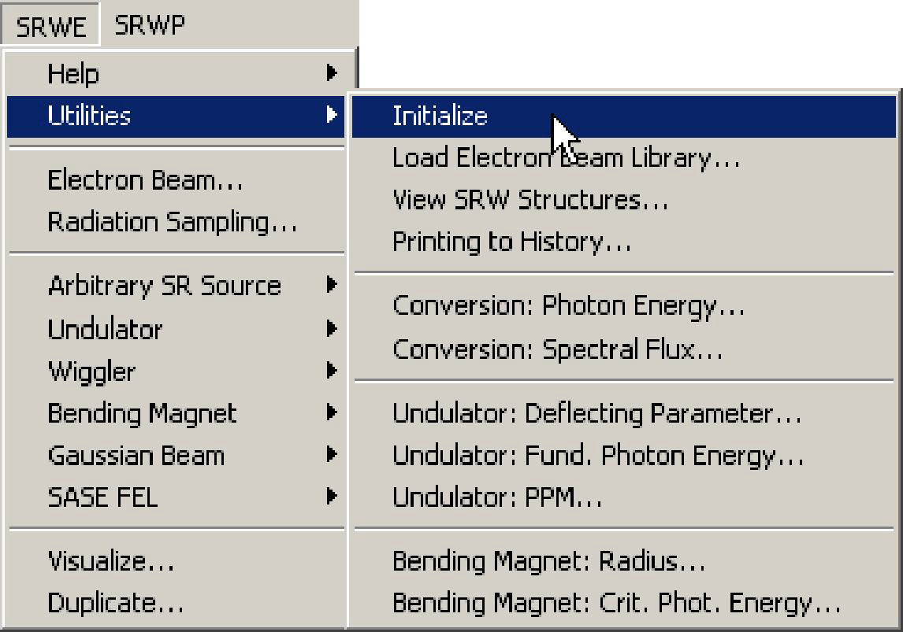

Normally, the initialization is executed automatically when you start Igor with the SRW installed.
However, if you may still need to execute it manually when starting a new "experiment", to
ensure that all SRW global variables are (re-)initialized to their default values. It is not
recommended to make more than one initialization in the same experiment.

2) Define **Electron Beam**.

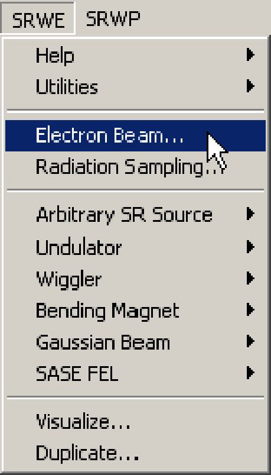

Here one defines all the parameters of the electron beam. See the Reference Manual records
for the dialog box "Electron Beam" and the macro commands **SrwElecFilament** and
**SrwElecThick**.

3) Define **Radiation Sampling**.

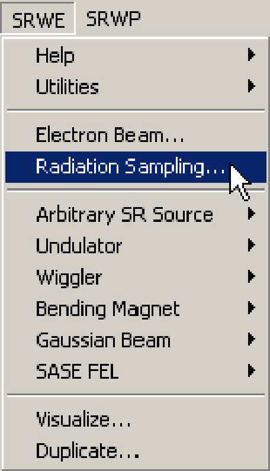

Here one defines the longitudinal position of the observation plane, ranges of transverse
positions and photon energy and number of points where the radiation will be computed. For
details on the Radiation Sampling definition, see the Reference Manual topic **Radiation
Sampling** and the records on the macro commands **SrwSmpCreate** and **SrwSmpScanXZE**.

4) Define **Magnetic Field**.

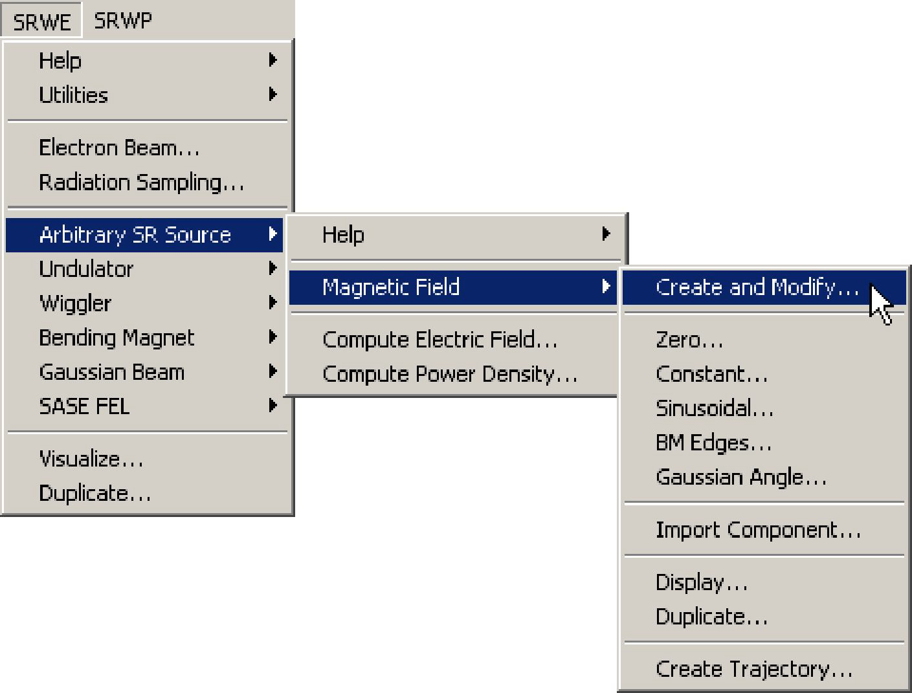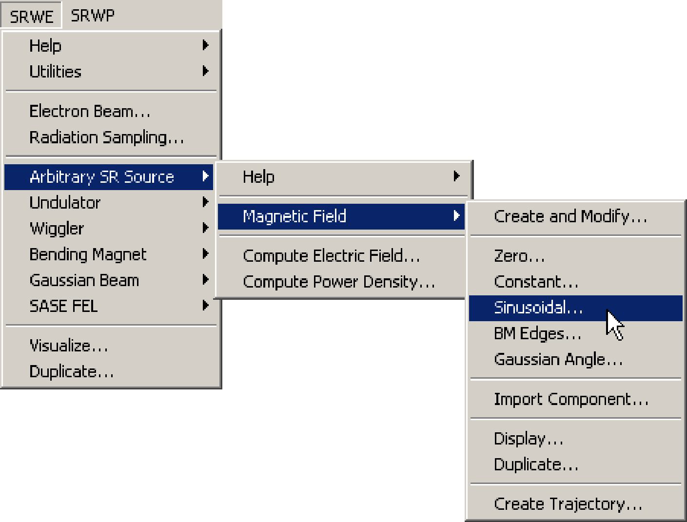

Here one defines all the parameters of the magnetic field. For details on the magnetic field
definition, see the Reference Manual records on the macro commands **SrwMagFieldCreate**,
**SrwMagZero**, **SrwMagConst**, **SrwMagSin**, **SrwMagEdge**, **SrwMagGsnAng**,
**SrwMagImportCmpn**, **SrwMagDisplayField**, **SrwMagElecTraj**, **SrwMagDupl**.

5) **Compute** the Near-Field SR Electric Field.

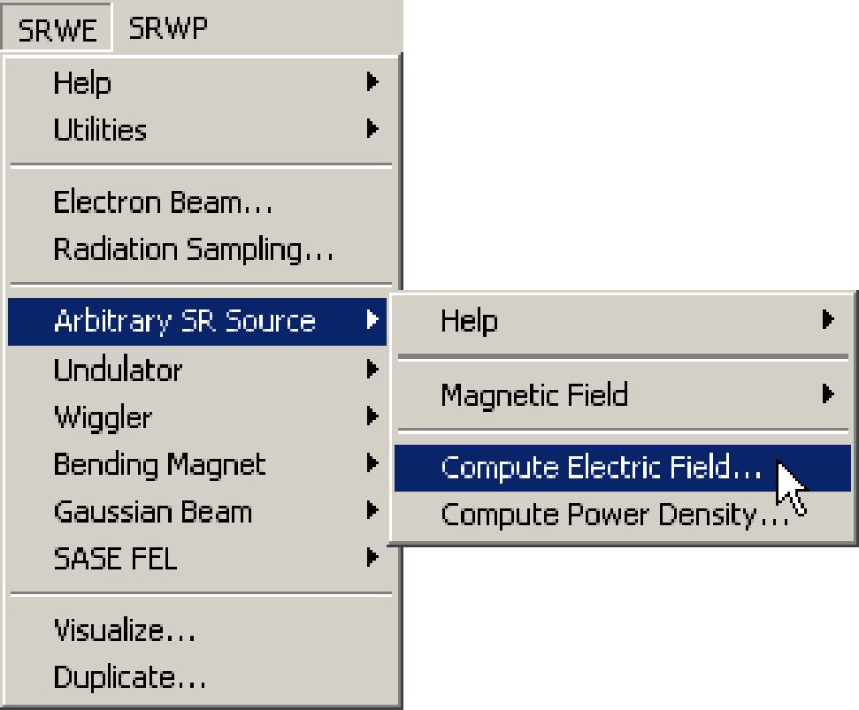

This is where the radiation is computed. It is the only place which may take significant CPU time
depending on the number of points defined in the Radiation Sampling structure. For details on
the Near Field SR computation, see the section "Near-Field SR Computation Method" in the
"Theoretical Notes", and the Reference Manual records for the dialog box "Compute Electric
Field" and the macro commands **SrwWfrCreate** and **SrwMagPrec**.

6) Visualize**** the computed SR component of interest.

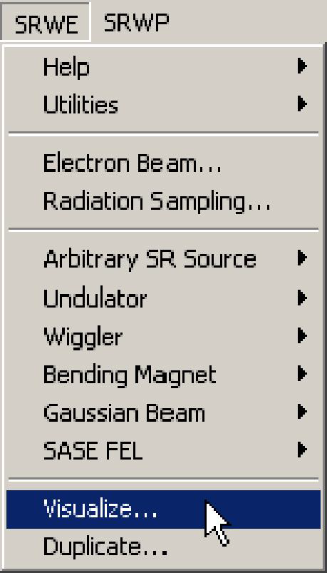

This is where one plots the data associated with a particular polarization. For details on options
of visualization of single-electron or multi-electron SR components see the Reference Manual
record for the dialog box "Visualize" and the macro command **SrwWfr2Int**.

**IMPORTANT**: It is important to make several cycles of computation with different values of the
integration precision parameters (dialog "Compute Electric Field"). The independence, at a
given precision level, of the computation results on the integration parameters is the necessary
condition for the validity of the results (however, it is not at all a sufficient condition...).

If you end up doing always the same kind of computation varying a few parameters each time,
you may find it cumbersome to select all the time the same menus. There are several
alternatives.
- The simplest one consists in re-executing the macros by copying them in the History window
and pasting them into the Command window. After pasting and before executing, you may want
to edit some parameters.

- You may group all the macro calls into your own macro. You can type your own macro directly
into the procedure window, yet this is not a recommended method because you must know the
text equivalent of each command and remember its list of arguments (that you can derive from
the Reference Manual section, by the way). A better method is to copy the macro command
calls one by one from the History window or from another macro. For this, you may want to have
a look and print a macro associated with one of examples included in SRW. You can access the
files containing the SRW examples from the menu "Windows" of Igor:

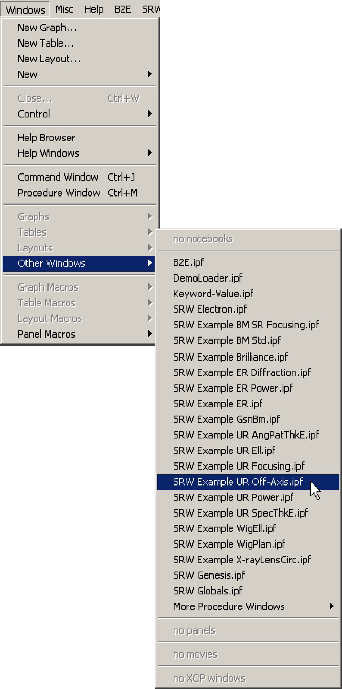

You may copy the whole macro of the SRW example into the Procedure window and modify it
for your convenience, but then do not forget to change its name (to avoid name conflict). Also, it
is recommended to replace the "proc" qualifier (at the beginning of the macro) by the "macro" in
such a way that you can call it directly from the "Macros" menu of Igor without typing its text
definition in the Command window.

## **Assumptions**
**I.** The following **assumptions** are made when computing the **Near Field SR**:
   * The electrons are relativistic.
   * Radiation from different electrons is incoherent.
   * Only transverse SR polarization components are considered.
   * Electron trajectory passes at a distance larger than at least several wavelengths from the
observation point.
   * The angle between the electron velocity and the direction to the observation point is (much)
smaller than 1 radian at any point of the electron trajectory.
   * SR emission is not affected by conductive walls of a vacuum chamber.
   * Diffraction effects on the vacuum chamber are neglected.
   
**II.** The following **assumptions** are made at the computation of the intensity distributions due to
**Non-zero Emittance Electron Beam**:
* The particle distribution in the electron beam is Gaussian over transverse positions and angles.
* Magnetic field is transversely uniform in the region where the SR is emitted.

## **Problems and Limitations**
The implemented method of the **Near Field SR** computation has the following **problems and
limitations**.

*Observation distance and wavelength.*   
This version does not treat separately the Electric and Magnetic fields of the radiation. Only
transverse components of the Electric field are actually considered. Such a consideration is valid
only if the electron trajectory passes at a distance from the observation point considerably larger
than the wavelength of the observed radiation. This requirement is easily satisfied in most of the
cases of SR extraction in high-energy storage rings, where the electron beam is deflected by a
bending magnet before the SR comes to a beamline. However, any treatment of the SR very
close to the electron beam should be done with due regard for this limitation.

*Consistency of the input data.*  
To get a correct result of the SR computation, one needs to input Magnetic Field versus
longitudinal position and Electron Beam parameters allowing explicit definition of the (average)
trajectory, to properly set up the Radiation Sampling and Mode of Integration. These
independent parameters should be consistent between each other.
For example, if one wants to compute the flux per unit surface produced at some photon energy
into some direction, one must provide the magnetic field defined over a sufficiently large
longitudinal range to allow the SR computation for the given direction. If this is not the case,
SRW may throw an error message asking to increase the range of definition of the magnetic
field.

## **Theoretical Notes**
1. **Near-Field SR Computation Method**  

To compute the Near Field SR in frequency domain, an approach based on retarded potentials
is applied. Starting from Fourier transformations of the retarded scalar and vector potentials, one
can easily get the following expression for the electric field of the radiation emitted by a
relativistic electron (Gaussian System): 

$$
\displaystyle \vec{E}=iek\int\limits_{-\infty}^{+\infty}[\vec{\beta}-\vec{n}[1+i(kR)^{-1}]]R^{-1}e^{ik(c\tau+R)}d\tau
$$

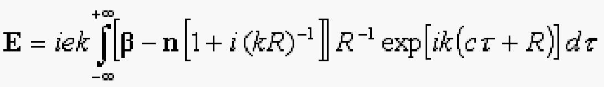

where $$k$$ is a wave number, $$\vec{\beta}$$ instant relative velocity of electron, $$\vec{n}$$ unit vector directed from
instant electron position to an observation point, $$R$$ distance from the electron to the observation
point, $$c$$ speed of light, e charge of electron. The integration is done over the time in laboratory
frame.

The electric field is computed in the code almost directly from the above formula, after a proper
phase expansion that preserves variation of R with the electron movement and allows to avoid
losses of precision in the phase (see paper: O.V.Chubar, Rew. Sci. Instrum., Vol. 66, No.2,
1995, pp. 1872-1874).

To ensure fast convergence of the above integral, semi-analytical treatment of its outer parts is
performed according to the following simplest asymptotic expansion:

$$
\displaystyle \int\limits_{-\infty}^{+\infty}Fe^{i\Phi}ds = \int\limits_{s_1}^{s_2}Fe^{i\Phi}ds + \int\limits_{-\infty}^{s_1}Fe^{i\Phi}ds + \int\limits_{s_2}^{+\infty}Fe^{i\Phi}ds
$$

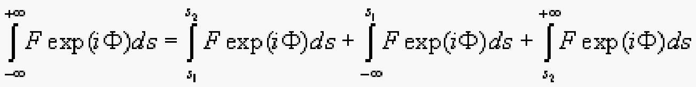

$$
\displaystyle \int\limits_{-\infty}^{s_1}Fe^{i\Phi}ds + \int\limits_{s_2}^{+\infty}Fe^{i\Phi}ds \approx\left[\left(\frac{F}{i\Phi'} + \frac{F'\Phi'-F\Phi{''}}{\Phi^{'3}}\right)e^{i\Phi}\right]_{s_2}^{s_1}
$$

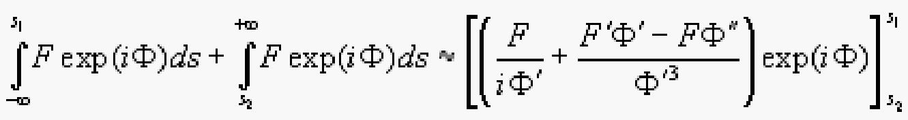

This allows to compute numerically only the integral between some values of the longitudinal
position $$s_1$$ and $$s_2$$. These values are chosen in such a way that the interval $$[s_1,s_2]$$ is as small as
possible yet still satisfies the requirement that the second term of the asymptotic expansion is
essentially smaller than the first one.

It can be shown analytically, that for a non-zero frequency, the method based or the retarded
potentials is equivalent to a more widely used one which treats separately the acceleration and
velocity fields (J.D. Jackson, Classical Electrodynamics, 2nd. ed., New York: Wiley, 1975, p.
657). We have also tested this numerically on a number of cases. We believe that for numerical
calculations, the method based on the retarded potentials has more advantages.

2. **Thick Electron Beam**  

The previous section treats the single-electron emission. This section describes how a non-zero
emittance of electron beam is taken into account in the Near Field computation.

The SR intensity distribution corresponding to electron beam with non-zero transverse emittance
is computed in the code by making a 2D convolution over horizontal and vertical coordinates of
the single-electron intensity distribution, with a 2D Gaussian. The RMS of this Gaussian are
given by the electron beam sizes propagated to the observation plane, using the rules of the
second-order moments propagation.

Let $$\varepsilon_x$$ and $$\delta E$$ be horizontal emittance and relative energy spread of the electron beam. Then
the second-order central moments of particle distribution in the beam can be readily computed
at any longitudinal position from the values of lattice functions (alpha, beta, dispersion
function and its derivative) at that position:

$$ 
  \begin{cases}
    \langle(x-\langle x\rangle)^2\rangle = \sigma_x^2 = \varepsilon_x\beta_x + \delta E^2\eta_x^2\\
    \langle(x-\langle x\rangle)(x'-\langle x'\rangle)\rangle = -\varepsilon_x\alpha_x + \delta E^2 \eta_x\eta{'}_x\\
    \langle(x'-\langle x'\rangle)^2\rangle = \sigma_{x'}^2 = \varepsilon_x(1+\alpha_x^2)/\beta_x + \delta E^2\eta{'}_x^2
  \end{cases}
$$

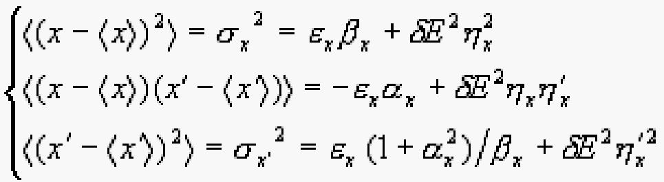

Let $$T$$ be a $$3\times3$$ matrix describing the transformation of the (horizontal) second-order moments
from the source point to the observation plane. The RMS of the Gaussian used in the
convolution with the single-electron intensity $$\langle(x-\langle x\rangle)^?\rangle_p$$ (**this notation is not clear in the original SRW_Help.pdf file.**) is obtained from the matrix relation:

$$
  \begin{bmatrix}
  \langle(x-\langle x\rangle)^2\rangle_p\\
  \langle(x-\langle x\rangle)(x'-\langle x'\rangle)\rangle_p\\
  \langle(x'-\langle x'\rangle)^2\rangle_p
  \end{bmatrix}
  =T
    \begin{bmatrix}
  \langle(x-\langle x\rangle)^2\rangle_p\\
  \langle(x-\langle x\rangle)(x'-\langle x'\rangle)\rangle_p\\
  \langle(x'-\langle x'\rangle)^2\rangle_p
  \end{bmatrix}
$$

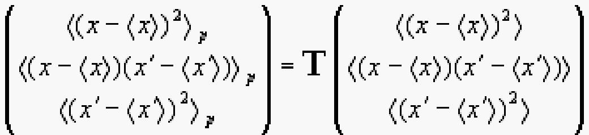

The vertical moments are treated similarly, with the only difference that the vertical dispersion is
neglected.  
This treatment of non-zero transverse emittance of electron beam is valid within the assumption
of a transversely uniform magnetic field in the region where the SR is emitted. This assumption
is met in most of the SR sources. However there are cases, such as SR produced in a
quadrupole, which cannot be computed in this manner.

## **Examples**

1. **Near-Field Edge Radiation**  
This example illustrates the simplest near-field SR computation. It gives the Spectral Flux per
unit surface (intensity) of the Edge Radiation at 0.7 m from downstream bending magnet edge
at 12.4 μm wavelength for the parameters of the SOLEIL ring, in assumption of a filament
electron beam. The intensity vs horizontal coordinate, the magnetic field and beam trajectory
are displayed in graphs.
2. **Off-Axis Undulator Radiation**  
This example computes several spectra produced by a filament electron beam of ESRF (6 GeV,
200 mA) injected through a U35 undulator (46.5 periods of 35 mm, peak field of 0.7 T), and
observed at a distance of 30 m from the undulator in the photon energy range between 11 and
14 keV corresponding to the 5-th harmonic. The spectra are computed on the electron beam
axis and with a vertical displacement of 1, 1.5 and 2 mm away from the on-axis position. As
expected, the photon energy of the harmonic peak is displaced towards lower energies. Another
feature appears, namely the shape of the peaks changes and becomes significantly broader as
one observes the radiation away from the axis. This is a typical case when the radiation
computed in the near field differs from the far field approximation.
The peculiarities of the near-field undulator radiation were described in the paper: R.P.Walker,
Nucl. Instr. and Meth., A267 (1988), pp. 537-546.

3. **Polarization of Bending Magnet Synchrotron Radiation**  
This example computes electric field of standard bending magnet synchrotron for the
parameters of SOLEIL (E = 2.75 GeV, I = 0.5 A) and shows spectral flux per unit surface at
different polarizations.

 

