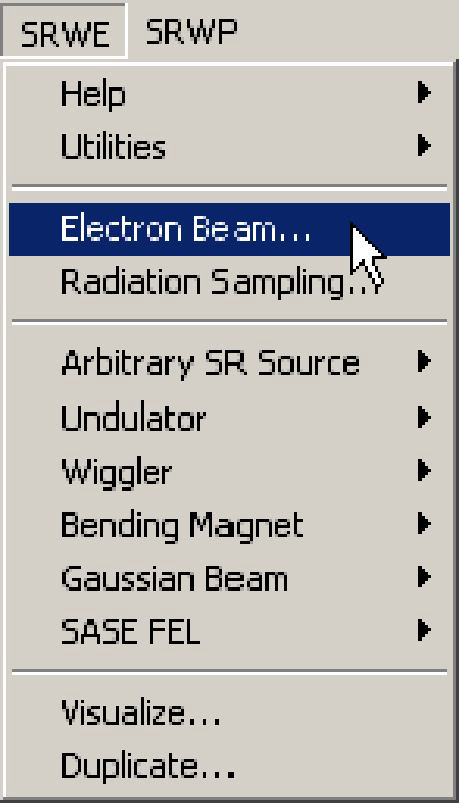

# **Fast Computation of Undulator Radiation Spectra through a Slit**

## **Introduction**
This part of SRW treats undulator radiation emitted by an electron beam with non-zero
emittance and energy spread in a periodic magnetic field and observed through some kind of
rectangular aperture. The typical computation is a spectrum integrated through a slit or an
image of the radiation pattern observed at a single energy at some distance from the source.
The computation is performed in far-field approximation. This type of computation is probably
less accurate than the near-field computation. Its main advantage is speed.
## **Getting Started**
We assume that you have successfully installed the SRW on your computer, following the
instructions in the "ReadMe.txt" file supplied with the distribution pack. Run Igor Pro. Menu items
"SRW..." should appear in the Igor Pro menu. Select the sub-menu SRWE: "Undulator
Examples" and choose a computation example of your interest. During the execution of the
example, a window giving some explanations on the content of the computation being made should appear on your screen. Please read the explanations and make sure that everything
goes as prescribed (you can also find the text of the explanations in section "Examples"). If
everything goes well, at the end of the computation you should obtain a (set of) graph(s)
displaying the results, which should fit the explanations.

If you have passed this step successfully, you are ready to perform your own computation.
## **Computation of Undulator Radiation Spectra through a Slit Step by Step**

The following are the steps one needs to make in order to perform the computation of the
undulator radiation.
1. Initialize SRW.

In any Igor experiment, the initialization should be done only once, before you start to work with
the SRW. It is not recommended to make more than one initialization in the same experiment.It is not
recommended to make more than one initialization in the same experiment.

2. Define Electron Beam.

Here one defines all the parameters of the electron beam. See the Reference Manual records
for the dialog box "Electron Beam" and the macro commands **SrwElecFilament** and
**SrwElecThick**for details. It is important to properly set up both "filament" and "thick" beam
parameters for this mode of computation.

3. Define Radiation Sampling.

Here one defines the longitudinal position of the observation plane, ranges of transverse
positions and photon energy and number of points where the radiation will be computed. For
details on the Radiation Sampling definition, see the Reference Manual topic **Radiation**
Sampling and the records on the macro commands **SrwSmpCreate** and **SrwSmpScanXZE**.
Please note that for this method of computation, the Radiation Sampling parameters have
slightly different meaning compared to the other methods implemented in SRW, since this mode
of computation produces Spectral Flux integrated within a slit, while most of the other methods
in SRW produce Spectral Flux per Unit Surface (or the electric field from which the Spectral Flux
per Unit Surface can be deduced). The details of these differences can be found in the
Reference Manual record for the macro command **SrwPerStoCreate** (menu call "SRWE ->
Undulator -> Compute Stokes...").

4. Define Periodic Magnetic Field.

Here one sets up all parameters of the periodic magnetic field. For details on the magnetic field
definition, see the Reference Manual records for the dialog box "Periodic Magnetic Field" and
macro commands **SrwMagPerCreate2D**, **SrwMagPerAddHarm**, **SrwMagPerPPMUndField**.

5. **Compute** UR spectrum through a slit.

This is where the radiation is computed. For details on the computation, see the sections
"Assumptions", "Problems and Limitations", "Theoretical Notes" below and the Reference
Manual record on the macro command **SrwPerStoCreate**.

6. **Visualize** the UR component of interest.

This is where one plots the data associated with a particular polarization. For details on options of visualization of the UR spectra and intensity distributions see the Reference Manual record for the dialog box "Visualize" and the macro command SrwSto2Int.

**IMPORTANT**: It is important to make several cycles of computation with different values of precision parameters (macro SrwPerStoCreate). The independence, at a given precision level, of the computation results on the precision parameters is the necessary validity condition for the results (however, it is not at all a sufficient condition...).

If you end up doing always the same kind of computation varying a few parameters each time, you may find it cumbersome to select all the time the same menus. There are several alternatives.

- The simplest one consists in re-executing the macros by copying them in the History window and pasting them into the Command window. After pasting and before executing, you may want to edit some parameters.

- You may group all the macro calls into your own macro. You can type your own macro directly into the procedure window, yet this is not a recommended method because you must know the text equivalent of each command and remember its list of arguments (that you can derive from the Reference Manual section, by the way). A better method is to copy the macro command calls one by one from the History window or from another macro. For this, you may want to have a look and print a macro associated with one of examples included in SRW. You can access the files containing the SRW examples from the menu "Windows" of Igor. You may copy the whole macro of an SRW example into the Procedure window and modify it for your convenience, but then do not forget to change its name (to avoid name conflict). Also, it is recommended to replace the "proc" qualifier (at the beginning of the macro) by the "macro" in such a way that you can call it directly from the "Macros" menu of Igor without typing its text definition in the Command window.
## Assumptions
The following **assumptions** are made when computing the **UR Spectra through a Slit**:
- Electrons are relativistic.
- Radiation from different electrons is incoherent: the flux is proportional to the number of
electrons.
- Only transverse SR polarization components are considered.
- Distance from undulator to observation plane is considerably larger than the length of the
undulator.
- Number of periods in the undulator is significantly larger than 1.
- The effect of terminating poles of the undulator is neglected.
- Angle between electron velocity and direction to the observation point is comparable with the
angular size of central cone of the undulator radiation.
- SR emission is not affected by conductive walls of a vacuum chamber.
- Diffraction effects on the vacuum chamber are neglected.

## **Problems and Limitations**
The implemented computation method of **UR Spectra through a Slit** has the following
**problems and limitations**.
Number of Periods.
The computation method implemented is valid at $$1 \ll N_{per} \le +\infty$$, where Nper is the
number of periods. The smaller is $$N_{per}$$, the less precise is the computation.
Observation Angles and Distance from Undulator.
Basically, the implemented method is the Far-Field SR computation method. Therefore it can
not give a high precision at small distances or large observation angles, especially at small
electron beam emittance values. Peculiarities of the Near-Field undulator radiation were
discussed in the paper: R.P.Walker, Nucl. Instr. and Meth., A267 (1988), pp. 537-546.

## **Theoretical Notes**
* **Computation of UR Spectra through a Slit for a Finite-Emittance Electron Beam**

Consider a non-zero emittance ("thick") electron beam travelling in a finite-length undulator and
emitting the radiation which is collected within a rectangular slit (aperture) at a large distance
from the undulator.

For a photon energy range around the resonant energy value of a given harmonic for a given
observation direction, the radiation from a finite-length undulator and a "thick" e-beam can be represented with a reasonable precision as a convolution of a spectrum resulting from an
infinitely long undulator with a resonant $$(\sin x)^2/x^2$$ function describing the shape of harmonic
for the case of finite-length undulator and zero-emittance electron beam.

So the computation is done in two steps in SRW. First, the spectrum for the infinite-length
undulator and finite transverse emittance (but zero energy spread) of electron beam is
computed. After that, a convolution is performed in order to take into account the finite number
of periods of the undulator and finite energy spread of the electron beam.
## **Examples**
* **UR Spectrum through a Slit**

This example computes Spectral Flux through a slit vs photon energy for the finite-emittance
electron beam of ESRF (energy 6 GeV, current 200 mA, horizontal and vertical emittances 3.9
nm and 0.039 nm, beta functions 35.6 m and 2.5 m, rms energy spread 0.1%), injected through
an undulator (total length 3.2 m, period 35 mm, deflection parameter 2.2). The 0.5 mm x 0.5
mm rectangular slit is located at 30 m distance from the undulator, with its center on the
undulator axis. Due to finite beam emittance and slit size, the on-axis spectrum possesses both
even and odd harmonics. The shapes of the harmonics strongly differ from the single-electron
shape.  

* **UR Angular Pattern**

This example computes undulator radiation Spectral Flux per Unit Surface produced by finiteemittance
electron beam of ESRF (energy 6 GeV, current 200 mA, horizontal and vertical
emittances 3.9 nm and 0.039 nm, beta functions 35.6 m and 2.5 m, rms energy spread 0.1%),
injected through an undulator (total length 3.2 m, period 35 mm, deflection parameter 2.2), and
by a filament electron beam. The radiation is observed in transverse plane at 30 m distance
from the undulator. The photon energy is 13.5 keV, which is between resonant values of
harmonics 4 and 5 of the on-axis spectrum. In the image plots, the contributions from harmonics
5 and 6 are well seen. The harmonics with lower numbers (1 - 4) make no contributions to the
observed intensity distributions. Since horizontal emittance of the real electron beam is
considerably larger than the vertical emittance, the "undulator rings" are stronger smoothed-off
horizontally than vertically.

To reduce the CPU time, the computation in this example is performed in the mode of "infinite"
undulator, with the intensity normalized to that of the real 3.2 m length undulator. One can make
the same computation in the mode of "conventional" undulator (see Reference Manual record
for the macro **SrwPerStoCreate**). This will significantly enlarge the computation time, yet will
bring-in almost no changes to the plots. Stronger differences in the cases of "infinite" and a finitelength
undulator may appear for the values of photon energy in a small region slightly higher
than on-axis resonant value of an odd harmonic.

* **Ellipsoidal Undulator**

This example computes Spectral Flux through a slit vs photon energy for the finite-emittance
electron beam of ESRF (energy 6 GeV, current 200 mA, horizontal and vertical emittances 3.9
nm and 0.039 nm, beta functions 35.6 m and 2.5 m, rms energy spread 0.1%), injected through
an Ellipsoidal Undulator (total length 3.2 m, period 42 mm, deflection parameters: $$K_z=2$$, $$K_x=1$$). The 0.5 mm x 0.5 mm rectangular slit is located at 30 m distance from the undulator, with its
center on the undulator axis. The radiation is generally circularly polarized. Note the presence of
circularly polarized on-axis emission at higher harmonics. The image plot of the Power Density
distribution illustrates small heat load in the on-axis direction.

* **Brilliance at ESRF**

This example estimates the brilliance of undulator radiation source at ESRF (U42 undulator,
electron beam energy 6 GeV, current 200 mA, horizontal and vertical emittances 3.9 nm and
0.039 nm, beta functions 35.6 m and 2.5 m, rms energy spread 0.1%). The computation is only
done on the odd harmonics of the spectrum. The brilliance at any photon energy is computed
for particular deflection parameter value which makes the energy of the selected harmonics to
coincide with the photon energy of interest. This corresponds to a continuous gap change
(current change in coils) for a permanent magnet (electro-magnet) undulator.
 

 

