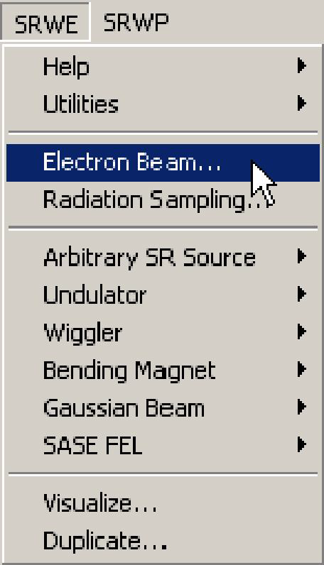
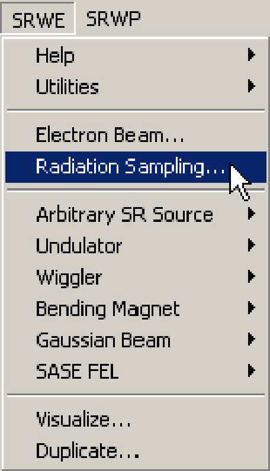
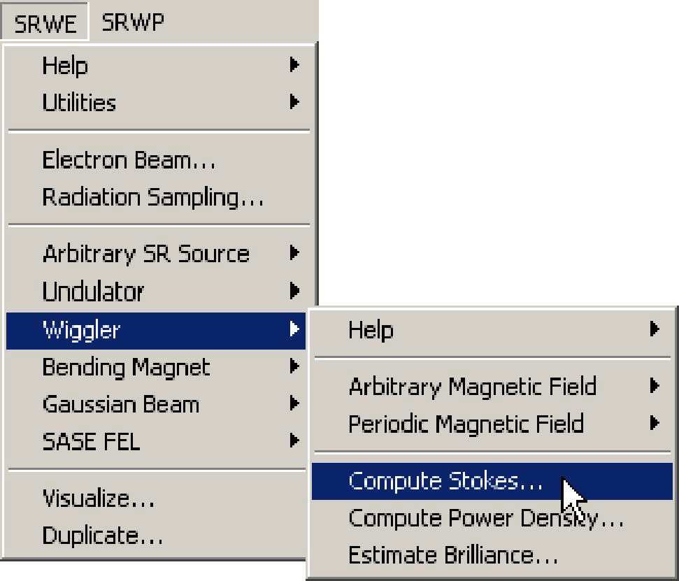
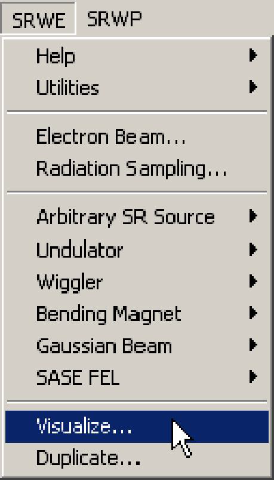

# **Computation of Wiggler Radiation**

## **Introduction**
This part of SRW computes spectral flux per unit surface of radiation emitted by an electron
beam with non-zero emittance in a wiggler. Typical computation is a spectral flux per unit
surface at fixed photon energy in a transverse plane at some distance from the wiggler, or a
spectrum vs photon energy at fixed direction (observation point).

## **Getting Started**

We assume that you have successfully installed the SRW on your computer, following the
instructions in the "ReadMe.txt" file supplied with the distribution pack. Run Igor Pro. Menu
item(s) "SRW..." should appear in the Igor Pro menu. Select the sub-menu "Wiggler\-\>
Examples" and choose a computation example of your interest. During the execution of the
example, a window giving some explanations on the content of the computation being made
should appear on your screen. Please read the explanations and make sure that everything
goes as prescribed (you can also find the text of the explanations in section "Examples"). If
everything goes well, at the end of the computation you should obtain a (set of) graph(s)
displaying the results, which should fit the explanations.

If you have passed this step successfully, you are ready to perform your own computation.

## **Computation of Wiggler Radiation Step by Step**
The following are the steps one needs to make in order to perform the computation of spectral
angular distributions of wiggler radiation.
1) **Initialize** SRW.

In any Igor experiment, the initialization should be done only once, before you start to work with
the SRW. It is not recommended to make more than one initialization in the same experiment.

2) Define **Electron Beam**.

Here one defines all the parameters of the electron beam. See the Reference Manual records
for the dialog box "Electron Beam" and the macro commands **SrwElecFilament** and
**SrwElecThick** for details. It is important to properly set up both "filament" and "thick" beam
parameters for this mode of computation.

3) Define **Radiation Sampling**.

Here one defines the longitudinal position of the observation plane, ranges of transverse
positions and number of points where the radiation will be computed. For details on the
Radiation Sampling definition, see the Reference Manual topic **Radiation Sampling** and the
records on the macro commands **SrwSmpCreate** and **SrwSmpScanXZE**.

4) Define Arbitrary or Periodic **Magnetic Field**.

Here one sets up all parameters of the arbitrary or periodic magnetic field. For details on the
magnetic field definition, see the Reference Manual records on macro commands
**SrwMagFieldCreate**, **SrwMagZero**, **SrwMagConst**, **SrwMagSin**, **SrwMagEdge**,
**SrwMagGsnAng**, **SrwMagImportCmpn**, **SrwMagPerCreate2D**, **SrwMagPerAddHarm**.

5) **Compute** Stokes components of Spectral Flux per Unit Surface of wiggler radiation.

This is where the radiation is computed. For details on the computation, see the section
"Assumptions" and the Reference Manual records on the macro command **SrwStoWigCreate**.

6) **Visualize** the SR component of interest.

This is where one plots the data associated with a particular polarization. For details on options
of visualization of the wiggler radiation spectra and intensity distributions see the Reference
Manual record for the dialog box "Visualize" and the macro command **SrwSto2Int**.

**IMPORTANT**: It is important to make several cycles of computation with different values of
precision parameter (macro **SrwStoWigCreate**). The independence, at a given precision level,
of the computation results on the precision parameter is the necessary validity condition for the
results (however, it is not at all a sufficient condition...).
## Assumptions
The following **assumptions** are made when computing spectral angular distributions of **Wiggler
Radiation**:
- Electrons are relativistic.
- Radiation from different electrons is incoherent: the flux is proportional to the number of
electrons.
- Only transverse SR polarization components are considered.
- **Emission conditions correspond to a wiggler case**, i.e. radiation is generally emitted from
distinct separate parts of electron trajectory, and phase shifts of the radiation between these
trajectory parts is much larger than Pi.

## **Examples**
* **Planar Wiggler**

This example computes spectral flux per unit surface of synchrotron radiation emitted by a nonzero
emittance electron beam in a planar wiggler ($$B_{max} = 1.8$$ T, 3 periods of 150 mm length).
The effect of the wiggler terminations is taken into account. The electron beam parameters are
those of ESRF (energy 6 GeV, current 200 mA, horizontal and vertical emittances 3.9 nm and
0.039 nm, beta functions 35.6 m and 2.5 m).

* **Ellipsoidal Wiggler**

This example computes spectral flux per unit surface of synchrotron radiation emitted by a nonzero
emittance electron beam in an ellipsoidal wiggler ($$K_z=20$$, $$K_x=1.2$$, 3 periods of 150 mm
length). The effect of the wiggler terminations is NOT taken into account. The electron beam
parameters are those of ESRF (energy 6 GeV, current 200 mA, horizontal and vertical
emittances 3.9 nm and 0.039 nm, beta functions 35.6 m and 2.5 m).
