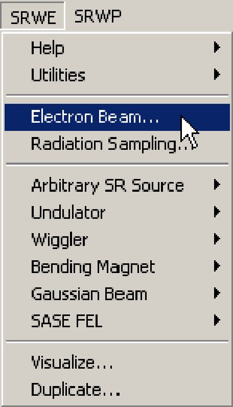
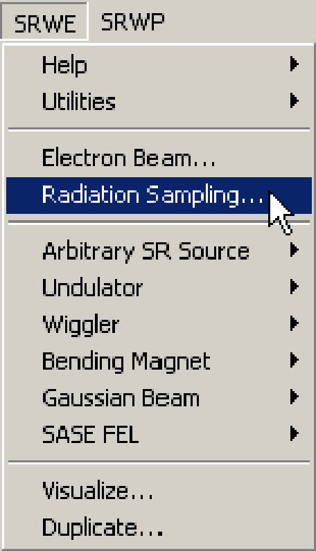
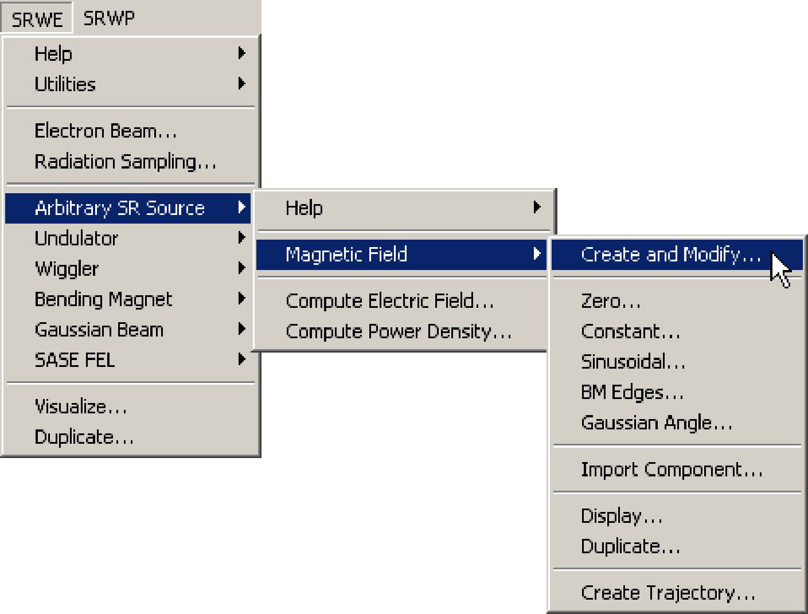
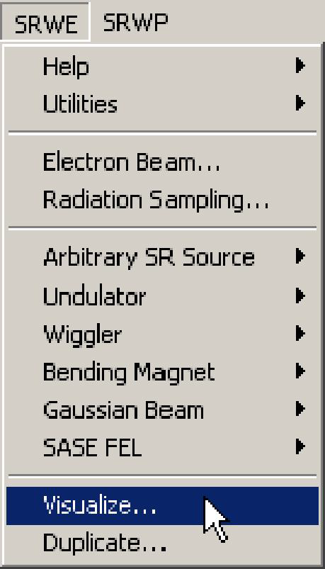

# **Computation of SR Power Density**

## **Introduction**
This part of SRW computes power density integrated over all photon energies for synchrotron
radiation emitted by an electron beam with non-zero emittance in arbitrary magnetic field.
Typical computation is power density distribution (heat load) in a transverse plane located at
some distance from the SR emission region.

## **Getting Started**

We assume that you have successfully installed the SRW on your computer, following the
instructions in the "ReadMe.txt" file supplied with the distribution package. Run Igor Pro. Menu
items "SRW..." should appear in the Igor menu. Select in one of the SRW sub-menus an
example dedicated to the power density computation. During the execution of the example, a
window giving some explanations on the content of the computation being made should appear
on your screen. Please read the explanations and make sure that everything goes as prescribed
(you can also find the text of the explanations in section "Examples"). If everything goes well, at
the end of the computation you should obtain a (set of) graph(s) displaying the results, which
should fit the explanations.

If you have passed this step successfully, you are ready to perform your own computation.

## **Computation of SR Power Density Step by Step**

The following are steps one needs to make in order to perform the computation of SR power
density from Arbitrary Magnetic Field source. For particular Undulator, Wiggler and Bending
Magnet sources the computation of the power density should be done by direct analogy.

1) **Initialize** SRW.

In any Igor experiment, the initialization should be done only once, before you start to work with
the SRW. It is not recommended to make more than one initialization in the same experiment.

2) Define **Electron Beam**.

Here one defines all the parameters of the electron beam. See the Reference Manual records
for the dialog box "Electron Beam" and the macro commands **SrwElecFilament** and
**SrwElecThick** for details. It is important to properly set up both "filament" and "thick" beam
parameters for this mode of computation.

3) Define **Radiation Sampling**.

Here one defines the longitudinal position of the observation plane, ranges of transverse
positions and number of points where the radiation will be computed. For details on the
Radiation Sampling definition, see the Reference Manual topic **Radiation Sampling** and the
records on the macro commands **SrwSmpCreate** and **SrwSmpScanXZE**.

4) Define Arbitrary or Periodic **Magnetic Field**.

Here one sets up all parameters of the arbitrary or periodic magnetic field. For details on the
magnetic field definition, see the Reference Manual records on macro commands
**SrwMagFieldCreate**, **SrwMagZero**, **SrwMagConst**, **SrwMagSin**, **SrwMagEdge**,
**SrwMagGsnAng**, **SrwMagImportCmpn**, **SrwMagPerCreate2D**, **SrwMagPerAddHarm**.

5) **Compute** SR Power Density.

This is where the radiation is computed. For details of the computation, see the sections
"Assumptions", "Problems and Limitations", "Theoretical Notes" below and the Reference
Manual records on the macro command **SrwPowCreate**.

6) **Visualize** the SR component of interest.

This is where one plots the data on computed power density. We note that the power density
computation results can be also plotted immediately after the computation by the macro
**SrwPowCreate** (see the Reference Manual record for that macro).

**IMPORTANT**: It is important to make several cycles of computation with different values of
precision parameter (macro **SrwStoWigCreate**). The independence, at a given precision level,
of the computation results on the precision parameter is the necessary validity condition for the
results (however, it is not at all a sufficient condition...).

## **Assumptions**

The following **assumptions** are made when computing the **SR Power Density**:

- Electrons are relativistic.
- Radiation from different electrons is incoherent: the flux is proportional to the number of
electrons.

## **Examples**
* **UR Power Density**

This example computes the SR power per unit surface produced by finite-emittance electron
beam of ESRF (energy 6 GeV, current 200 mA, horizontal and vertical emittances 3.9 nm and
0.039 nm, beta functions 35.6 m and 2.5 m), injected through a planar undulator (total length
3.2 m, period 35 mm, deflection parameter 2.2). The observation plane is located at 30 m
distance from the undulator. The units of the computed power density are W/mm^2.

* **ER Power Density**

This example computes power density distribution of SR emitted by electron beam (energy 2.5
GeV, current 200 mA, horizontal and vertical emittances 20 nm and 0.2 nm) in the fringe
magnetic fields of bending magnet edges bounding a 6 m long straight section. The observation
plane is located at 20 m from the middle of the straight section.
