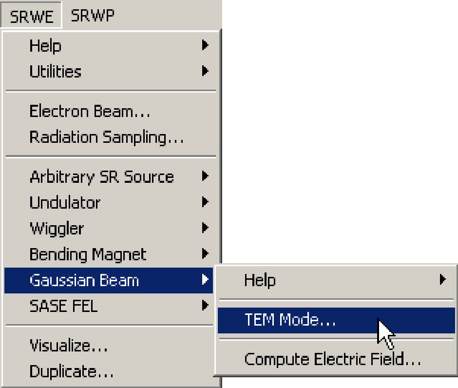
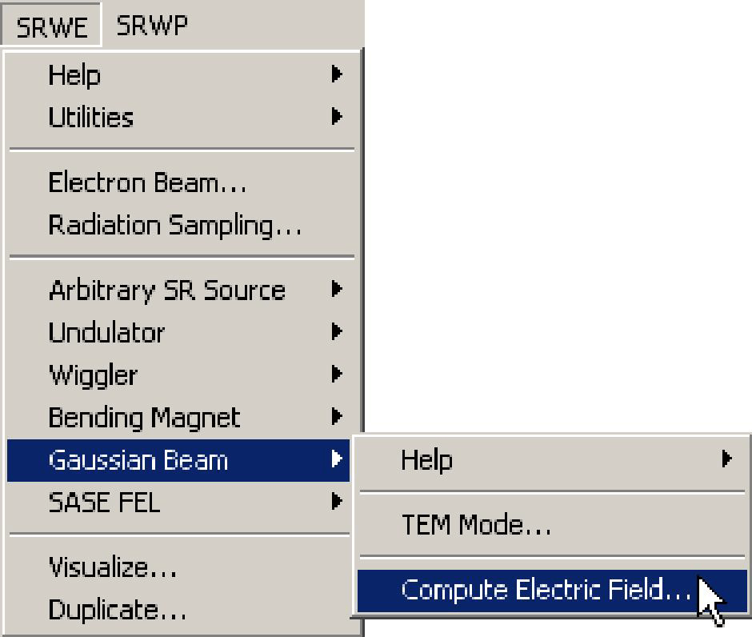

# **Gaussian Beam**

## **Introduction**
One can use this approximation for preliminary simulations of radiation sources other than
synchrotrons / storage rings, e.g. conventional lasers and FELs.

## **Gaussian Beam Computation Step by Step**
The following are the steps one needs to make in order to perform the computation of spectral
angular distributions of wiggler radiation.
1) **Initialize** SRW.

2) Define **Electron Beam**.

In this type of computation, the Electron Beam structure is used to define initial average
transverse positions and angles of the Gaussian beam.

3) Define **Radiation Sampling**.

Here one defines the longitudinal position of the observation plane, ranges of transverse
positions and number of points where the radiation will be computed. For details on the
Radiation Sampling definition, see the Reference Manual topic **Radiation Sampling** and the
records on the macro commands **SrwSmpCreate** and **SrwSmpScanXZE**.

4) Define parameters of the **Gaussian Beam** mode.

See Reference Manual record on the macro **SrwGsnBeam** for details.

5) **Compute** Gaussian Beam wavefront.

See Reference Manual record on the macro **SrwGsnBeamCreate** for details.

6) **Visualize** the computed wavefront component of interest.

## **Examples**
* **Gaussian Beam Definition and Propagation**

- This is a simple illustration of initial computation and propagation of a Gaussian wavefront.
First, a "Gaussian beam" source (10 μm RMS diameter of the waist) is created, and the initial
wavefront (12.4 keV photon energy) is calculated analytically at 20 m from the source.
- Next, the wavefront is propagated numerically through 300 m long drift space. The propagation
is performed in "automatic" mode, so that the code attempts to steer automatically transverse
range and resolution of the propagated wavefront (the final resolution is such that the wavefront
is suitable for further propagation).
- After this, another wavefront is computed analytically at 320 m from the source and is
compared with the wavefront propagated numerically. Small differences between the numerical
and analytical results can be seen only in logarithmic scale.
- Note that numerical wavefront propagation allows to simulate effects of apertures and various optical elements and is not at all limited by the case of Gaussian beam.
