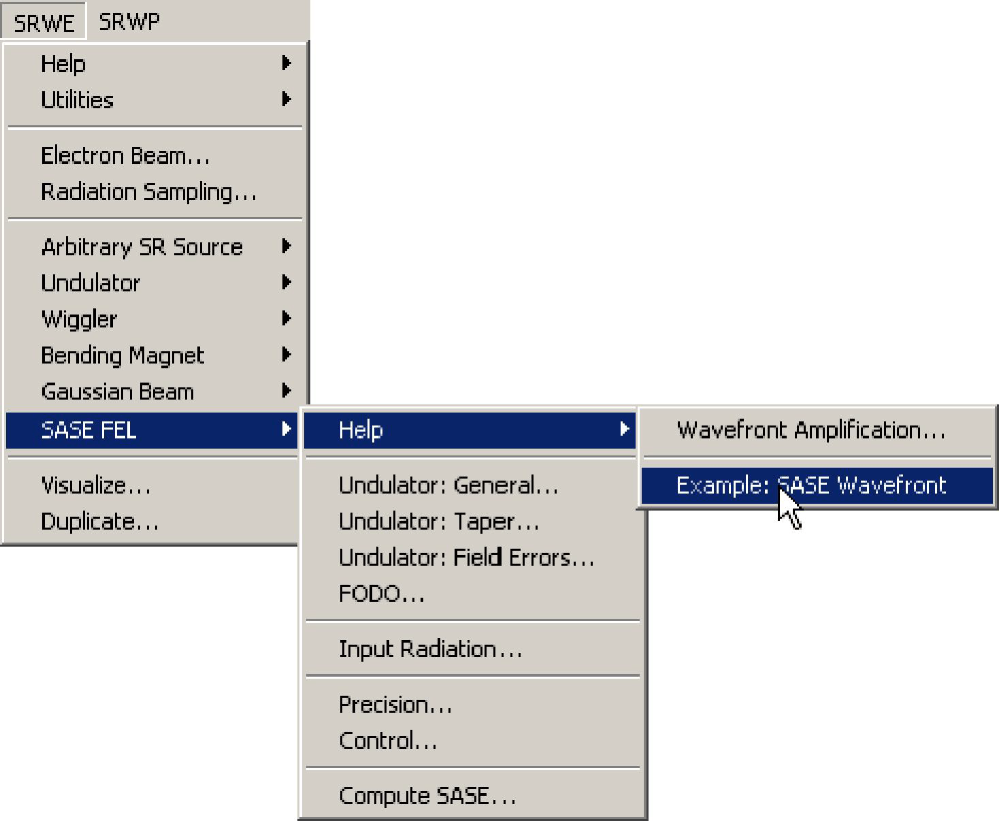
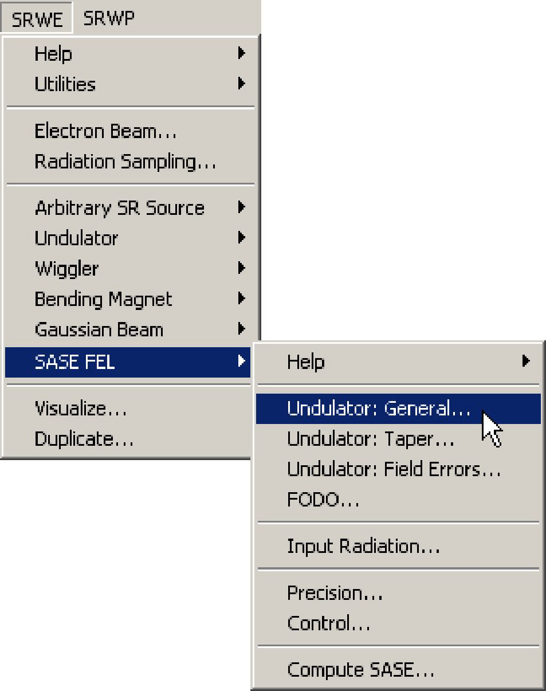
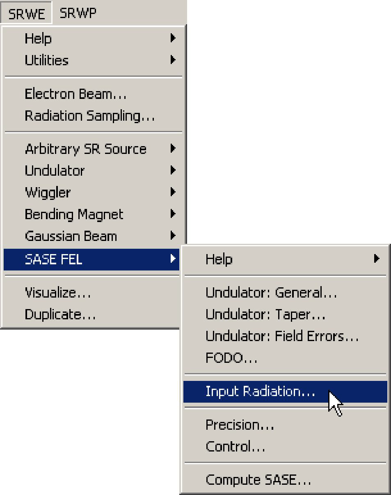
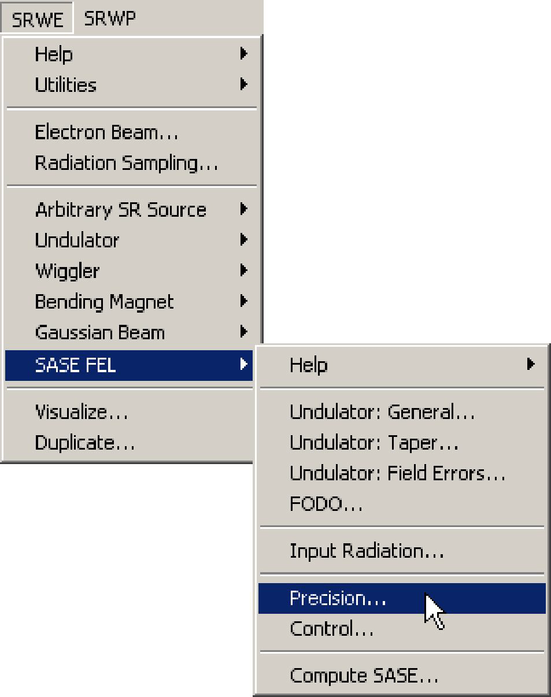
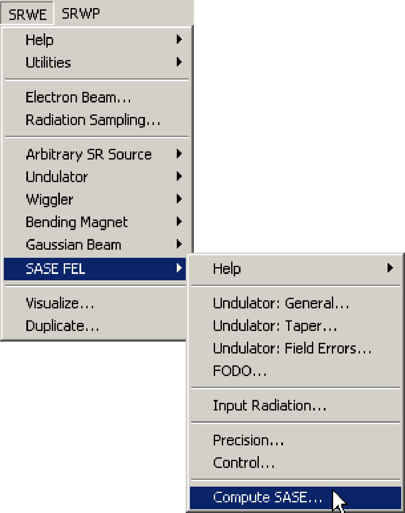

# **SASE FEL: Wavefront Amplification**

## **Introduction**
This type of computation can be used to simulate Self-Amplified Spontaneous Emission (SASE)
in Free-Electron Lasers (FEL). The implementation is mainly based on the Genesis 3D code
developed at DESY by S.Reiche et. al. For better inter-operation with other parts of SRW, this
FORTRAN code was converted (with minor modifications) to C and re-compiled as a shared
library.

The SASE computation in SR\W is currently limited by a numerical solution of the steady state
paraxial FEL equations at the approximation of slowly varying amplitude of the radiation field. If
electron beam and FEL undulator parameters, together with the wavelength of observed
radiation, are tuned properly, one can simulate the radiation wavefront amplification in the
undulator due to interaction with the electron beam. The wavefront (i.e. complex electric field)
obtained after this simulation, can be used for further manipulations / propagation through
optical elements using the methods of Fourier optics implemented in the SRWP.

## **Getting Started**

A good starting point can be the example of SASE computation distributed with the SRW:

During the execution of the example, a window with some explanations should appear. Please read the explanations and make sure that everything goes as described (you can also find the
text of the explanations in the section **Examples**). At the end of the computation you should
obtain a set of graphs displaying the results, which should fit the explanations.

You may want to vary some parameters of this example and watch the results. Such exercise is
a good and recommended way to proceed. Some knowledge in macro programming within Igor
Pro is nevertheless needed. To try, please select from the the Igor menu "Windows->Other
Windows->SRW Example SASE...". A window with a procedure containing the macro calls of
the example should appear. We suggest to modify the name of this procedure and save it to
another file before starting to play with parameters.

## **SASE Computation Step by Step**

1) **Initialize** SRW.

2) Define **Electron Beam**.

Here one defines necessary parameters of the electron beam. See the Reference Manual
records for the dialog box "Electron Beam" and the macro commands **SrwElecFilament** and
**SrwElecThick** for details. It is important to properly set up finite-emittance beam parameters for
this type of computation.

3) Define **Radiation Sampling**.

Here one defines the longitudinal position of the observation plane, ranges of transverse
positions and photon energy and number of points where the radiation will be computed. For
details on the Radiation Sampling definition, see the Reference Manual topic **Radiation**
Sampling and the records on the macro commands **SrwSmpCreate** and **SrwSmpScanXZE**.

4) Define parameters of SASE **Undulator** (and focusing structure, if necessary).

See Reference Manual record on the macros **SrwSASEUndCreate**, **SrwSASEUndTaperAdd**,
**SrwSASEUndErrAdd** and **SrwSASEFODOAdd** for details.

5) Define **Initial Radiation** wavefront.

See Reference Manual record on the macro **SrwSASEInRadGsn** for details.

6) Define **Precision** and computation **Control** parameters.

See Reference Manual record on the macros **SrwSASEPrecMain**, **SrwSASECntrl** for details.

7) **Computer** SASE

See Reference Manual record on the macro **SrwWfrSASECreate** for details.

8) **Visualize** the computed wavefront component of interest.

## **Examples**
* **SASE Wavefront**

- This is an illustration of a steady-state SASE computation and further propagation of the SASE
wavefront in free space. The parameters generally correspond to the DESY XFEL project:
electron energy ~ 25 GeV, peak current ~5000 A, undulator period ~ 50 mm, resonant radiation
wavelength ~ 1 Å. The initial wavefront is assumed to be Gaussian with its waist at the beginning of the undulator. The SASE computation is mainly based on the GENESIS 3D code developed
at DESY (this FORTRAN code was converted to C and integrated with other parts of SRW).
- As the computation progresses, several characteristics of the SASE wavefront, including
power, RMS size of the power density distribution and bunching factor, are displayed in graphs
vs longitudinal position (zero longitudinal position corresponds to the end of undulator). One can
observe exponential growth of the radiation power, until a saturation happens. In the saturation
mode, the radiation power fluctuates (since a portion of energy is transferred back and forth
between the radiation and the electron beam).
- After the exit from the undulator, the wavefront is further propagated by 500 m in free space.
The intensity distributions at the exit of the undulator and after the drift space should be plotted in
graphs at the end of the computation. Due to oscillatory behavior of the power gain after the
saturation, the intensity profiles of the propagated wavefront possess fringes, which can be
interpreted as resulting from the interference between radiations from those intervals of the
electron beam path where the emitted power is higher.
- We note that the computation in this example does not take into account a number of
important factors and processes (e.g. time dependence, stochastic "origin" of the SASE,
"competition" of modes, possible degradation of transverse coherence, etc.), and therefore can
be used for qualitative estimations only. *Absolute values of the computed spectral flux density
are very imprecise, and therefore can not be used for comparisons with other sources.*